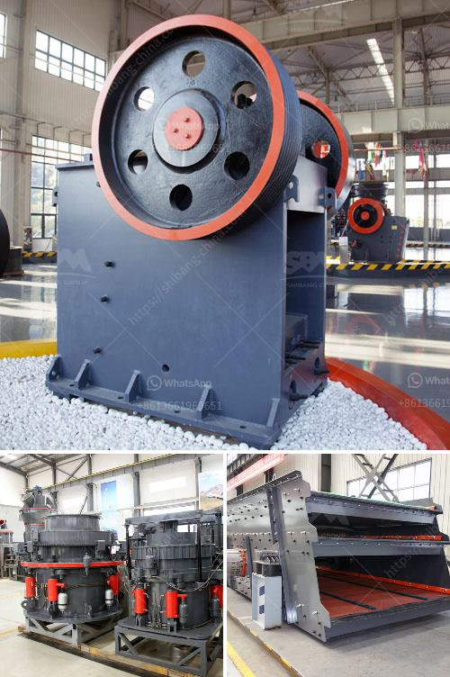

<h3>How to choose a cone crusher for rock crushing？</h3>
When it comes to rock crushing, there is no one-size-fits-all solution. The equipment selection process for a rock crushing project will depend on multiple factors, including the type of rock being crushed, the size of the desired final product, and the budget available for investment in the rock crushing process. One crucial piece of equipment in the rock crushing process is the cone crusher. But with so many options on the market, how do you choose the right cone crusher for your rock crushing project? In this article, we will discuss the key factors to consider when selecting a cone crusher for rock crushing.

There are two main types of cone crushers: standard and short head. The standard cone crusher has a coarser feed and produces a larger size of product, whereas the short-head cone crusher has a finer feed and produces a finer product. Consider the type of rock you need to crush and the desired product size to determine which type of cone crusher is best suited for your rock crushing project.

The capacity of a cone crusher determines how much rock it can process in a given timeframe. It is essential to choose a cone crusher with sufficient capacity to meet your rock crushing requirements. Consider the project's anticipated production volume and the rock's hardness to determine the capacity needed for your cone crusher.

The power and efficiency of a cone crusher are crucial for effective rock crushing. Higher power means higher crushing force, resulting in quicker and more efficient rock processing. However, higher power also means higher energy consumption. Strike a balance between power and efficiency to choose a cone crusher that provides optimal performance without excessive energy usage.

Regular maintenance of the cone crusher is essential for its longevity and reliability. Consider the ease of access to various parts of the cone crusher for routine maintenance activities, such as changing wear liners or inspecting components. Opt for a cone crusher with good serviceability features, such as easily accessible maintenance points and excellent manufacturer support.

Safety should always be a top priority in the rock crushing process. Look for a cone crusher equipped with safety features such as hydraulic adjustment, tramp release system, and automatic overload protection. These features help prevent damage to the crusher and ensure the safety of the operators.

Lastly, consider the cost of the cone crusher. While it's essential to invest in a high-quality and reliable cone crusher, it's also crucial to stay within your budget. Compare the prices of different cone crushers available in the market and choose the one that offers the best value for your money.

In conclusion, choosing the right cone crusher for rock crushing requires careful consideration of various factors, including cone crusher type, capacity, power and efficiency, maintenance and serviceability, safety features, and cost. By taking these factors into account and conducting thorough research, you can select the cone crusher that best meets your rock crushing needs and maximizes your project's success.
<h3>Contact us</h3><ul><li><strong>Whatsapp:&nbsp;<a href="https://wa.me/8613661969651">+8613661969651</a></strong></li><li><a href="https://swt.shibang-china.com/?git&amp;zhl&amp;How to choose a cone crusher for rock crushing？"><strong>Online Service(chat now)</strong></a></li></ul><h3>Related</h3><ul><li><a href='What is the most popular rock crusher on market.md'>What is the most popular rock crusher on market?</a></li><li><a href='What is needed to open an aggregate mine.md'>What is needed to open an aggregate mine?</a></li><li><a href='What equipment and machinery are needed to mine marble.md'>What equipment and machinery are needed to mine marble?</a></li><li><a href='What is the role of crushing in the beneficiation process.md'>What is the role of crushing in the beneficiation process?</a></li><li><a href='What are the ponent of nigerian mining industry.md'>What are the ponent of nigerian mining industry?</a></li></ul>