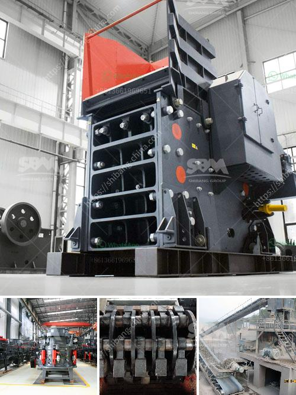

<h3>What  is vertical shaft impact crusher?</h3>
Vertical shaft impact crusher is a type of impact crusher that operates under the principle of acceleration. Due to its compact size and efficient functioning, it is a popular choice for crushing and screening applications of various types of hard and brittle materials, such as minerals, ores, rocks, limestone, and concrete.

The crusher consists of a feed hopper, a vertical shaft, a rotor, an impact plate, a centrifugal force chamber, and a discharge chute. All these components work together to create a controlled fragmentation of the material fed into the machine.

When the material enters the feed hopper, it is evenly distributed and accelerated by the high-speed rotating rotor. The centrifugal force exerted by the rotor hurls the material against the impact plate, creating a high-speed impact. This impact causes the material to break into smaller pieces, which are then further crushed and processed.

One of the major advantages of the vertical shaft impact crusher is its ability to produce a cubical product with a high reduction ratio. This is achieved through the unique design of the machine, which utilizes the centrifugal force to break the material along its natural fracture lines. As a result, the crushed product has a uniform shape and size distribution, making it suitable for a wide range of applications.

Another advantage of the vertical shaft impact crusher is its versatility. It can be used for both primary and secondary crushing, allowing the machine to handle a wide range of materials and applications. Additionally, the crusher can be configured to operate in a closed circuit with a secondary screen and conveyor, enabling the production of multiple finished products.

In terms of maintenance, the vertical shaft impact crusher is designed to be easily serviced and maintained. The rotors and wear parts can be easily accessed and replaced, reducing downtime and overall operating costs. Furthermore, the crusher is equipped with a hydraulic system that provides automatic overload protection, ensuring safe and efficient operation.

Overall, the vertical shaft impact crusher offers numerous benefits over traditional crushers, making it a preferred choice for many crushing and screening applications. Its compact size, high reduction ratio, and versatility make it suitable for a wide range of materials and industries. With its efficient operation, ease of maintenance, and ability to produce a cubical product, the vertical shaft impact crusher continues to be an essential component in the mining, construction, and recycling industries.
<h3>Contact us</h3><ul><li><strong>Whatsapp:&nbsp;<a href="https://wa.me/8613661969651">+8613661969651</a></strong></li><li><a href="https://swt.shibang-china.com/?git&amp;zhl&amp;What  is vertical shaft impact crusher"><strong>Online Service(chat now)</strong></a></li></ul><h3>Related</h3><ul><li><a href='What is iron ore mining in Pakistan.md'>What is iron ore mining in Pakistan?</a></li><li><a href='What is cost of bauxite processing per ton.md'>What is cost of bauxite processing per ton?</a></li><li><a href='What is the difference between impact crusher and jaw crusher.md'>What is the difference between impact crusher and jaw crusher?</a></li><li><a href='what jaw crushers speed rpm should do.md'>what jaw crushers speed rpm should do</a></li><li><a href='What machine is used to crush copper ore.md'>What machine is used to crush copper ore?</a></li></ul>