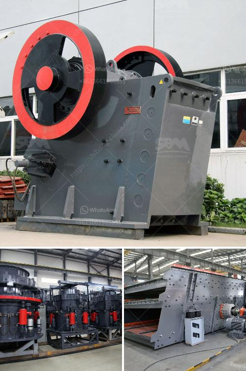

<h3>What about the crusher made in Ethiopia?</h3>
Ethiopia is a developing country in East Africa that has been making significant progress in various sectors, including construction and manufacturing. One of the key industries witnessing growth in Ethiopia is the production of crushers. The country has seen an increase in the number of companies specializing in the manufacturing of crushers, predominantly used in the construction and mining sectors.

The crushers produced in Ethiopia are characterized by reasonable structure, simple operation, low investment cost, and high efficiency. They are ideally suited for crushing materials with a compressive strength of less than 320MPa, such as limestone, granite, gypsum, pebbles, quartz, basalt, river pebble, etc. These crushers are widely used in industries such as construction, mining, chemical, cement, transportation, and metallurgy.

What sets the crushers made in Ethiopia apart from those manufactured in other countries? Firstly, the cost of production is relatively low in Ethiopia. The country has abundant mineral resources, which reduces the cost of raw materials required for crusher manufacturing. This, in turn, lowers the overall production cost, making the crushers more affordable for both domestic and international markets.

Additionally, crushers made in Ethiopia are known for their high quality. Most of the manufacturers in the country adhere to strict quality control measures, ensuring that the crushers meet international standards. This quality focus has helped Ethiopia gain a reputation as a reliable supplier of crushers. Many foreign companies prefer to source crushers from Ethiopia due to their durability and reliability, which ultimately leads to a longer lifespan and more cost-effective operation.

Furthermore, the crushers made in Ethiopia are designed to be environmentally friendly. The manufacturers adopt advanced technologies and equipment to minimize pollutant emissions during the production process. This focus on sustainability aligns with Ethiopia's commitment to environmental conservation and has garnered appreciation from both local and international customers.

The crushers made in Ethiopia have also contributed to the country's economic growth. The booming construction and mining sectors have created employment opportunities for many Ethiopians, directly and indirectly. As the demand for crushers increases, local manufacturers are expanding their operations and employing more people. This not only boosts the economy but also enhances the skill set and expertise of the local workforce.

In conclusion, the crushers made in Ethiopia have garnered attention and appreciation in the global market. The country's low production cost, focus on quality, environmental friendliness, and contribution to the economy have made Ethiopian crushers a preferred choice for many customers. As the country continues to invest in its manufacturing sector, it is expected that the crushers made in Ethiopia will further improve in terms of technology, efficiency, and overall performance.
<h3>Contact us</h3><ul><li><strong>Whatsapp:&nbsp;<a href="https://wa.me/8613661969651">+8613661969651</a></strong></li><li><a href="https://swt.shibang-china.com/?git&amp;zhl&amp;What about the crusher made in Ethiopia"><strong>Online Service(chat now)</strong></a></li></ul><h3>Related</h3><ul><li><a href='What kind of crushing equipment is needed to produce cement.md'>What kind of crushing equipment is needed to produce cement</a></li><li><a href='What equipment and machinery are needed to mine marble.md'>What equipment and machinery are needed to mine marble?</a></li><li><a href='What are the methods of mining mica.md'>What are the methods of mining mica?</a></li><li><a href='What is the size of the coal after it passes through the crusher.md'>What is the size of the coal after it passes through the crusher?</a></li><li><a href='What is the difference between impact crusher and hammer mill.md'>What is the difference between impact crusher and hammer mill?</a></li></ul>