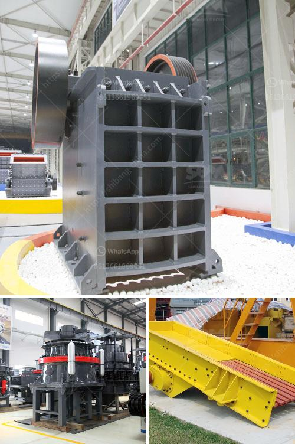

<h3>What are factors that will affect the output of a cement mill?</h3>
A cement mill is a crucial equipment in the production of cement. It is responsible for grinding clinker, gypsum, and other ingredients into the fine powder that is used to create concrete. As such, it is essential to ensure that the cement mill is operating efficiently and effectively. However, several factors can affect the output of a cement mill, and it is crucial to understand these factors to enhance production.

One of the primary factors that affect the output of a cement mill is the fineness of the cement. Fineness refers to the particle size distribution of the cement particles. A finer cement grind means there are more particles in a given volume, which increases the surface area available for hydration. This results in higher early strength and overall enhanced cement performance. Therefore, controlling and optimizing the fineness of the cement is crucial for maximizing the mill's output.

The feed size of the clinker is another critical factor that affects the output of a cement mill. The clinker is the primary raw material used in cement manufacturing and must be properly ground to ensure efficient production. If the clinker particles are too large, they may not be effectively ground, leading to a lower output. Additionally, larger clinker particles can cause blockages in the mill, leading to reduced grinding efficiency. Therefore, it is essential to ensure an optimal feed size to maximize mill output.

The moisture content of the materials is also a significant factor that affects cement mill output. Moisture in the raw materials can cause problems during the grinding process. Excessive moisture can lead to the formation of a coating on the grinding media, reducing their efficiency. Moreover, moisture can cause the material to agglomerate, resulting in poor grinding performance and lower output. Hence, controlling and maintaining the moisture content of the materials is crucial for optimal mill operation.

The grinding media used in the cement mill can also affect its output. Different types of grinding media, such as steel balls, ceramic balls, or cylpebs, have different densities and sizes, which directly impact the grinding efficiency. The right selection of grinding media is essential to maximize the mill's output. Additionally, the wear rate of the grinding media also influences the mill's productivity. Higher wear rates can result in increased downtime for media replacement, leading to reduced output.

The mill internals, such as liners and diaphragms, are other factors that can affect the output of a cement mill. Liners protect the mill shell from wear and optimize the grinding process by lifting the grinding media. Diaphragms control the material flow and optimize the grinding efficiency. Maintaining and replacing worn-out liners and diaphragms is crucial for maximizing the mill's output.

In conclusion, several factors affect the output of a cement mill. These include the fineness of the cement, feed size of the clinker, moisture content of the materials, grinding media, and the condition of the mill internals. Understanding and optimizing these factors are vital for efficiently operating a cement mill and maximizing its output. Implementing proper maintenance and monitoring processes can help identify potential issues and ensure consistent and high-quality cement production.
<h3>Contact us</h3><ul><li><strong>Whatsapp:&nbsp;<a href="https://wa.me/8613661969651">+8613661969651</a></strong></li><li><a href="https://swt.shibang-china.com/?git&amp;zhl&amp;What are factors that will affect the output of a cement mill"><strong>Online Service(chat now)</strong></a></li></ul><h3>Related</h3><ul><li><a href='What is primary crushing equipment .md'>What is primary crushing equipment ?</a></li><li><a href='What equipment to extract iron ore.md'>What equipment to extract iron ore?</a></li><li><a href='What is the process of mining and extraction of gold and molybdenum.md'>What is the process of mining and extraction of gold and molybdenum?</a></li><li><a href='What type of crushing equipment should copper mine choose.md'>What type of crushing equipment should copper mine choose?</a></li><li><a href='What machine can crush small stones into sand？.md'>What machine can crush small stones into sand？</a></li></ul>