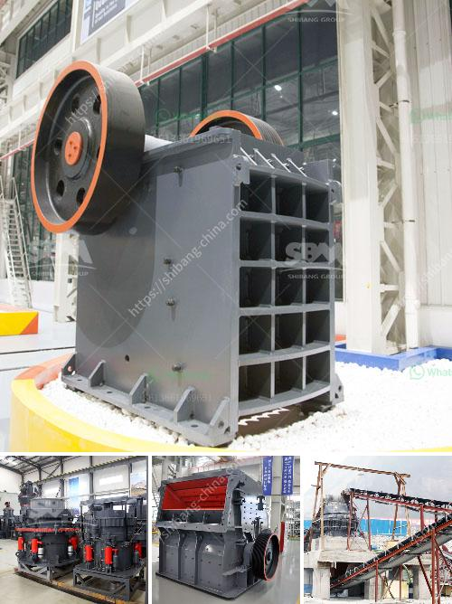

<h3>What are grinding and crushing in small scale miners?</h3>
Grinding and crushing are essential processes in the small-scale mining industry. These processes are used to extract valuable minerals or metals from ore, as well as for particle size reduction of solid materials in order to achieve the desired size and consistency.

In small-scale mining, these processes are performed manually by miners using simple equipment such as hand tools, hammers, and mortars. The grinding process involves breaking down the ore into small pieces or particles that can be further processed or refined. This is usually done by manually pounding the ore with a hammer or using a mortar and pestle.

Crushing, on the other hand, is the process of reducing the size of larger rocks and ores into smaller particles or pieces. This is usually done using mechanical means, such as crushers and mills. Crushers are machines designed to break large rocks into smaller rocks, gravel, or rock dust. They are commonly used in small-scale mining operations as primary crushers to reduce the size of the ore before further processing.

Both grinding and crushing play a crucial role in the extraction process by breaking down the raw material into manageable sizes for subsequent stages of processing, such as flotation, leaching, and smelting. Without these processes, it would be challenging to separate the valuable minerals or metals from the waste material effectively.

However, grinding and crushing in small-scale mining can pose several challenges. Firstly, the lack of proper equipment and machinery can make the process time-consuming and labor-intensive. This can increase the risks of fatigue or injuries among miners. Moreover, the repetitive nature of these tasks can lead to long-term health issues, such as musculoskeletal disorders.

Additionally, the environmental impact of grinding and crushing in small-scale mining needs to be addressed. Dust and noise pollution can be significant, especially in areas where there is limited ventilation or inadequate protective measures. Moreover, improper disposal of waste materials generated during the grinding and crushing processes can also lead to environmental contamination, affecting nearby water sources or agricultural land.

To mitigate these challenges, there is a need for technological advancements and improved working conditions in small-scale mining. Implementing simple yet effective engineering controls, such as dust suppression systems and personal protective equipment, can help minimize the health and safety risks associated with grinding and crushing.

Furthermore, promoting sustainable practices in small-scale mining, such as the use of more efficient and cleaner technologies, can reduce the environmental footprint. Encouraging the adoption of responsible mining practices and providing appropriate training and education to small-scale miners also play a vital role in ensuring safe and environmentally conscious grinding and crushing operations.

In conclusion, grinding and crushing are crucial processes in small-scale mining for the extraction of valuable minerals and ores. These processes, performed manually or with basic equipment, are essential for particle size reduction and subsequent processing stages. However, they can pose several challenges, including health and safety risks, and environmental impacts. To address these challenges, it is essential to promote technological advancements, improve working conditions, and implement sustainable practices in small-scale mining operations.
<h3>Contact us</h3><ul><li><strong>Whatsapp:&nbsp;<a href="https://wa.me/8613661969651">+8613661969651</a></strong></li><li><a href="https://swt.shibang-china.com/?git&amp;zhl&amp;What are grinding and crushing in small scale miners"><strong>Online Service(chat now)</strong></a></li></ul><h3>Related</h3><ul><li><a href='What is the role of crushing in the beneficiation process.md'>What is the role of crushing in the beneficiation process?</a></li><li><a href='what type of pumps uesd in stone crusher？.md'>what type of pumps uesd in stone crusher？</a></li><li><a href='what jaw crushers speed rpm should do.md'>what jaw crushers speed rpm should do</a></li><li><a href='What kind of crushing machinery is used for sandstone processing ？.md'>What kind of crushing machinery is used for sandstone processing ？</a></li><li><a href='What equipment is needed for perlite ore mines.md'>What equipment is needed for perlite ore mines?</a></li></ul>