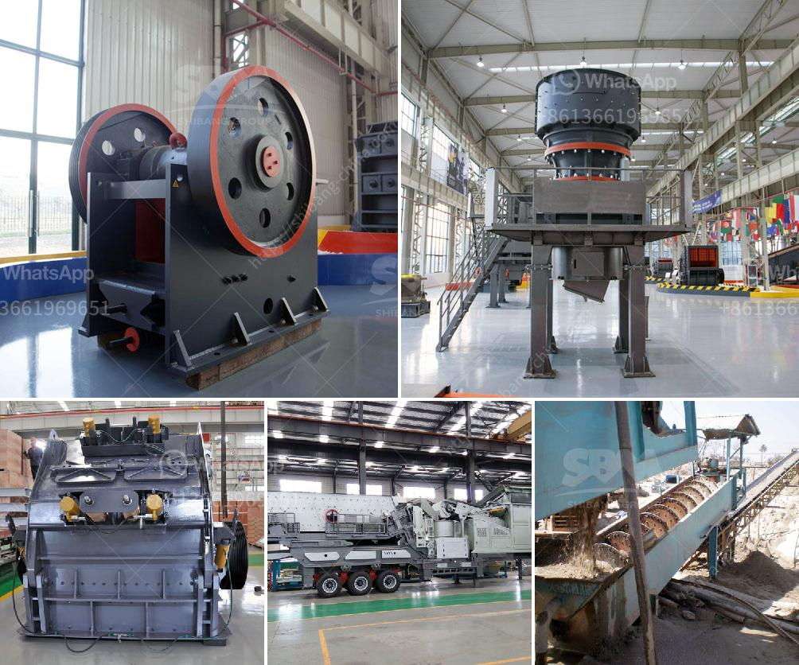

<h3>What are machines used for mining iron ore?</h3>
Mining iron ore is a complex process that requires significant technology, skill, and expertise in extracting, refining, and purifying iron ore from the ground. Below are some of the machines used for mining iron ore.

In the mining industry, technological advances and innovations have improved efficiency and effectiveness in extracting iron ore from the ground. These machines are deployed in various stages of the mining process. They facilitate the excavation, crushing, and screening of iron ore into manageable sizes for smelting and refining purposes. The following machines are commonly used for mining iron ore:

Jaw crushers are used for the initial crushing of mined ore into smaller fragments. They are designed to process large quantities of ore quickly and efficiently. This machine uses compressive force, producing strong pressure to crush the ore into smaller pieces. It is an essential tool in the mining process as it breaks down the larger rocks into smaller, more manageable sizes.

After the ore has been crushed by the jaw crusher, it is further refined by the cone crusher. The cone crusher reduces the ore into smaller particles through compression and crushing. It plays a critical role in reducing the size of the ore for further processing.

Iron ore grinding equipment is essential in the beneficiation process. Grinding mills are used to grind various materials into powder, and this is a critical step in the mining process. Due to the precise grinding power of the ball mill, these machines are used for grinding, extracting, and purifying minerals. To maximize the ores' valuable minerals, it is necessary to grind the rocks finely before further processing.

Magnetic separators are used to extract and separate ferromagnetic materials from the ore. These machines play a crucial role in helping to separate the iron ore from other elements or compounds in the ore. Magnetic separators pass the ore through a magnetic field, attracting the iron while allowing the non-magnetic materials to pass through.

Flotation machines are used to separate valuable minerals from the ore through the process of flotation. This process involves adding various chemicals to the ore mix, creating bubbles that attach to the valuable minerals. These bubbles then rise to the surface, where they can be collected and separated from the non-valuable material.

Blasting equipment is used to break larger pieces of ore and remove overburden to access the ore deposits. This equipment uses controlled explosions to dislodge and break the ore effectively. Blasting techniques are essential in creating manageable sizes of ore that can be transported and processed efficiently.

The machines used for mining iron ore are crucial for productivity and efficiency in the mining process. From initial excavation to transportation, crushing, and refining, these machines play essential roles in extracting iron ore from the ground. Technological advancements have allowed for improved efficiency and safety in mining operations. With ongoing research and innovation, these machines are likely to grow even more advanced in the future, further enhancing the mining process.
<h3>Contact us</h3><ul><li><strong>Whatsapp:&nbsp;<a href="https://wa.me/8613661969651">+8613661969651</a></strong></li><li><a href="https://swt.shibang-china.com/?git&amp;zhl&amp;What are machines used for mining iron ore"><strong>Online Service(chat now)</strong></a></li></ul><h3>Related</h3><ul><li><a href='What are factors that will affect the output of a cement mill.md'>What are factors that will affect the output of a cement mill?</a></li><li><a href='What type of bearings must be used for the taper of a jaw crusher.md'>What type of bearings must be used for the taper of a jaw crusher?</a></li><li><a href='What is concrete crusher.md'>What is concrete crusher?</a></li><li><a href='What equipment is needed for alumstone mines.md'>What equipment is needed for alumstone mines?</a></li><li><a href='What companies make concrete crushers .md'>What companies make concrete crushers ?</a></li></ul>