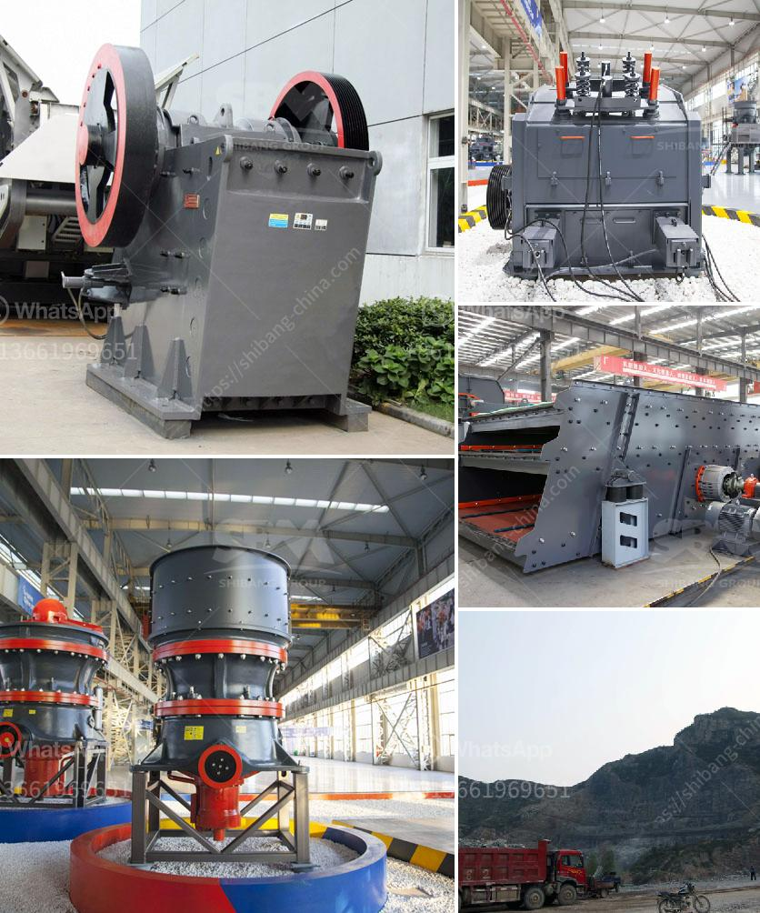

<h3>What are the characteristics of bauxite ore and how to crush it?</h3>
Bauxite ore is a widespread rock mainly composed of aluminum hydroxide minerals. On the last count, it has been confirmed that there are over 250 various kinds of bauxite ore minerals. However, bauxite ores are usually composed of mixtures of gibbsite (Al2O3.3H2O), boehmite (Al2O3.H2O) or diaspore (Al2O3.H2O), along with several impurities such as iron oxides, clay minerals, and titanium dioxide.

The characteristics of bauxite ore largely determine the way it should be crushed. For instance, high content of alumina in the ore can demand a finer grind size for better liberation of aluminum-containing minerals. Low-grade bauxite ores can also contain reactive silica, which can result in a high silica to alumina ratio (SiO2/Al2O3). This makes it critical to crush the ore to a smaller particle size to reduce the silica content.

The crushing process of bauxite ore requires various types of crushers that can perform different tasks. To ensure optimal crushing efficiency, the proper selection of crushers must be based on various circumstances. Operators should consider the nature of bauxite ore, the production requirements, and the characteristics of the equipment available.

Jaw crusher is often used as primary crushing equipment for bauxite ore crushing. It has extra-large crushing force and production capacity, along with crushing ratio, uniform particle size, and high quality. With a simple structure, a reliable operation, and easy maintenance, jaw crusher can crush the toughest materials, such as granite, basalt, gabbro, etc. as well as a variety of minerals and ores like bauxite ore.

For crushing bauxite, our HXJQ® hydraulic cone crusher, a simplified version of the traditional cone crusher, can be used. Crushing equipment is important to the mining process because it reduces the size of the material, which is then transported to the next stage in the process. Crushed ore can be crushed to the particle size required by grinding and beneficiation processes, which improves the efficiency of subsequent operations.

To crush bauxite ore into smaller particles, different types of crushers are used, such as jaw crusher for primary crushing, impact crusher and cone crusher for secondary crushing, belt conveyor for transferring the vibrating screen for classification and grading. Crushing plants are stationary units with specialized equipment for handling and processing bauxite ore in various sizes and specifications.

In conclusion, bauxite ore is a complex mineral with various characteristics that can significantly affect the way it should be crushed. The properties of the ore, such as hardness, toughness, and silica content, play a crucial role in determining the appropriate crushers for the crushing process. By understanding these characteristics, operators can select the right equipment and optimize the crushing process to achieve the desired outcome.
<h3>Contact us</h3><ul><li><strong>Whatsapp:&nbsp;<a href="https://wa.me/8613661969651">+8613661969651</a></strong></li><li><a href="https://swt.shibang-china.com/?git&amp;zhl&amp;What are the characteristics of bauxite ore and how to crush it"><strong>Online Service(chat now)</strong></a></li></ul><h3>Related</h3><ul><li><a href='What equipment is needed for kaolin ore mines.md'>What equipment is needed for kaolin ore mines?</a></li><li><a href='What is chrome ore grades.md'>What is chrome ore grades?</a></li><li><a href='What mechanical equipment is used in limestone mining.md'>What mechanical equipment is used in limestone mining</a></li><li><a href='What is mechanism sand.md'>What is mechanism sand?</a></li><li><a href='What equipment is needed for silicon ore mines.md'>What equipment is needed for silicon ore mines?</a></li></ul>