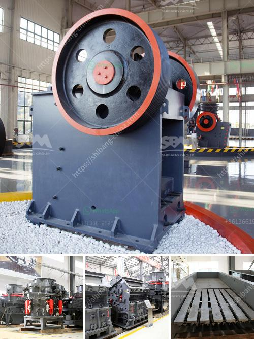

<h3>What are the different steps of chromite ore beneficiation ?</h3>
Chromite ore beneficiation is a multi-stage process that aims to remove impurities and increase the chromium content in the ore. The process involves crushing, screening, grinding, magnetic separation, gravity concentration and flotation techniques. In this article, we will discuss the different steps involved in the chromite ore beneficiation process.

1. Crushing: The first step in the beneficiation process is crushing the ore into smaller pieces. The chromite ore is usually extracted through open-pit mining techniques. Once the ore is extracted, it goes through various crushing stages to reduce the size of the particles for further processing.

2. Screening: After the crushing process, the ore is screened to separate the valuable chromite grains from the waste material. Screening is done through mechanical screens or vibrating screens that separate the ore into different size fractions. The chromite grains that are larger than the screen mesh are retained for further processing, while the smaller grains are discarded.

3. Grinding: The next step in the beneficiation process is grinding. Grinding is the process of reducing the size of the chromite particles to a finer size for further processing. This is done through various grinding mills, such as ball mills, rod mills, and autogenous mills, depending on the ore properties and desired particle size.

4. Magnetic Separation: After grinding, the chromite particles are subjected to magnetic separation to remove any magnetic impurities. This is done using magnetic separators, which attract and separate the magnetic components from the non-magnetic ones. The chromite ore is passed through a series of magnetic separators to remove the magnetic impurities and obtain a concentrated chromite product.

5. Gravity Concentration: The non-magnetic fraction obtained from magnetic separation is subjected to gravity concentration. Gravity concentration is a method of separating minerals based on their specific gravity. In the case of chromite ore beneficiation, gravity concentration techniques, such as jigging and shaking tables, are used to separate the chromite grains from the lighter gangue minerals.

6. Flotation: Flotation is the final step in the chromite ore beneficiation process and is used to separate the valuable chromite grains from the gangue minerals. This is achieved by adding specific chemicals to the slurry containing the chromite particles. These chemicals selectively attach to the chromite grains and float them to the surface, while the gangue minerals sink. The chromite concentrate is then collected and further processed.

Overall, chromite ore beneficiation is a complex process that requires advanced techniques and equipment. The different steps of this process involve crushing, screening, grinding, magnetic separation, gravity concentration, and flotation. These steps aim to remove impurities and increase the chromium content in the ore to meet market requirements. Successful beneficiation of chromite ore can result in the production of high-quality chromite concentrate, which can be used in various industries, such as metallurgy, refractory, and chemical industries.
<h3>Contact us</h3><ul><li><strong>Whatsapp:&nbsp;<a href="https://wa.me/8613661969651">+8613661969651</a></strong></li><li><a href="https://swt.shibang-china.com/?git&amp;zhl&amp;What are the different steps of chromite ore beneficiation "><strong>Online Service(chat now)</strong></a></li></ul><h3>Related</h3><ul><li><a href='What equipment is used in iron ore crusher.md'>What equipment is used in iron ore crusher?</a></li><li><a href='What kind of crushing machinery is used for sandstone processing ？.md'>What kind of crushing machinery is used for sandstone processing ？</a></li><li><a href='What is the aggregate crusher.md'>What is the aggregate crusher?</a></li><li><a href='What are the machines used to mine bauxite.md'>What are the machines used to mine bauxite?</a></li><li><a href='What is grindind machine.md'>What is grindind machine?</a></li></ul>