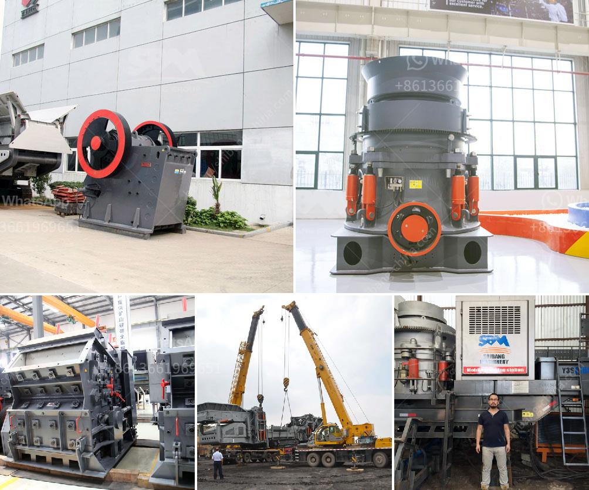

<h3>What are the machines and equipment in mining?</h3>
Mining is a complex and arduous industry that involves extracting valuable minerals or other geological materials from the earth. To accomplish this task, mining companies use a variety of machines and equipment. These specialized tools are designed to facilitate the extraction and processing of raw materials, making mining operations more efficient and productive. Let's delve into some common machines and equipment that are vital to the mining industry.

Excavators: One of the most recognizable machines in mining is the heavy-duty excavator. These massive machines are used to dig out the earth and remove large amounts of soil, rocks, or other materials. Equipped with a bucket attached to a hydraulic arm, excavators have the strength and versatility to efficiently delve into the ground and extract minerals. These machines come in various sizes and capacities to cater to different mining requirements.

Bulldozers: Another crucial machine in mining is the bulldozer. These robust and powerful vehicles are primarily used for pushing and moving large quantities of soil, rocks, and debris. They play a significant role in clearing the mining site, creating access roads, and leveling the ground. Bulldozers feature a large blade in the front, which allows them to effectively shift heavy materials and reshape the landscape for mining operations.

Drilling Machines: Before mining operations can commence, the earth must be penetrated to access the underground minerals. This is where drilling machines play a vital role. These machines use various drilling methods, such as rotary, percussion, or core drilling, to bore holes into the earth's surface. Drilling machines are equipped with robust drill bits that can cut through hard rock formations, allowing access to valuable minerals and ores.

Dump Trucks: Once materials have been extracted and processed, they need to be transported from the mining site to their destination. Dump trucks are the workhorses of the transportation process in mining. These gigantic vehicles are specifically designed to carry and dump heavy loads of extracted materials. Dump trucks come in a variety of sizes and capacities, with the ability to haul large volumes of ore, waste, or other mining byproducts safely and efficiently.

Conveyors: In large-scale mining operations, the use of conveyors is essential for efficient material handling. Conveyors are belt systems that transport materials from one location to another within the mining site. They are a critical part of the mining process, enabling the movement of minerals or other extracted materials over long distances. Conveyors minimize the need for manual labor and allow for the continuous flow of materials, increasing productivity.

Crushers and Grinders: In the later stages of mining, extracted materials often need to be processed further for refinement or separation. Crushers and grinders play a crucial role in this process. Crushers break down large chunks of ore or rock into smaller, more manageable pieces, while grinders further reduce the size of the material into fine particles. This enables more effective separation of valuable minerals from waste.

In conclusion, the machines and equipment used in mining are essential for efficiently extracting and processing raw materials. From excavators and bulldozers to drilling machines and dump trucks, each tool plays a critical role in different stages of the mining process. By utilizing these specialized machines, mining companies can increase productivity, improve safety, and maximize the extraction of valuable resources from the earth.
<h3>Contact us</h3><ul><li><strong>Whatsapp:&nbsp;<a href="https://wa.me/8613661969651">+8613661969651</a></strong></li><li><a href="https://swt.shibang-china.com/?git&amp;zhl&amp;What are the machines and equipment in mining"><strong>Online Service(chat now)</strong></a></li></ul><h3>Related</h3><ul><li><a href='What is the cost of the cone crusher.md'>What is the cost of the cone crusher?</a></li><li><a href='what are the equipment for gypsum mining.md'>what are the equipment for gypsum mining?</a></li><li><a href='What can be used for basalt.md'>What can be used for basalt?</a></li><li><a href='What is concrete crusher.md'>What is concrete crusher?</a></li><li><a href='What is belt conveyor in gold mining.md'>What is belt conveyor in gold mining?</a></li></ul>