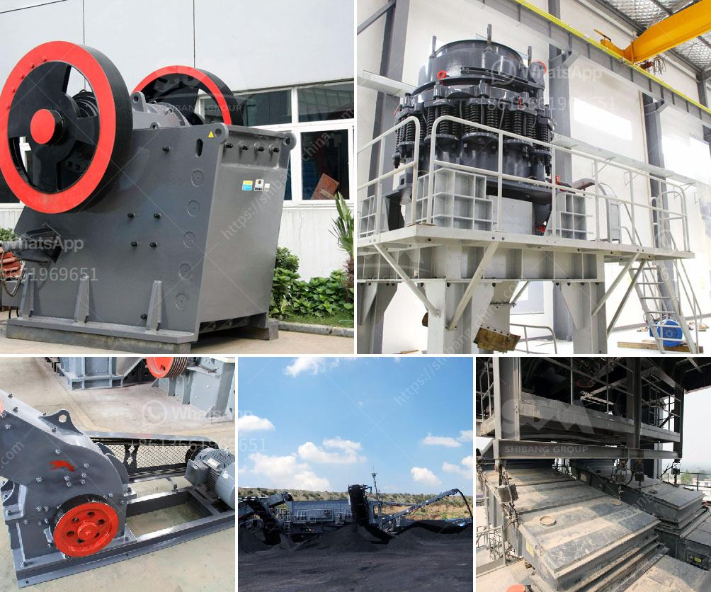

<h3>What are the machines used to mine bauxite?</h3>
Bauxite is a mineral that is typically extracted through open-pit mining, which involves removing the topsoil covering the bauxite ore deposits. This process involves the use of heavy machinery to facilitate the extraction of bauxite, a common ore which is refined to produce aluminum products. In this article, we will explore the various machines used in the mining process of bauxite.

1. Excavators: Excavators are essential machines used in mining bauxite. These massive machines, equipped with buckets or shovels, are responsible for removing the overburden or the topsoil covering the bauxite deposit. With their immense power and capabilities, excavators are capable of efficiently removing thousands of cubic meters of material in a single cycle.

2. Haul trucks: Once the overburden has been removed, haul trucks are used to transport the extracted bauxite from the mining site to the processing plants or stockpiles. These trucks are designed to carry heavy loads and have a high capacity to transport the bauxite safely and efficiently over long distances.

3. Crushers: Bauxite is a rock composed mainly of aluminum oxide and other minerals. To extract aluminum, the bauxite ore is first crushed, often using jaw crushers, and then further refined through various purification processes. The primary purpose of crushing is to reduce the size of the bauxite particles to facilitate easier extraction.

4. Conveyors: Conveyors are used to transport the crushed bauxite from the crushers to the processing plants or stockpiles. They are crucial in ensuring a continuous and reliable flow of material, minimizing downtime and optimizing the overall efficiency of the mining operation.

5. Grinders: Once the bauxite has been crushed and transported, it undergoes grinding to attain the desired particle size. Grinding bauxite into a fine powder is essential for further processing into aluminum products. Grinders, often in the form of ball mills, are used to grind the bauxite particles into a powder form. This powder can then be processed into aluminum through various refining processes.

6. Washers and separators: Bauxite often contains impurities such as clay, silica, and other minerals. To remove these impurities and improve the quality of the bauxite, washers and separators are used. Washers generally employ a series of water jets and screens to separate the impurities from the bauxite ore, while separators use different physical properties to separate the bauxite from the impurities.

In conclusion, mining bauxite requires the use of various heavy machinery and equipment to extract, transport, and refine the ore. Excavators, haul trucks, crushers, conveyors, grinders, washers, and separators are some of the primary machines used in the mining process. Each machine plays a vital role in ensuring the efficient extraction and processing of bauxite to produce aluminum products.
<h3>Contact us</h3><ul><li><strong>Whatsapp:&nbsp;<a href="https://wa.me/8613661969651">+8613661969651</a></strong></li><li><a href="https://swt.shibang-china.com/?git&amp;zhl&amp;What are the machines used to mine bauxite"><strong>Online Service(chat now)</strong></a></li></ul><h3>Related</h3><ul><li><a href='What is the separation process in a vertical raw mill.md'>What is the separation process in a vertical raw mill?</a></li><li><a href='what are steps to wash iron sand？.md'>what are steps to wash iron sand？</a></li><li><a href='What are the different steps of chromite ore beneficiation .md'>What are the different steps of chromite ore beneficiation ?</a></li><li><a href='What equipment is needed for iron ore mines .md'>What equipment is needed for iron ore mines ?</a></li><li><a href='What kind of crushing equipment is needed to produce cement.md'>What kind of crushing equipment is needed to produce cement</a></li></ul>