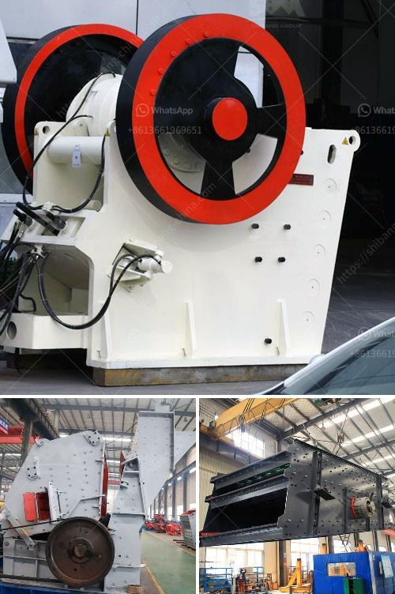

<h3>What are the methods of mining mica?</h3>
Mica, a mineral renowned for its stunning shimmer, is widely used in various industries, including cosmetics, electronics, and construction. The global demand for mica continues to rise, leading to an increase in mining operations. However, mining mica can be a challenging process due to its complex geology and the risks involved. In this article, we will explore some of the methods employed in mining mica.

Open-pit mining is one of the most common methods used to extract mica. In this technique, the overlying soil or rock layer is first removed to access the mica deposit beneath the surface. Bulldozers, excavators, and other heavy machinery are typically used to carry out the excavation process. The extracted mica is then sorted and processed to separate the desired mineral from impurities and other unwanted materials.

Underground mining is another method employed to mine mica. This method is typically used when the mica deposit is located at a depth that makes surface mining impractical or less economical. In underground mining, tunnels or shafts are created to access the mineral-bearing veins. Miners may use tools such as drills, explosives, and machinery to excavate the mica ores safely. The extracted mica is then transported to the surface for further processing.

Hydraulic mining, also known as sluicing, is a mining method commonly used to extract mica from stream beds and other water bodies. High-pressure water jets are directed at the mineral deposits, causing the mica to dislodge and flow along with the water. As the mica-rich water is collected in settling ponds or tanks, the mica particles separate from the water due to their relatively higher density. Further processing is then carried out to refine and purify the mica.

Strip mining is often used for extracting mica deposits that are situated close to the Earth's surface in large, horizontal beds or layers. This method involves removing the overlying soil and rock layers, referred to as overburden, to expose the mica-bearing ores. The overburden is typically transported to nearby disposal areas, while the extracted mica is collected and processed.

It is important to note that mining mica can have negative environmental and social impacts if not carried out responsibly. Some areas where mica mining occurs face issues such as deforestation, land degradation, water pollution, and hazardous working conditions. However, there are initiatives to promote responsible mining practices, transparency, and ethical sourcing to minimize the adverse effects and ensure sustainability throughout the mining process.

In conclusion, mining mica involves various methods depending on factors such as the depth of the deposit and its location. Open-pit mining, underground mining, hydraulic mining, and strip mining are some of the techniques used to extract this valuable mineral. It is crucial that mining activities are conducted responsibly to mitigate the environmental and social impacts associated with mica mining and to promote a sustainable and ethical approach within the industry.
<h3>Contact us</h3><ul><li><strong>Whatsapp:&nbsp;<a href="https://wa.me/8613661969651">+8613661969651</a></strong></li><li><a href="https://swt.shibang-china.com/?git&amp;zhl&amp;What are the methods of mining mica"><strong>Online Service(chat now)</strong></a></li></ul><h3>Related</h3><ul><li><a href='What are the characteristics of bauxite ore and how to crush it.md'>What are the characteristics of bauxite ore and how to crush it?</a></li><li><a href='What is belt conveyor in gold mining.md'>What is belt conveyor in gold mining?</a></li><li><a href='What is the best concrete crusher to make gravel.md'>What is the best concrete crusher to make gravel?</a></li><li><a href='when pulverizing coal what is a crusher use for？.md'>when pulverizing coal what is a crusher use for？</a></li><li><a href='What is the aggregate crusher.md'>What is the aggregate crusher?</a></li></ul>