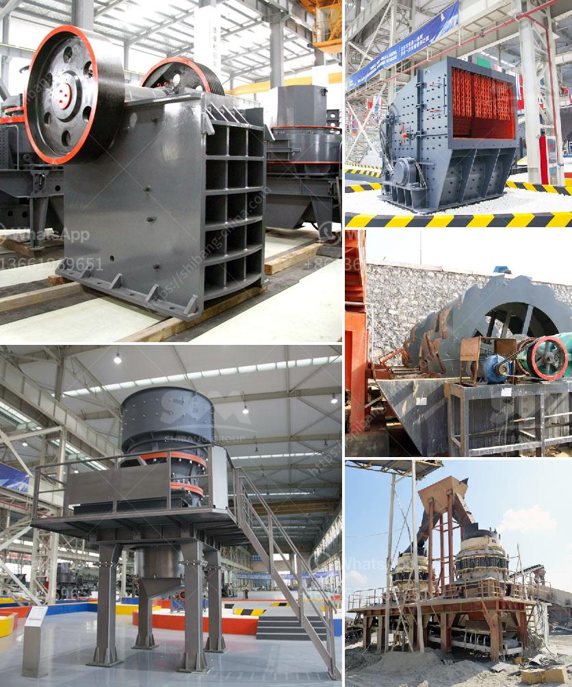

<h3>What are the mining processes of copper?</h3>
Copper, one of the most widely used metals in the world, is extracted from various sources through the process of mining. The mining processes of copper involve a series of steps that yield impressive quantities of the metal, making it an essential component in many industries.

The first step in the mining of copper involves drilling and blasting. This process is carried out meticulously to ensure the safety of the workers and to properly fragment the rock for easy extraction. Once the blast has been set off, the broken rocks are then hauled away using large trucks, creating space for further mining operations.

The next step in the process is crushing the mined rocks into smaller pieces, typically through the use of a primary crusher. This reduces the size of the material, making it more manageable and suitable for further processing. The crushed material is then conveyed to a secondary crusher for further reduction in size.

Once the copper-bearing material has been crushed, it is then ground into a fine powder. This process, known as milling, involves the use of large rotating mills that contain grinding media such as steel balls. As the materials collide with one another and the grinding media, the copper ore is broken down into smaller particles.

After milling, the powdered copper ore is subjected to a process called flotation. The purpose of flotation is to separate the copper minerals from the gangue, or waste materials. In this process, chemicals known as collectors are added to the slurry, which attach to the copper minerals, enabling them to float to the surface.

The resulting concentrate, which contains a high percentage of copper, is then sent to a smelter. Smelting involves heating the concentrate to extremely high temperatures, around 1200-1300 degrees Celsius. At these temperatures, the copper minerals are melted and separated from the impurities and waste materials. The impurities, known as slag, float to the top and are skimmed off, leaving behind the pure copper.

After smelting, the molten copper is poured into molds, where it solidifies into ingots or other desired shapes. These copper products can then be further processed into various forms, including wire, sheets, pipes, and countless other applications.

It should be noted that mining processes can vary depending on the type of copper deposit being exploited. For example, open-pit mining and underground mining are two common methods used to extract copper. In open-pit mining, a large pit is created where the copper ore is accessed and extracted. In underground mining, tunnels are dug deep into the earth to reach the copper deposits.

In conclusion, the mining processes of copper involve a series of steps that transform raw copper ore into the metal that is widely used in various industries. From drilling and blasting to crushing, milling, flotation, smelting, and finally casting, these processes play a vital role in extracting copper and meeting the growing demand for this valuable metal.
<h3>Contact us</h3><ul><li><strong>Whatsapp:&nbsp;<a href="https://wa.me/8613661969651">+8613661969651</a></strong></li><li><a href="https://swt.shibang-china.com/?git&amp;zhl&amp;What are the mining processes of copper"><strong>Online Service(chat now)</strong></a></li></ul><h3>Related</h3><ul><li><a href='what jaw crushers speed rpm should do.md'>what jaw crushers speed rpm should do</a></li><li><a href='what aspects influence stone crusher efficiency.md'>what aspects influence stone crusher efficiency</a></li><li><a href='What are the characteristics of bauxite ore and how to crush it.md'>What are the characteristics of bauxite ore and how to crush it?</a></li><li><a href='What is wet process cement.md'>What is wet process cement?</a></li><li><a href='What is the best granite crusher machinery.md'>What is the best granite crusher machinery?</a></li></ul>