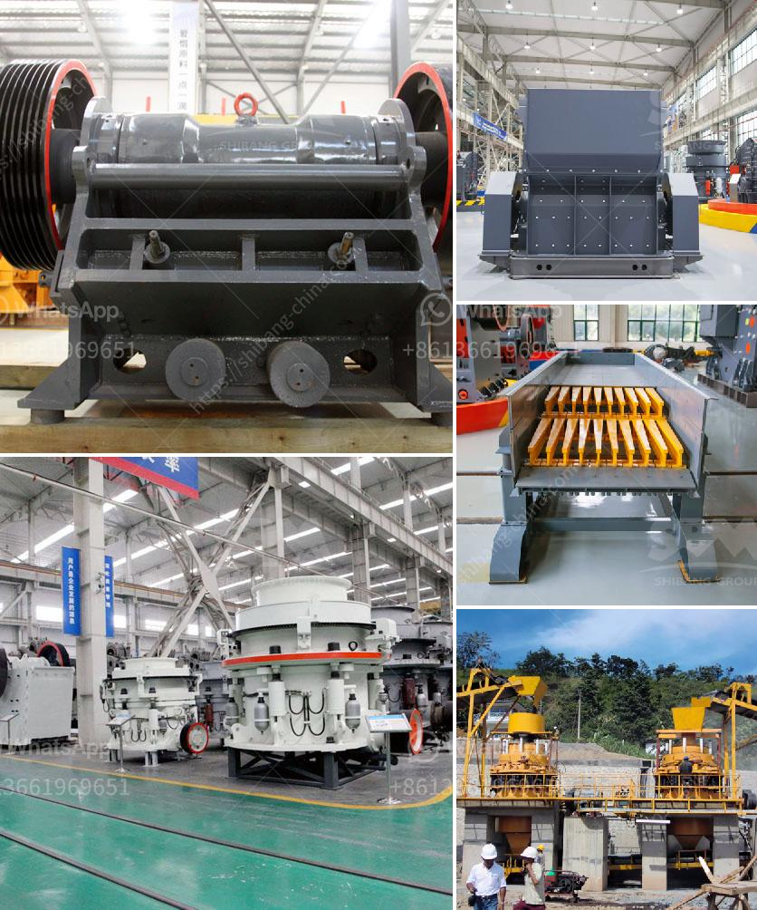

<h3>What are the most common expenses in crushing plant project?</h3>
A crushing plant project is an extensive undertaking that requires significant investment in terms of time, labor, and finances. While it offers the potential for enormous returns in terms of revenue and operational efficiency, it is crucial to be aware of the most common expenses incurred in such a project to ensure that it remains within budget and delivers the desired results.

1. Equipment: The primary expense in a crushing plant project is the cost of equipment. Purchasing high-quality, reliable, and durable crushers, screens, conveyors, and other crushing equipment can be a significant investment, but it ensures the efficiency and productivity of the plant.

2. Labor: Skilled labor is another significant expense in a crushing plant project. Hiring experienced professionals such as operators, mechanics, and electricians is crucial for the smooth operation and maintenance of the plant. Contractors or employees with specialized knowledge and skillsets might also be required for specific tasks.

3. Energy and fuel: Operating a crushing plant requires a constant supply of energy. This includes electricity for powering the various equipment and fuel for operating generators or operating mobile crushing units. The cost of energy and fuel can vary depending on factors such as location, fuel prices, and the size of the plant.

4. Maintenance and repairs: To ensure the longevity and optimal functioning of the crushing plant, regular maintenance and repairs are essential. This includes routine inspections, equipment servicing, replacing worn-out parts, and addressing any unexpected breakdowns or malfunctions. Budgeting for maintenance and repair expenses is crucial to avoid costly downtime and ensure maximum productivity.

5. Site preparation and infrastructure: Before the actual crushing plant installation, site preparation and infrastructure development are necessary. This includes clearing the land, building access roads, establishing power and water connections, and setting up the necessary infrastructure such as storage areas and workshops. These expenses can significantly impact the overall project budget.

6. Permitting and legal requirements: Depending on the jurisdiction, obtaining the necessary permits and complying with legal requirements can be a time-consuming and costly process. This includes environmental permits, operational licenses, safety inspections, and compliance with local regulations. Failing to budget for these expenses can result in delays and potential legal issues.

7. Transportation and logistics: The cost of transporting equipment, materials, and finished products to and from the crushing plant can be substantial. It is essential to consider the distance, mode of transportation, fuel costs, and any associated fees or permits required for transporting heavy machinery or hazardous materials.

8. Consumables and spare parts: Consumables such as wear parts for crushers, screens, and conveyors, as well as lubricants, hydraulic fluids, and filters, are recurring expenses in a crushing plant project. Budgeting for the regular replacement of these items is crucial to maintain optimal machine performance and avoid unexpected breakdowns.

In conclusion, a crushing plant project involves various expenses that must be carefully considered and budgeted for. From acquiring the necessary equipment to maintaining it, managing labor costs, and ensuring compliance with legal requirements, every aspect demands meticulous planning. By being aware of the most common expenses, project owners can set realistic budgets and ensure the successful completion of their crushing plant project.
<h3>Contact us</h3><ul><li><strong>Whatsapp:&nbsp;<a href="https://wa.me/8613661969651">+8613661969651</a></strong></li><li><a href="https://swt.shibang-china.com/?git&amp;zhl&amp;What are the most common expenses in crushing plant project"><strong>Online Service(chat now)</strong></a></li></ul><h3>Related</h3><ul><li><a href='What are the parts of ball mill internal structure.md'>What are the parts of ball mill internal structure?</a></li><li><a href='What equipment to extract iron ore.md'>What equipment to extract iron ore?</a></li><li><a href='what are the applications of small portable crusher.md'>what are the applications of small portable crusher?</a></li><li><a href='What is wet process cement.md'>What is wet process cement?</a></li><li><a href='What kind of crushing machinery is used to mine marble ore.md'>What kind of crushing machinery is used to mine marble ore</a></li></ul>