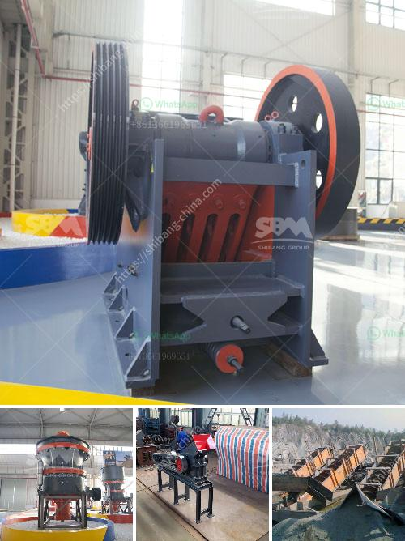

<h3>What are the ore and vein minerals in coal mines ?</h3>
Coal, the primary source of energy in many parts of the world, is often associated with other minerals. These minerals, known as ore and vein minerals, are commonly found in coal mines. Understanding the presence and characteristics of these minerals is crucial for both miners and scientists, as they can influence the mining process and provide valuable insights into the geological history of coal deposits.

Several ore and vein minerals can be found in coal mines, each with its unique properties and origins. Some of the most common minerals encountered in coal mines are pyrite, marcasite, calcite, siderite, quartz, and clay minerals. Let's take a closer look at each of these minerals and their significance.

Pyrite and marcasite are iron sulfide minerals commonly found in coal. Their presence in coal mines can pose serious issues since they often react with oxygen and water to form sulfuric acid. This process, known as acid mine drainage, can lead to water pollution, damaging both the environment and human health.

Calcite and siderite are carbonate minerals that occur as veins or concretions in coal seams. They are often precipitated from groundwater and can provide valuable information about the conditions under which the coal deposits formed. Calcite, in particular, can affect the coal's quality as it leads to impurities and decreased calorific value.

Quartz, a mineral composed of silicon dioxide, is abundantly present in coal mines. It has no direct impact on coal mining operations but can serve as an indicator of sedimentary environments. The presence of high quartz content suggests a sandy or silty origin for the coal, while low quartz content indicates a more clay-rich environment.

Clay minerals, such as kaolinite and illite, are commonly found in association with coal seams. They originate from the weathering and alteration of the surrounding rocks and can affect the coal's physical properties. Clay minerals can increase the coal's plasticity, making it more prone to swelling and clogging in the mining process.

Understanding the distribution and concentration of these minerals within coal seams is essential for efficient and safe mining operations. Through geological exploration and sampling, miners can identify areas with high concentrations of valuable minerals. This knowledge can help optimize the extraction process, minimizing waste production and maximizing economic returns.

Furthermore, the presence of ore and vein minerals can provide valuable insights into the geological history of coal deposits. By studying the composition and characteristics of these minerals, scientists can infer the conditions under which the coal was formed. This information aids in the understanding of paleoenvironments, depositional processes, and geological changes over time.

In conclusion, coal mines are not only rich in coal but also host a variety of ore and vein minerals. Pyrite, marcasite, calcite, siderite, quartz, and clay minerals are commonly encountered in coal mines. Their presence can have significant impacts on mining operations, water pollution, and coal quality. At the same time, these minerals offer valuable insights into the geological history of coal deposits and aid in optimizing mining processes. Safely extracting coal while considering the ore and vein minerals is crucial for both the economic viability of the mine and environmental conservation.
<h3>Contact us</h3><ul><li><strong>Whatsapp:&nbsp;<a href="https://wa.me/8613661969651">+8613661969651</a></strong></li><li><a href="https://swt.shibang-china.com/?git&amp;zhl&amp;What are the ore and vein minerals in coal mines "><strong>Online Service(chat now)</strong></a></li></ul><h3>Related</h3><ul><li><a href='What is barite and how is it mined.md'>What is barite and how is it mined?</a></li><li><a href='What is the cost of quarry stones in Kenya.md'>What is the cost of quarry stones in Kenya?</a></li><li><a href='What kind of crusher crushes basalt best.md'>What kind of crusher crushes basalt best?</a></li><li><a href='What are the methods of mining mica.md'>What are the methods of mining mica?</a></li><li><a href='What is the process of mining and extraction of gold and molybdenum.md'>What is the process of mining and extraction of gold and molybdenum?</a></li></ul>