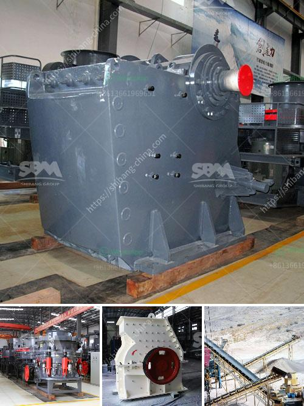

<h3>What are the parts of ball mill internal structure?</h3>
A ball mill is a type of grinding mill which purpose is similar to the sag mill or other mining crushers. These machines are used to grind or mix metals or raw materials for further processing. The internal structure of the ball mill can be divided into five parts: cylinder, shell, feed and discharge device, drive system, and bearing support.

Cylinder: The cylinder is the main component of the ball mill. It is composed of the machine's frame, ends, and liner plates. The cylinder is filled with grinding media (steel balls or rods). The grinding media and the particles to be broken collide and grind against the cylinder wall, resulting in the liberation of the required particles.

Shell: The shell is the external component of the ball mill. It provides protection to the cylinder and maintains its shape. The shell is usually made of metal, but it can also be lined with rubber or other materials for better resistance to abrasion.

Feed and Discharge Device: The feed and discharge devices are located at the ends of the ball mill. The feed device regulates the flow of materials into the mill, while the discharge device controls the discharge of the ground particles from the mill. These devices can be as simple as a grated screen or as complex as a spiral conveyor.

Drive System: The drive system of the ball mill is responsible for rotating the mill at a desired speed. It consists of a motor, a gearbox, and sometimes an auxiliary drive unit. The motor transmits power to the gearbox, which then drives the mill. The gearbox can either be a spur type or a helical type, depending on the requirements of the mill and the desired rotational speed.

Bearing Support: The bearing support is an important part of the ball mill's internal structure. It provides support for the rotating parts of the mill, the motor, and the gearbox. The bearing support ensures smooth rotation and minimal friction between the moving parts.

In conclusion, the internal structure of the ball mill is relatively complex, consisting of five main components: cylinder, shell, feed and discharge device, drive system, and bearing support. These components work together to grind or mix the materials efficiently, resulting in the desired final product. Understanding the internal structure of the ball mill is essential for successful operation and efficient grinding or mixing processes.
<h3>Contact us</h3><ul><li><strong>Whatsapp:&nbsp;<a href="https://wa.me/8613661969651">+8613661969651</a></strong></li><li><a href="https://swt.shibang-china.com/?git&amp;zhl&amp;What are the parts of ball mill internal structure"><strong>Online Service(chat now)</strong></a></li></ul><h3>Related</h3><ul><li><a href='What is the cost of a quarry crusher for 500 tons.md'>What is the cost of a quarry crusher for 500 tons?</a></li><li><a href='what type of crusher is best for concrete crushing.md'>what type of crusher is best for concrete crushing?</a></li><li><a href='What is the difference between impact crusher and jaw crusher.md'>What is the difference between impact crusher and jaw crusher?</a></li><li><a href='What is roller crusher.md'>What is roller crusher?</a></li><li><a href='what does a vibrating feeder do.md'>what does a vibrating feeder do?</a></li></ul>