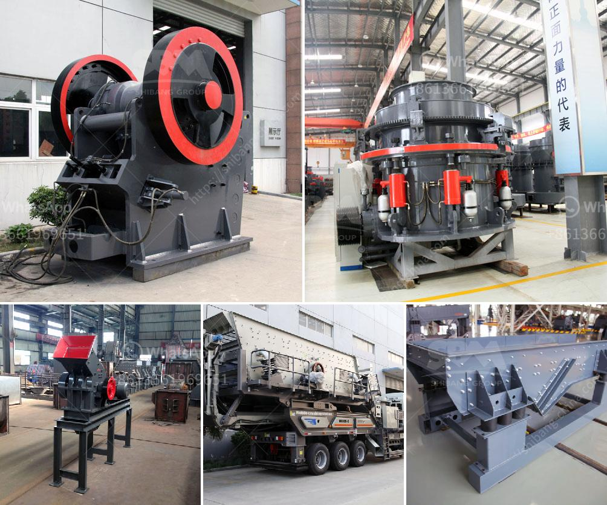

<h3>What are the ponent of nigerian mining industry?</h3>
The mining industry in Nigeria is considered to be one of the key sectors driving the country's economic growth. In recent years, this industry has witnessed tremendous development, with investments pouring in from both local and foreign entities. The Nigerian mining industry comprises various components, which are critical to the country's economic development and industrialization. Let's take a closer look at these components.

First and foremost, the Nigerian mining industry is dominated by the exploration and extraction of solid minerals, such as limestone, granite, and coal. These minerals are essential raw materials for the construction, infrastructure, and energy sectors, thus making mining a crucial aspect of Nigeria's economic diversification plans.

Another component of the Nigerian mining industry is the processing and beneficiation of these minerals. After extraction, raw materials need to be processed to enhance their quality and value. This involves crushing, grinding, and refining the minerals to obtain usable products that can be utilized in various industries. For example, coal can be processed into coke for the production of steel, while limestone can be refined to produce cement.

In addition to solid minerals, the Nigerian mining industry also encompasses the exploration and production of precious metals and gemstones. Nigeria is blessed with abundant mineral resources, including gold, tin, and gemstones like sapphire, topaz, and emerald. These resources have vast potential and can be harnessed to generate revenue and create employment opportunities.

Furthermore, the Nigerian mining industry includes the manufacturing and supply of mining equipment and machinery. This component plays a pivotal role in ensuring efficient and sustainable mining operations. Companies that specialize in manufacturing mining equipment provide the necessary machinery, tools, and technology needed for exploration, extraction, processing, and transportation of minerals.

The Nigerian mining industry also involves the provision of various support services. These services include geological surveys, data analysis, and mapping to identify potential mineral deposits and determine their commercial viability. Additionally, mining companies require engineering and consulting services for project management, environmental impact assessments, and financial modeling. These support services are essential for effective and sustainable mining operations.

Lastly, the Nigerian mining industry comprises regulatory agencies and institutions responsible for overseeing and managing mining activities. These regulatory bodies ensure compliance with environmental and safety regulations, issue licenses and permits for mining operations, and develop policies to attract investments and promote sustainable mining practices. The key regulatory bodies in Nigeria's mining industry include the Ministry of Mines and Steel Development, the Nigerian Geological Survey Agency, and the Mining Cadastre Office.

In conclusion, the Nigerian mining industry is a multi-faceted sector comprised of various components. From the exploration and extraction of solid minerals to their processing and beneficiation, as well as the manufacturing and supply of mining equipment, each component plays a crucial role in driving the industry's growth and contributing to Nigeria's overall economic development. Furthermore, support services and regulatory institutions ensure the industry operates efficiently, sustainably, and in compliance with relevant laws and regulations. With continued investments and strategic policies, the Nigerian mining industry has the potential to unlock immense economic opportunities for the country.
<h3>Contact us</h3><ul><li><strong>Whatsapp:&nbsp;<a href="https://wa.me/8613661969651">+8613661969651</a></strong></li><li><a href="https://swt.shibang-china.com/?git&amp;zhl&amp;What are the ponent of nigerian mining industry"><strong>Online Service(chat now)</strong></a></li></ul><h3>Related</h3><ul><li><a href='what is throughput for a cement grinding ball mill？.md'>what is throughput for a cement grinding ball mill？</a></li><li><a href='what are some of the equipments used in mining industry.md'>what are some of the equipments used in mining industry?</a></li><li><a href='What equipment to extract iron ore.md'>What equipment to extract iron ore?</a></li><li><a href='What machine is used to crush copper ore.md'>What machine is used to crush copper ore?</a></li><li><a href='What is the cost of limestone crushing process .md'>What is the cost of limestone crushing process ?</a></li></ul>