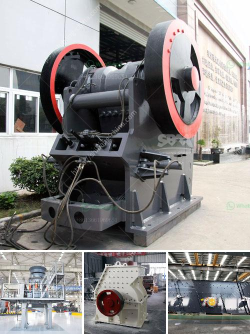

<h3>What are the processes of iron ore beneficiation?</h3>
Iron ore beneficiation is a multi-stage process that raw iron ore undergoes to purify it prior to the process of smelting, which involves melting the ore to remove the metal content. The process of iron ore beneficiation has two complementary goals and these define the methods used to refine it.

The iron content in the ore needs to be increased and gangue, which is native rock and minerals of lesser value within the ore itself, must be separated out. Methods such as screening, crushing, and grinding of iron ore are often used in various ways to purify it, along with several stages of magnetic separation.

The iron ore industry classifies the material by the concentration of the metal that is present after iron ore beneficiation has been completed. High-grade iron ore must have a concentration of 65% iron or higher, and medium grade of 62% to 65%. Low-grade iron ore includes all mixtures below 62% iron concentration, which are not considered to be viable types of ore for use in metallurgy. Several different types of natural iron ore exist, but the two most common types used for metal refining are hematite, Fe2O3, which is usually 70% iron, and magnetite, Fe3O4, which is 72% iron.

Once iron ore goes through some processing, the molten steel obtained from the furnaces are passed through casters and transformed into slabs, billets, and blooms. They form the primary steel products which can be processed into various finished products using cold and hot rolling procedures. Usually, the slabs are rolled to form flat finished products, and the blooms are rolled to reduce larger sections to finished round or square products.

The beneficiation process can be defined as a treatment process of ore which results in a more concentrated form of the product. It is often used in the preparation of iron ore for smelting. This is an essential process as it helps improve the yield from a deposit of ore, thereby increasing the potential profits that can be obtained from the ore and allowing mining companies to increase the overall profitability of a mine.

Iron ore beneficiation also plays a significant role in aligning plant throughput and concentrate quality with the downstream smelting operation. This has led to the development of several iron ore beneficiation technologies, such as potent jigging systems, magnetic separation, spiral chute, and wash water systems. Screening and crushing of iron ore lumps is another process that generates fines known as fines because they're too small to be used in lump form for blast furnaces and sponge iron plants.

Depending upon the origin and mineralogical characteristics of the ore, beneficiation methods vary from simple crushing and screening to complex concentration processes. Iron ore beneficiation process typically involves mixing flotation, high-intensity magnetic separation, electrostatic separation, re-election, and other procedures to gradually separate the iron from the gangue particles.

The key purpose of beneficiation plants is to remove the impurities from the ore and to improve the quality of iron ore thereby increasing the iron content of the raw ore. The beneficiation process also contributes to pollution control and lowers the energy consumption in the furnace. Most commonly, the beneficiation process is used for laterite ores. The ores are first dried and then crushed, after which the iron is separated from other elements, including phosphorus, through the use of gravity separation techniques.
<h3>Contact us</h3><ul><li><strong>Whatsapp:&nbsp;<a href="https://wa.me/8613661969651">+8613661969651</a></strong></li><li><a href="https://swt.shibang-china.com/?git&amp;zhl&amp;What are the processes of iron ore beneficiation"><strong>Online Service(chat now)</strong></a></li></ul><h3>Related</h3><ul><li><a href='What is dry screening iron ore.md'>What is dry screening iron ore?</a></li><li><a href='What machine need to be used for rock mining industry.md'>What machine need to be used for rock mining industry?</a></li><li><a href='What equipment is used in iron ore crusher.md'>What equipment is used in iron ore crusher?</a></li><li><a href='What is a belt conveyor control system.md'>What is a belt conveyor control system?</a></li><li><a href='Which industries depend on coal.md'>Which industries depend on coal?</a></li></ul>