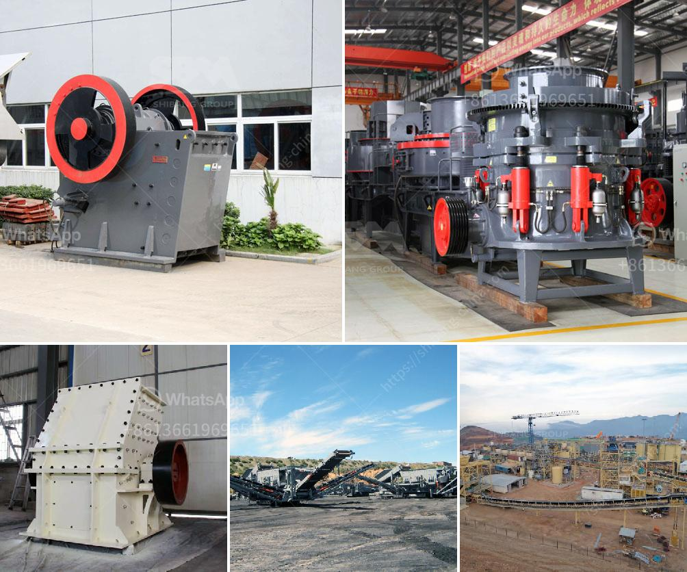

<h3>What are the production and uses of crushed rock aggregates?</h3>
Crushed rock aggregates, also known as aggregate materials, are a vital component in various construction and landscaping projects. These aggregates are primarily used in the production of concrete, asphalt, and road base materials. With a multitude of applications, crushed rock aggregates are widely used in the construction industry for laying foundations, precast concrete blocks, drainage surfaces, and other related uses.

The production process of crushed rock aggregates starts with the extraction of raw materials from the earth's surface. A large-scale drilling and blasting process is employed to extract the rock formations from the quarry. Once extracted, the rocks are then crushed into smaller pieces, usually through a secondary or tertiary crushing stage, to achieve the desired size and shape. Different crushers and screening equipment are used depending on the end product's specifications.

Crushed rock aggregates are commonly categorized into two types based on their sizes: coarse aggregates and fine aggregates. Coarse aggregates are larger stones, typically measuring between 4.75mm and 20mm in size. They are primarily used in the construction of driveways, foundations, and road surfaces, providing stability and strength to these structures. Fine aggregates, on the other hand, are much smaller and typically range from 0.075mm to 4.75mm in size. They are mainly used to create sand-like materials for concrete production and other applications that require a smoother finish.

One of the primary uses of crushed rock aggregates is in concrete production. Aggregates make up approximately 60-75% of the volume of concrete and play a crucial role in its strength and durability. The combination of crushed rock aggregates, cement, and water creates a strong and solid material that can withstand heavy loads and adverse weather conditions. Crushed rock aggregates also improve the workability of concrete, making it easier to mix and transport.

Another common use of crushed rock aggregates is in the production of asphalt. Asphalt is a composite material used for paving roads, parking lots, and other surfaces. The aggregates provide stability and strength to the asphalt mixture, ensuring its durability and longevity. Additionally, crushed rock aggregates enhance the surface texture of asphalt, providing better traction and reducing the risk of accidents.

Crushed rock aggregates are also used in the construction of road bases and sub-bases. These materials provide a stable foundation for the roads, offering support and preventing the deformation caused by heavy traffic. Additionally, crushed rock aggregates improve drainage and reduce the risk of water-related damage, such as potholes and cracks.

In landscaping and gardening, crushed rock aggregates are often used as decorative elements. They can be used to create pathways, driveways, or as a base material for patios and retaining walls. Crushed rock aggregates come in various colors and sizes, allowing homeowners and designers to create visually appealing outdoor spaces.

In conclusion, crushed rock aggregates are versatile materials widely used in the construction industry. They play a vital role in the production of concrete, asphalt, road base materials, and other construction applications. From providing strength and stability to enhancing the aesthetics of landscapes, crushed rock aggregates are an essential component in various projects, contributing to the development and construction of infrastructure worldwide.
<h3>Contact us</h3><ul><li><strong>Whatsapp:&nbsp;<a href="https://wa.me/8613661969651">+8613661969651</a></strong></li><li><a href="https://swt.shibang-china.com/?git&amp;zhl&amp;What are the production and uses of crushed rock aggregates"><strong>Online Service(chat now)</strong></a></li></ul><h3>Related</h3><ul><li><a href='What is the machine used in hard rock gold mining.md'>What is the machine used in hard rock gold mining?</a></li><li><a href='What beneficiation method is used for iron ore.md'>What beneficiation method is used for iron ore?</a></li><li><a href='What is roller crusher.md'>What is roller crusher?</a></li><li><a href='what aspects influence stone crusher efficiency.md'>what aspects influence stone crusher efficiency</a></li><li><a href='What are machines used for mining iron ore.md'>What are machines used for mining iron ore?</a></li></ul>