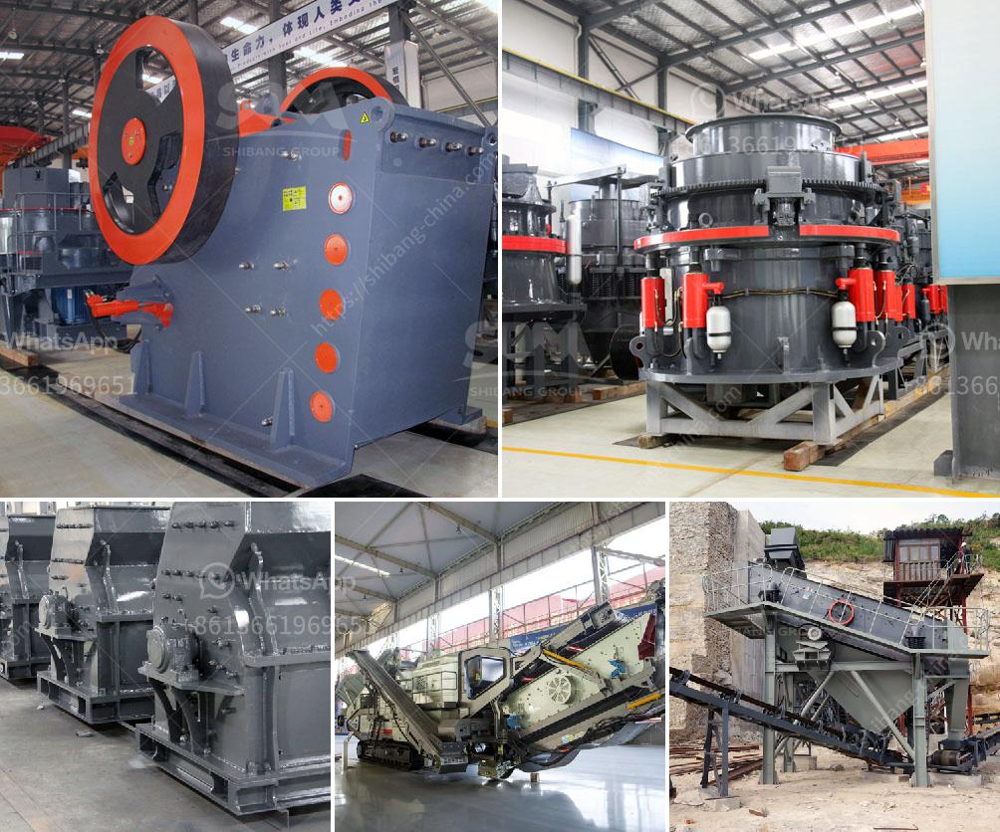

<h3>What are the raw materials used in cement production?</h3>
Cement is a crucial component in construction and infrastructure development. It is a binding agent that hardens and sets to hold different materials together, such as bricks, stones, and concrete blocks. Before delving into the raw materials used in cement production, it is essential to understand the manufacturing process.

The primary process of manufacturing cement involves quarrying limestone, which is then crushed and heated in a rotating kiln at temperatures reaching around 2,700 degrees Fahrenheit. This process, known as calcination, converts limestone into calcium oxide, or lime. The resulting lime is combined with other materials to create cement.

Raw materials used in cement production play a vital role in the final product's quality and characteristics. Let's explore some of the major raw materials used in cement manufacturing:

1. Limestone: Limestone is the primary raw material used in cement production. It is a sedimentary rock composed mainly of calcium carbonate. The presence of limestone determines the cement's chemical composition and influences its color and strength. The limestone is usually extracted through blasting from quarries.

2. Clay or Shale: Another essential raw material in cement manufacturing is clay or shale. Clay provides the required aluminosilicate component, which helps in binding the limestone particles together during the heating process. Shale, a type of sedimentary rock, is also used as a substitute for clay.

3. Silica: Silica, in the form of sand, is another crucial component in cement production. It provides strength and durability to the end product. Silica can be obtained from quarries or sand mines.

4. Iron Ore: Iron ore is used to provide the required amount of iron oxide, which gives cement its characteristic red color. It is mainly obtained from mines and can be processed to obtain iron oxide powder.

5. Gypsum: Gypsum is added to control the setting time of cement. It slows down the initial setting time and prevents flash setting, allowing ample time for workability. Gypsum is a byproduct of sulfur dioxide scrubbing from power plants and is widely available.

6. Fly Ash and Slag: Fly ash, a byproduct of coal combustion, and slag, a byproduct of metal smelting, can be used as supplementary materials in cement production. They improve the workability and durability of cement while reducing its environmental impact.

7. Additives: Various additives are mixed with the raw materials to enhance specific properties of the cement. These additives may include limestone powder, pozzolans (such as volcanic ash or silica fume), and other chemical admixtures.

In conclusion, cement production is a complex process that requires the use of various raw materials to achieve the desired physical and chemical properties. Limestone and clay provide the essential components, while silica, iron ore, gypsum, and various additives contribute to its overall quality. The proper selection and proportioning of these raw materials are crucial in producing high-quality cement that meets industry standards.
<h3>Contact us</h3><ul><li><strong>Whatsapp:&nbsp;<a href="https://wa.me/8613661969651">+8613661969651</a></strong></li><li><a href="https://swt.shibang-china.com/?git&amp;zhl&amp;What are the raw materials used in cement production"><strong>Online Service(chat now)</strong></a></li></ul><h3>Related</h3><ul><li><a href='what does a vibrating feeder do.md'>what does a vibrating feeder do?</a></li><li><a href='What equipment is used when sand mining.md'>What equipment is used when sand mining?</a></li><li><a href='What equipment and machinery are needed to mine marble.md'>What equipment and machinery are needed to mine marble?</a></li><li><a href='what are the applications of small portable crusher.md'>what are the applications of small portable crusher?</a></li><li><a href='What are the different steps of chromite ore beneficiation .md'>What are the different steps of chromite ore beneficiation ?</a></li></ul>