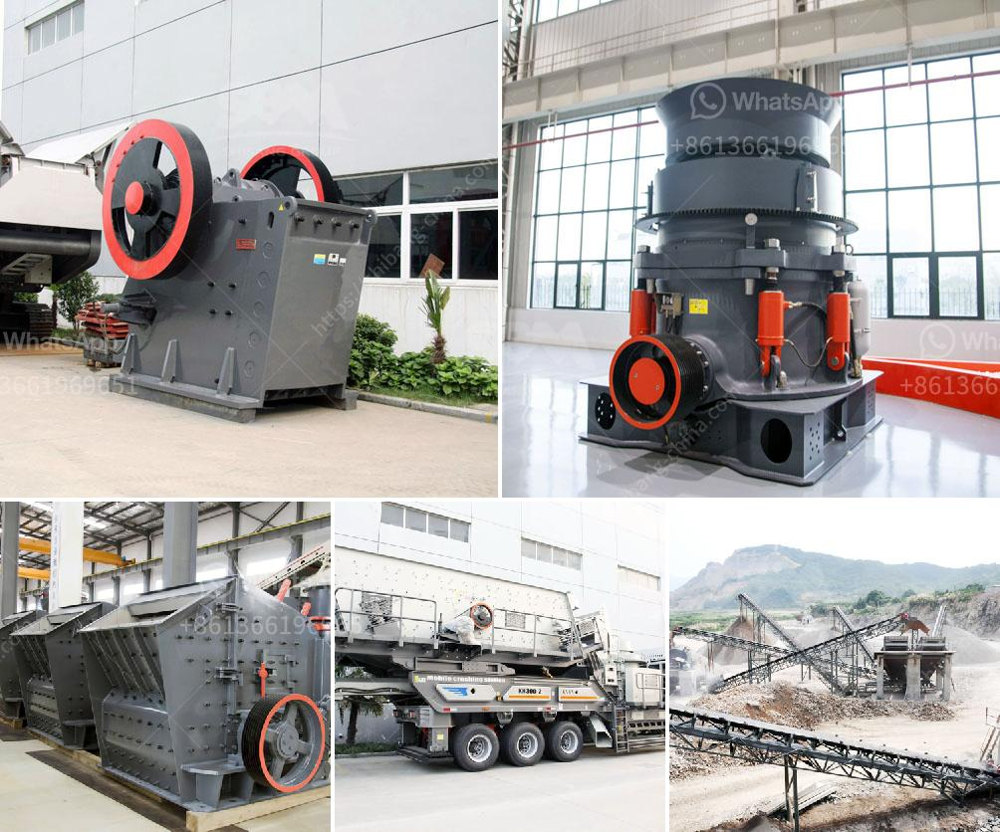

<h3>What are the wearing parts of grinding mill ?</h3>
A grinding mill is a crucial piece of machinery used to grind various materials into powder. These machines are used in a wide range of industries, including mining, construction, pharmaceuticals, food processing, and more. However, like any other mechanical equipment, grinding mills also have certain wearing parts that require regular maintenance to ensure their efficient functioning. In this article, we will explore the most common wearing parts of a grinding mill and the importance of their upkeep.

1. Grinding Rollers: Grinding rollers are one of the primary wearing parts of a grinding mill. These are the wheels that rotate and crush the material being ground. Due to constant contact with the material and the pressure exerted during the grinding process, the grinding rollers can wear out over time. Regular inspection and maintenance of these rollers are essential to prevent any decrease in their efficiency and to avoid costly repairs or replacements.

2. Grinding Ring: The grinding ring is another critical wearing part in a grinding mill. It is a circular track with multiple grooves or cavities where the grinding rollers roll and crush the material. Similar to the grinding rollers, the grinding ring can also wear out due to continuous grinding and contact with the material. Regular inspection and replacement of the grinding ring are important to maintain the mill's performance.

3. Classifier Blades: The classifier blades play a crucial role in separating the ground material into different sizes. These blades can wear out over time, leading to improper size distribution of the ground material. Regular inspection and sharpening or replacement of the classifier blades are necessary to ensure accurate separation and optimal grinding performance.

4. Grinding Media: Grinding mills often use various types of grinding media, such as steel balls or ceramic beads, to assist in the grinding process. These grinding media also experience wear and tear due to continuous grinding, resulting in a decrease in their efficiency. Regular inspection and replacement of grinding media are necessary to maintain the desired grinding efficiency and prevent any damage to the mill's internal components.

5. Bearings: Grinding mills have multiple bearings that support the rotating parts of the mill. These bearings can wear out over time due to the continuous rotation and load. Regular lubrication, inspection, and replacement of the bearings are crucial to prevent any breakdowns or damage to other parts of the grinding mill.

In conclusion, a grinding mill consists of several wearing parts that require regular maintenance and inspection to ensure its efficient operation. Grinding rollers, grinding rings, classifier blades, grinding media, and bearings are some of the most common wearing parts in a grinding mill. Regular upkeep and replacement of these parts are essential to maintain the desired grinding performance, prevent breakdowns, and avoid costly repairs or replacements. By paying attention to the maintenance of these wearing parts, grinding mills can operate smoothly and efficiently, contributing to the overall productivity of various industries in which they are utilized.
<h3>Contact us</h3><ul><li><strong>Whatsapp:&nbsp;<a href="https://wa.me/8613661969651">+8613661969651</a></strong></li><li><a href="https://swt.shibang-china.com/?git&amp;zhl&amp;What are the wearing parts of grinding mill "><strong>Online Service(chat now)</strong></a></li></ul><h3>Related</h3><ul><li><a href='What type of crushing equipment should copper mine choose.md'>What type of crushing equipment should copper mine choose?</a></li><li><a href='what type of pumps uesd in stone crusher？.md'>what type of pumps uesd in stone crusher？</a></li><li><a href='What are factors that will affect the output of a cement mill.md'>What are factors that will affect the output of a cement mill?</a></li><li><a href='What is the process of mining and extraction of gold and molybdenum.md'>What is the process of mining and extraction of gold and molybdenum?</a></li><li><a href='What are the characteristics of bauxite ore and how to crush it.md'>What are the characteristics of bauxite ore and how to crush it?</a></li></ul>