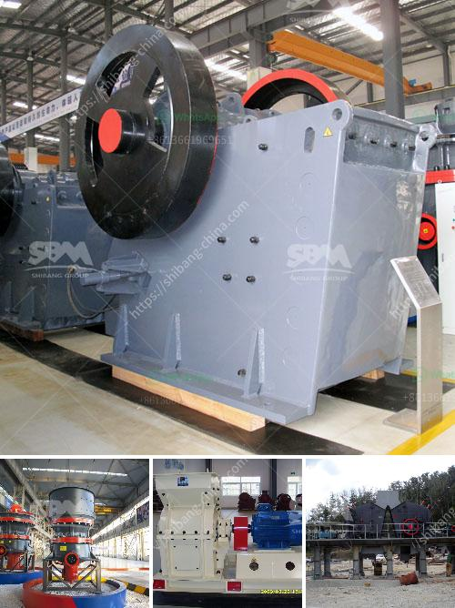

<h3>What beneficiation method is used for iron ore?</h3>
Iron ore is one of the important raw materials for the production of pig iron and steel in the iron and steel industry. There are many types of iron ore. According to the magnetic properties of the ore, it is mainly dividualled into strong magnetism and weak magnetism. In addition, according to the different processing of iron ore, it is dividualled into magnetite and hematite, which are the two main types of iron ore for beneficiation.

Beneficiation of iron ore refers to the process of removing impurities from iron ore. The commonly used beneficiation methods include gravity separation, magnetic separation, flotation separation, and chemical beneficiation. Gravity separation is utilized to separate coarse-grained iron ore and is also known as the jigging process. Magnetic separation is applied to remove magnetic impurities from iron ore, mainly including the strong magnetic minerals, such as magnetite, and weak magnetic minerals, such as ilmenite, hematite, etc. Flotation separation is mainly for removing the non-ferrous and non-magnetic gangue minerals, which is suitable for the beneficiation of fine grained and complex iron ore. Chemical beneficiation is applied based on the difference in the chemical properties of the minerals, such as the floatability or adsorbability of certain minerals in the ore.

Among these beneficiation methods, gravity separation and magnetic separation are the commonly used methods for iron ore beneficiation.

Gravity separation is a relatively simple and economical method for the beneficiation of iron ore. It uses the difference in the specific gravity of the minerals to achieve separation. In this process, the finely crushed ore is mixed with water and enters a jigging chamber. The ore particles with different densities settle in different layers according to the specific gravity, allowing the separation of the heavier iron ore particles from the lighter gangue particles. Gravity separation is effective for coarse-grained and medium-grained iron ores.

Magnetic separation is a process in which magnetic materials are attracted by an externally applied magnetic field. This method is mainly used for the separation of magnetite, which has strong magnetic properties. The crushed ore is passed through a magnetic separator, where the magnetic mineral particles are attracted to the magnetic drum or plate and are replaced by non-magnetic particles. This separation effectively removes impurities, such as alumina and silica, and increases the iron content of the ore.

In conclusion, the beneficiation of iron ore is crucial for the efficient utilization of resources and the production of high-quality iron and steel products. Different beneficiation methods are used depending on the characteristics of the ore. Gravity separation and magnetic separation are commonly used methods due to their simplicity, efficiency, and low cost. However, it is worth noting that the selection of the appropriate beneficiation method should be based on the specific requirements of the ore and the desired final product quality.
<h3>Contact us</h3><ul><li><strong>Whatsapp:&nbsp;<a href="https://wa.me/8613661969651">+8613661969651</a></strong></li><li><a href="https://swt.shibang-china.com/?git&amp;zhl&amp;What beneficiation method is used for iron ore"><strong>Online Service(chat now)</strong></a></li></ul><h3>Related</h3><ul><li><a href='How to choose a cone crusher for rock crushing？.md'>How to choose a cone crusher for rock crushing？</a></li><li><a href='What is the beneficiation of iron ore.md'>What is the beneficiation of iron ore?</a></li><li><a href='What equipment is used in iron ore crusher.md'>What equipment is used in iron ore crusher?</a></li><li><a href='What size equpment is used in big rock crushing crews.md'>What size equpment is used in big rock crushing crews?</a></li><li><a href='What is the difference between a quarry and a mine.md'>What is the difference between a quarry and a mine?</a></li></ul>