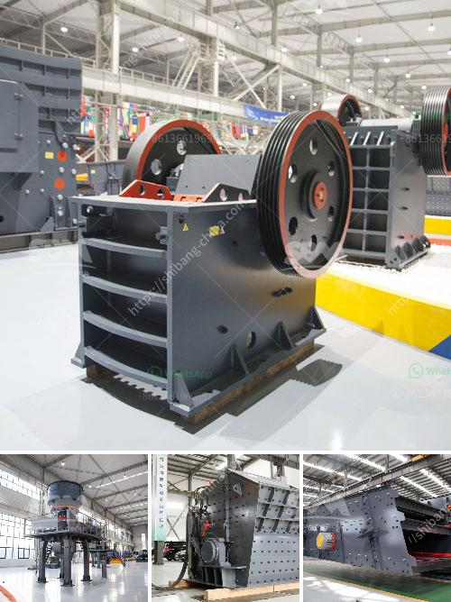

<h3>What can be used for basalt?</h3>
Basalt is a commonly occurring rock that is formed from volcanic activity. It is often found in areas where volcanic eruptions have occurred in the past, such as along the edges of tectonic plates or near hotspots. Basalt is a durable and versatile material that has a wide range of applications in various industries.

One of the most common uses for basalt is in construction. Its durability and strength make it an excellent choice for building materials such as concrete and asphalt. Basalt can be crushed into small aggregate sizes and used as a replacement for traditional forms of gravel or sand in these applications. The use of basalt in these construction materials helps to improve their strength and resistance to wear and tear.

Basalt can also be used as a decorative element in construction projects. Its dark, fine-grained appearance gives it a sleek and modern aesthetic that is popular in contemporary designs. Basalt is often polished and used as flooring or wall cladding material, adding an elegant touch to interiors and exteriors alike. Its natural beauty makes it a favored choice in high-end residential and commercial projects.

Another important application of basalt is in the manufacturing of fibers. Basalt fibers are made by melting crushed basalt rock at high temperatures and extruding it into fine strands. These fibers have excellent thermal resistance and strength properties, making them suitable for reinforcing materials in various industries. Basalt fibers are commonly used in construction, aerospace, automotive, and other sectors where high-performance materials are required.

Furthermore, basalt has proven to be an effective material for thermal insulation. Its low thermal conductivity, combined with its ability to withstand high temperatures, makes it an ideal material for insulating products. Basalt can be processed into batts or boards, which can be used for insulating walls, roofs, or even industrial equipment. The use of basalt in thermal insulation helps to reduce energy consumption, improve building efficiency, and create a more comfortable living or working environment.

In addition to its practical applications, basalt is also used in artistic and cultural pursuits. It has been used for centuries as a medium for sculpture and carving due to its workability and durability. Many ancient statues and monuments were carved from basalt, bearing witness to its lasting quality. Today, contemporary artists continue to explore the creative potential of basalt in various forms, showcasing its versatility as an artistic material.

In conclusion, basalt is a versatile and valuable resource that finds applications in a wide range of industries. Its strength, durability, and aesthetic appeal make it a preferred choice in construction, while its thermal resistance and insulating properties add value to various manufacturing processes. Basalt's artistic and cultural uses also highlight its longstanding presence in the world of art and sculpture. As technology continues to advance, new possibilities for utilizing basalt are likely to emerge, ensuring its relevance and significance in the years to come.
<h3>Contact us</h3><ul><li><strong>Whatsapp:&nbsp;<a href="https://wa.me/8613661969651">+8613661969651</a></strong></li><li><a href="https://swt.shibang-china.com/?git&amp;zhl&amp;What can be used for basalt"><strong>Online Service(chat now)</strong></a></li></ul><h3>Related</h3><ul><li><a href='What equipment is used to mine gold in Australia？.md'>What equipment is used to mine gold in Australia？</a></li><li><a href='What kind of crushing machinery is used to mine marble ore.md'>What kind of crushing machinery is used to mine marble ore</a></li><li><a href='What equipment is used in the cement process.md'>What equipment is used in the cement process?</a></li><li><a href='What is the optimal rotation speed for a ball mill.md'>What is the optimal rotation speed for a ball mill?</a></li><li><a href='What is the process of mining iron ore.md'>What is the process of mining iron ore?</a></li></ul>