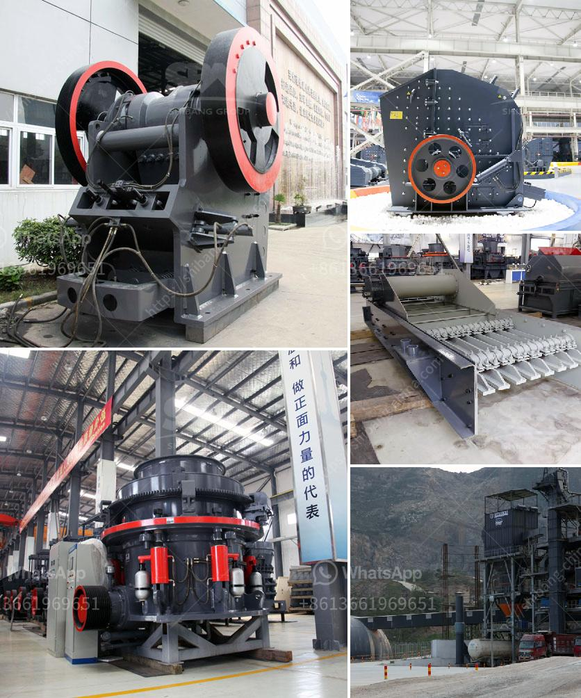

<h3>What causes the jaw crusher toggle plate to break?</h3>
The jaw crusher toggle plate is a crucial component that acts as a safety mechanism for the jaw crusher. It ensures that the two jaw plates are securely in place and will not move or break while the machine is in operation. While the jaw crusher toggle plate is designed to break and protect the machine parts, it is subjected to severe wearing and bending stresses caused by relentless crushing of hard and abrasive ores.

Unpredictable failures such as sudden fracture of the toggle plate are a challenge. Unfortunately, when one part of the jaw crusher fails, the entire machine is rendered useless. It is therefore important to ensure that the toggle plate is not only strong and durable but also resistant to wear and tear.

1. Unusually high load or shock load: Excessive load or shock load during the operation of the crusher is one of the main causes of premature failure of the toggle plate. The toggle plate is subjected to high stresses due to the crushing force, thus causing it to fracture.

2. Fatigue failure: The toggle plate is subjected to cyclic bending stresses when the jaw crusher is in operation. This can lead to cracks and a weakening of the steel structure, resulting in a fatigue failure.

3. Incorrect tooth profile: If the jaw plates are reversible--end for end--to utilize the complete life of the jaw plates, then there is a risk that the tooth profile will not be correct. This can cause premature failure when the crushing force is not distributed evenly across the toggle plate.

4. Improper maintenance: Lack of proper maintenance due to poor attention to detail can also cause the toggle plate to break. Insufficient lubrication, dirt accumulation, and failure to tighten the bolts properly are factors that can contribute to the failure of the toggle plate.

5. Material quality: The quality of the toggle plate is also important. A low-quality toggle plate will be prone to wear, and can easily break due to the high stress of crushing hard and abrasive ores. High-quality materials ensure durability and longevity.

To prevent the occurrence of toggle plate failures, it is important to ensure regular inspection and maintenance of the jaw crusher. This includes checking the toggle plate regularly to ensure it is intact and properly positioned, ensuring proper lubrication of the machine, and maintaining appropriate jaw clearance to reduce dual stress on the toggle plate.

In conclusion, the jaw crusher toggle plate is a critical component that ensures the safe and efficient operation of the crusher. It is subjected to high forces and wears and tears regularly, which can cause it to break. By understanding the causes of the toggle plate failure, we can implement measures to prevent it and ensure the longevity of the machine.
<h3>Contact us</h3><ul><li><strong>Whatsapp:&nbsp;<a href="https://wa.me/8613661969651">+8613661969651</a></strong></li><li><a href="https://swt.shibang-china.com/?git&amp;zhl&amp;What causes the jaw crusher toggle plate to break"><strong>Online Service(chat now)</strong></a></li></ul><h3>Related</h3><ul><li><a href='What is wet process cement.md'>What is wet process cement?</a></li><li><a href='what are the gold ore crusher.md'>what are the gold ore crusher?</a></li><li><a href='What is the difference between impact crusher and jaw crusher.md'>What is the difference between impact crusher and jaw crusher?</a></li><li><a href='what types of jaw crushers.md'>what types of jaw crushers</a></li><li><a href='How to choose a cone crusher for rock crushing？.md'>How to choose a cone crusher for rock crushing？</a></li></ul>