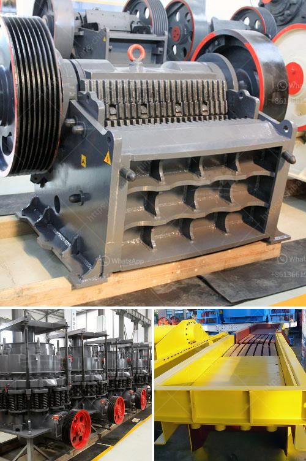

<h3>What companies make concrete crushers ?</h3>
Concrete crushers are essential pieces of machinery for the construction industry. Different companies manufacture these machines to serve various demolition and construction purposes. Here, we will explore some of the top companies that design and manufacture concrete crushers.

One leading company in the field of concrete crushers is Terex Corporation. They have been manufacturing equipment for the construction and mining industry for over a century and have gained a well-deserved reputation for their high-quality products. Terex offers a range of mobile and stationary concrete crushers suitable for various applications, including recycling, demolition, and quarrying.

Another reputable manufacturer of concrete crushers is Komatsu. With a focus on sustainability, Komatsu designs and produces innovative machines that reduce emissions and environmental impact. Their concrete crushers are equipped with advanced technologies, such as hybrid systems for efficient fuel consumption and intelligent control systems for enhancing performance.

Caterpillar Inc. is a well-known name in the construction industry, and they also produce concrete crushers. Their machines are known for their durability, reliability, and efficiency. These crushers are designed to easily handle tough materials in challenging conditions and are suitable for both primary and secondary crushing operations.

McCloskey International is a global leader in the construction industry, specializing in crushers, screeners, and conveyors. They have a wide range of concrete crushers, including jaw crushers, impact crushers, cone crushers, and VSI crushers. McCloskey crushers are known for their high performance, durability, and versatility, making them suitable for various applications.

Eagle Crusher Company is another well-established manufacturer of concrete crushers. They offer a comprehensive range of portable and stationary crushers, as well as screening plants, for efficient crushing and screening operations. Eagle crushers are known for their reliability and robust design, ensuring extended machine life and reduced downtime.

Rubblemaster is a leading manufacturer of mobile crushers for the recycling of construction and demolition waste. They offer compact crushers that can be easily transported on-site, providing an efficient solution for recycling concrete and other materials. Rubblemaster crushers are characterized by their high performance, simplicity, and low operating costs.

In addition to the above-mentioned companies, there are several others that also manufacture concrete crushers for various applications. These include Sandvik Group, Metso Outotec, Powerscreen, and Kleemann, among others. Each company has its own unique features and specializations, providing customers with a wide range of options to choose from based on their specific requirements.

In conclusion, concrete crushers play a crucial role in the construction industry, enabling efficient recycling and demolition of concrete structures. Various companies design and manufacture these machines, offering a diverse range of options to suit different applications. Whether for recycling, quarrying, or demolition purposes, finding the right concrete crusher from a reputable manufacturer is essential to ensure optimal performance and longevity.
<h3>Contact us</h3><ul><li><strong>Whatsapp:&nbsp;<a href="https://wa.me/8613661969651">+8613661969651</a></strong></li><li><a href="https://swt.shibang-china.com/?git&amp;zhl&amp;What companies make concrete crushers "><strong>Online Service(chat now)</strong></a></li></ul><h3>Related</h3><ul><li><a href='What is chrome ore grades.md'>What is chrome ore grades?</a></li><li><a href='What is the mining process for fluorite.md'>What is the mining process for fluorite?</a></li><li><a href='what is throughput for a cement grinding ball mill？.md'>what is throughput for a cement grinding ball mill？</a></li><li><a href='What are machines used for mining iron ore.md'>What are machines used for mining iron ore?</a></li><li><a href='What is medium speed mills.md'>What is medium speed mills?</a></li></ul>