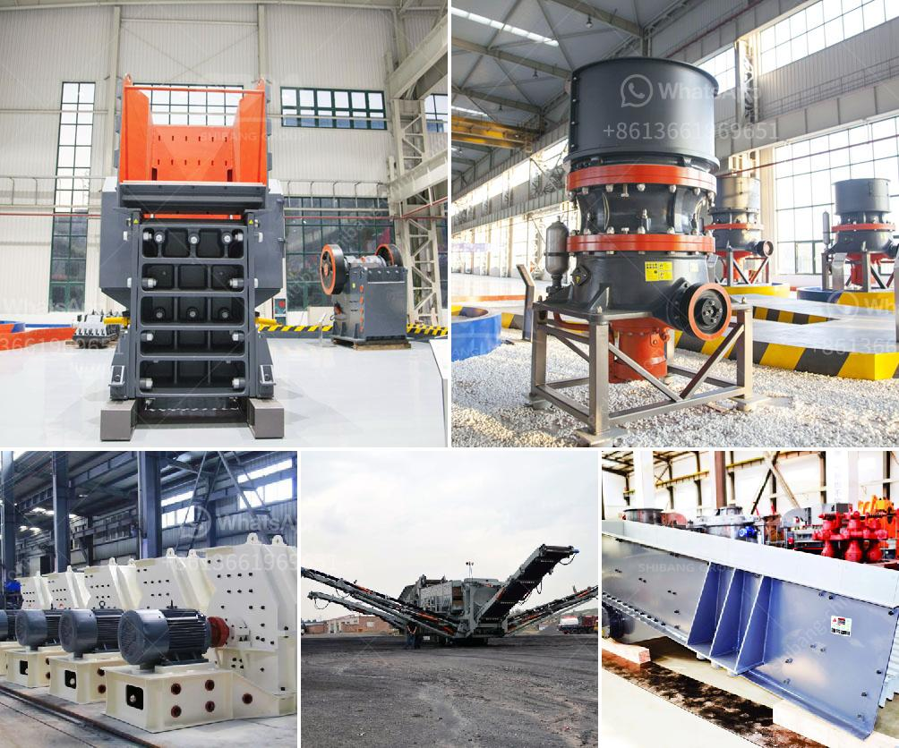

<h3>What could be the problems with your crusher plant?</h3>
A crusher plant is a crucial part of any construction or mining business. It is used to crush large rocks into small fragments and generate aggregate for various construction projects. However, problems can arise during the operation of the crusher plant, and they have the potential to hinder the productivity of the entire construction project.

Crusher plants have a huge impact on the global mining industry due to their wide range of applications in various sectors such as metallurgy, construction, road building, and chemical industries. In addition, it is widely used in the mining industry for the preparation of materials for further processing.

One of the biggest potential problems that can persist in a crusher plant is blockage, which can happen due to numerous reasons, such as oversized feed, unstable structures, or material buildup. Blockages not only halt the overall production process but also place excessive strain on the machinery, causing damage and leading to costly repairs or replacements.

Another common problem that could occur within a crusher plant is a breakdown of the conveyor system. The conveyor system is responsible for transferring crushed material from one process to another, and any malfunction in this system can result in costly delays and halt the entire production process.

Moreover, the vibration of the crusher plant, while in operation, can create numerous issues. Excessive vibration is abnormal and could be a symptom of underlying problems like misalignment, loose connections, or damaged components. If left unaddressed, it can cause premature wear and tear on the machinery and even lead to catastrophic failure.

Additionally, excessive dust can also become a significant problem in crusher plants. Dust is created during the crushing process as the machine generates fine fragments of rocks and minerals. If not contained properly, excessive dust can affect the health of workers, damage machinery, and cause air pollution, leading to regulatory fines and penalties.

Furthermore, the quality and consistency of the feed material can also impact the overall performance of the crusher plant. Inconsistent or poor-quality materials can lead to irregular operation, lower productivity, and increased wear on the machinery. It is crucial to ensure that the feed materials are of the desired quality, size, and composition to maximize efficiency and minimize breakdowns.

Maintenance and regular inspection of the crusher plant are vital in identifying these potential problems and addressing them promptly. Regular lubrication, tightening of loose connections, and replacing worn-out parts can help prevent major breakdowns and ensure smooth operation.

It is essential for operators and managers to invest in comprehensive operator training programs to ensure that the crusher plant is operated correctly and efficiently. Proper training can assist in identifying and addressing potential problems, and minimize downtime, resulting in increased productivity and reduced costs.

In conclusion, a crusher plant is a crucial part of any construction or mining business. Potential problems could arise due to blockages, breakdowns of the conveyor system, excessive vibration, dust, and poor-quality feed materials. Regular maintenance, proper operation, and training can greatly reduce the likelihood of these issues, ensuring smooth and efficient operation of the crusher plant.
<h3>Contact us</h3><ul><li><strong>Whatsapp:&nbsp;<a href="https://wa.me/8613661969651">+8613661969651</a></strong></li><li><a href="https://swt.shibang-china.com/?git&amp;zhl&amp;What could be the problems with your crusher plant"><strong>Online Service(chat now)</strong></a></li></ul><h3>Related</h3><ul><li><a href='what some of the equipment used in handling materials in the mining industry？.md'>what some of the equipment used in handling materials in the mining industry？</a></li><li><a href='Whats the difference between a mine and quarry.md'>Whats the difference between a mine and quarry?</a></li><li><a href='What is the process for mining line.md'>What is the process for mining line?</a></li><li><a href='What is the use of crushing magnetite rock before milling.md'>What is the use of crushing magnetite rock before milling?</a></li><li><a href='What is the process of mining iron ore.md'>What is the process of mining iron ore?</a></li></ul>