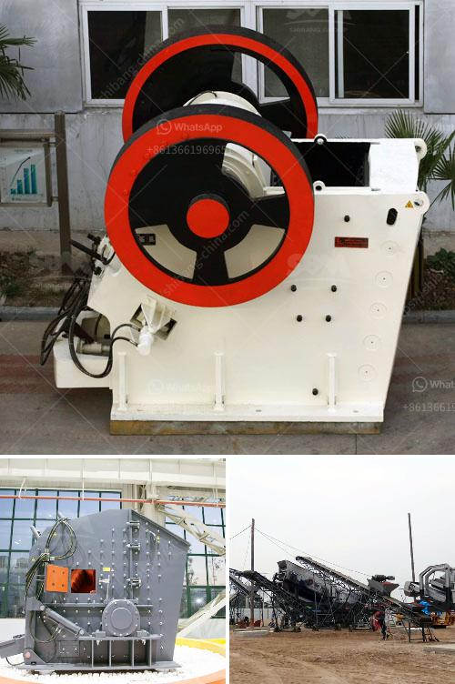

<h3>What does "20 mm all in aggregate" mean?</h3>
If you work in construction or have been involved in any building projects, you might have heard the term "20 mm all in aggregate" being mentioned by engineers, architects, or contractors. But what does it actually mean?

In the realm of construction, aggregate refers to a mixture of various materials commonly used as a foundation or base for different structures. These materials typically include crushed stones, sand, gravel, or even recycled concrete. The size of the aggregate particles plays a crucial role in determining its suitability for specific construction purposes.

When "20 mm all in aggregate" is mentioned, it specifically describes a type of aggregate that consists of particles with a maximum size of 20 millimeters. This size is significant as it meets the requirements for being used as a commonly utilized standard mix for building houses, roads, and many other structures.

The term "all in" further adds to the significance of this aggregate. It implies that the mixture consists of particles ranging in different sizes, from smaller ones to larger ones, with 20 mm being the maximum size allowed. This ensures that the aggregate interlocks well, providing strength to the construction.

The 20 mm all in aggregate has a few advantages that make it widely used in the construction industry. Firstly, the larger size of the particles in the aggregate allows for better drainage, ensuring that water does not accumulate, which could potentially lead to damage or erosion. Additionally, the interlocking nature of the particles provides stability, making it suitable for various load-bearing applications.

In terms of practical applications, this particular aggregate is commonly used in foundations, concrete mixes, and road construction. In foundations, it provides a solid and stable base to support structures like buildings and bridges. When used in concrete mixes, it improves the workability and durability of the concrete, making it ideal for floor slabs, pathways, and driveways. In road construction, the 20 mm all in aggregate is used as a base layer to enhance the stability and strength of the road surface.

To ensure that the 20 mm all in aggregate meets the required standards, it is possible to carry out tests to determine its quality. Tests such as the sieve analysis and the flakiness and elongation index tests can help assess the particle size distribution and shape characteristics, ensuring that the aggregate meets the specified criteria.

In conclusion, "20 mm all in aggregate" refers to a specific type of aggregate consisting of particles with a maximum size of 20 millimeters. It is commonly used in construction due to its ability to provide strength, stability, and good drainage. Its versatility makes it suitable for various applications, including foundations, concrete mixes, and road construction. By understanding the meaning and characteristics of this aggregate, professionals in the construction industry can make informed choices about its use in their projects.
<h3>Contact us</h3><ul><li><strong>Whatsapp:&nbsp;<a href="https://wa.me/8613661969651">+8613661969651</a></strong></li><li><a href="https://swt.shibang-china.com/?git&amp;zhl&amp;What does 20 mm all in aggregate mean"><strong>Online Service(chat now)</strong></a></li></ul><h3>Related</h3><ul><li><a href='What beneficiation method is used for iron ore.md'>What beneficiation method is used for iron ore?</a></li><li><a href='what are some of the equipments used in mining industry.md'>what are some of the equipments used in mining industry?</a></li><li><a href='What mineral types are good for a jaw crusher.md'>What mineral types are good for a jaw crusher?</a></li><li><a href='What is the aggregate crusher.md'>What is the aggregate crusher?</a></li><li><a href='What is the cost of quarry stones in Kenya.md'>What is the cost of quarry stones in Kenya?</a></li></ul>