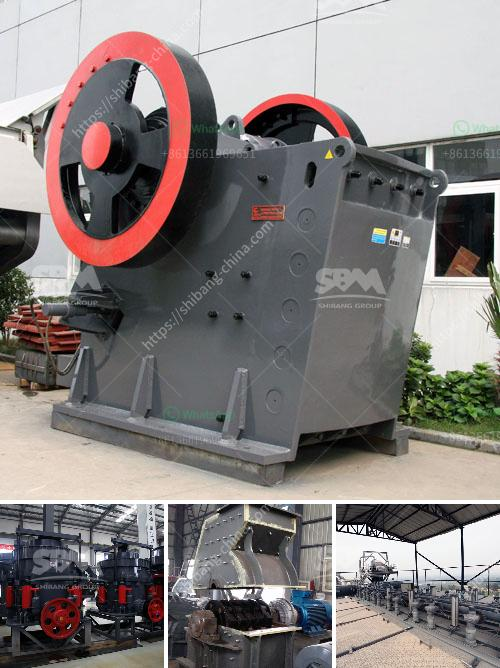

<h3>What does the concrete batching plant contain?</h3>
A concrete batching plant is a critical piece of machinery in the construction industry. It is responsible for delivering a precise mixture of cement, water, and aggregates to create concrete. This durable material is used in various construction projects, such as buildings, roads, bridges, and tunnels. In this article, we will explore the components and features that make up a typical concrete batching plant.

The heart of a concrete batching plant is the batcher. This is where the various materials are measured and combined to create the desired concrete mix. The batcher is often a large structure with multiple bins or hoppers for storing different aggregates, such as gravel, sand, and crushed stone. These bins are equipped with conveyor belts or pneumatic systems to transfer the materials to the weighing and mixing area.

The weighing system is crucial for achieving the correct ratio of materials. It consists of load cells or strain gauges that measure the weight of each material as it is being fed into the mixer. These measurements are sent to a computerized control system that ensures the correct proportions are maintained.

The mixing unit is where the magic happens. This is the component responsible for combining the cement, water, and aggregates to create the concrete mix. It typically consists of a twin-shaft mixer or a drum mixer. The twin-shaft mixer uses two horizontal shafts that rotate in opposite directions, while the drum mixer has a large cylindrical drum that rotates to mix the materials. Both types of mixers ensure a consistent and uniform blend of concrete.

To enhance the efficiency of the mixing process, concrete batching plants may also include additional features. One such feature is a moisture sensor that measures the moisture content of the aggregates. This information is used to adjust the water-to-cement ratio, ensuring the optimal consistency and strength of the concrete.

Another valuable feature found in some batching plants is an additive dispenser. This allows for the precise addition of chemicals or additives, such as accelerators, retarders, or plasticizers. These additives can improve the workability, setting time, and durability of the concrete.

Once the concrete is mixed, it needs to be transported to the construction site. Batching plants often include a concrete mixer truck loading point or a conveyor belt system to transfer the freshly mixed concrete. These systems are designed to minimize waste and ensure a smooth flow of materials from the plant to the construction site.

Overall, a concrete batching plant contains several essential components that work together to produce high-quality concrete. From the batcher and weighing system to the mixing unit and transportation system, each part plays a vital role in the efficiency and effectiveness of the plant. With advanced technology and automation, modern batching plants have become highly efficient and accurate, enabling construction projects to be completed with precision and reliability.
<h3>Contact us</h3><ul><li><strong>Whatsapp:&nbsp;<a href="https://wa.me/8613661969651">+8613661969651</a></strong></li><li><a href="https://swt.shibang-china.com/?git&amp;zhl&amp;What does the concrete batching plant contain"><strong>Online Service(chat now)</strong></a></li></ul><h3>Related</h3><ul><li><a href='What is primary crushing and secondary crushing.md'>What is primary crushing and secondary crushing?</a></li><li><a href='What is the process of mining hematite ore.md'>What is the process of mining hematite ore?</a></li><li><a href='What are factors that will affect the output of a cement mill.md'>What are factors that will affect the output of a cement mill?</a></li><li><a href='what is the best method for beneficiation of limonite.md'>what is the best method for beneficiation of limonite</a></li><li><a href='What is the fault and how do I repair a cone crusher.md'>What is the fault and how do I repair a cone crusher?</a></li></ul>