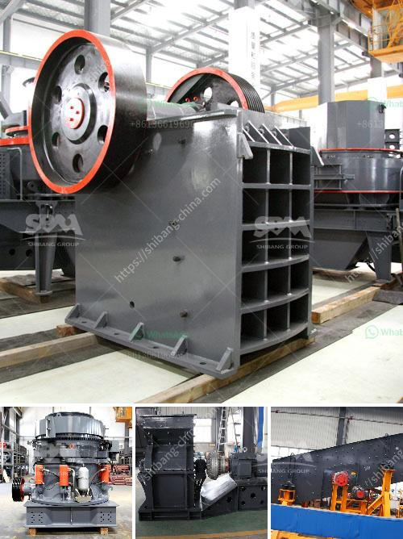

<h3>What does the crushing of copper ore have to do with ball mills?</h3>
Copper ore is a vital resource in various industries, including construction, electronics, and manufacturing. To obtain pure copper, the extraction process requires the ore to be crushed and ground down to a fine powder. This is where ball mills come into play. Ball mills serve as the final step in the comminution process, crushing and grinding the ore into a fine powder for further processing.

The crushing of copper ore is carried out in four stages: primary, secondary, tertiary, and quaternary crushing. In the primary stage, ore is initially blasted, then loaded onto trucks and transported to the crushers. These crushers break down the large rocks into smaller pieces, making it easier to handle and transport. The secondary crushing stage further reduces the size of the copper ore, typically to a diameter of about one inch.

Once the ore has been reduced to a suitable size, it moves on to the tertiary crushing stage. This stage involves using cone crushers or impact crushers to further reduce the size of the copper ore particles. The final stage of crushing, known as quaternary crushing, produces even smaller particles, typically less than half an inch in diameter.

After the crushing process, the copper ore is ready to undergo grinding in ball mills. Ball mills are cylindrical devices used to grind materials, such as ores, minerals, and chemicals, into a fine powder. They consist of a rotating cylindrical shell filled with steel or ceramic balls. As the mill rotates, the balls crush and grind the ore, breaking it down further into a powder with a consistent particle size.

The use of ball mills is crucial in the extraction of copper from its ore. The powdered ore is then mixed with water and chemicals, such as flotation agents and collectors, to create a slurry. This slurry is then fed into the ball mill, where the grinding process takes place. The rotation of the mill and the impact of the balls against the ore particles result in the reduction of the ore to the desired size.

Additionally, ball mills are essential for achieving a high level of liberation, which is crucial for the subsequent chemical and metallurgical processes. Liberation refers to the separation of valuable minerals from the gangue or waste materials present in the ore. The grinding action of the balls in the ball mill helps to release the valuable copper minerals from their associated gangue minerals, ensuring a higher concentration of copper in the final concentrate.

In conclusion, the crushing of copper ore is an essential step in the extraction process. Ball mills play a crucial role in this process by further reducing the size of the ore particles and achieving the desired particle size distribution. These mills facilitate the release of valuable copper minerals from the gangue, ensuring higher copper concentrate quality. Without the use of ball mills, the extraction of pure copper from its ore would not be possible in an efficient and cost-effective manner.
<h3>Contact us</h3><ul><li><strong>Whatsapp:&nbsp;<a href="https://wa.me/8613661969651">+8613661969651</a></strong></li><li><a href="https://swt.shibang-china.com/?git&amp;zhl&amp;What does the crushing of copper ore have to do with ball mills"><strong>Online Service(chat now)</strong></a></li></ul><h3>Related</h3><ul><li><a href='What is cost of bauxite processing per ton.md'>What is cost of bauxite processing per ton?</a></li><li><a href='What is the most popular rock crusher on market.md'>What is the most popular rock crusher on market?</a></li><li><a href='what is the running cost for a jaw crusher.md'>what is the running cost for a jaw crusher?</a></li><li><a href='What beneficiation method is used for iron ore.md'>What beneficiation method is used for iron ore?</a></li><li><a href='What causes the jaw crusher toggle plate to break.md'>What causes the jaw crusher toggle plate to break?</a></li></ul>