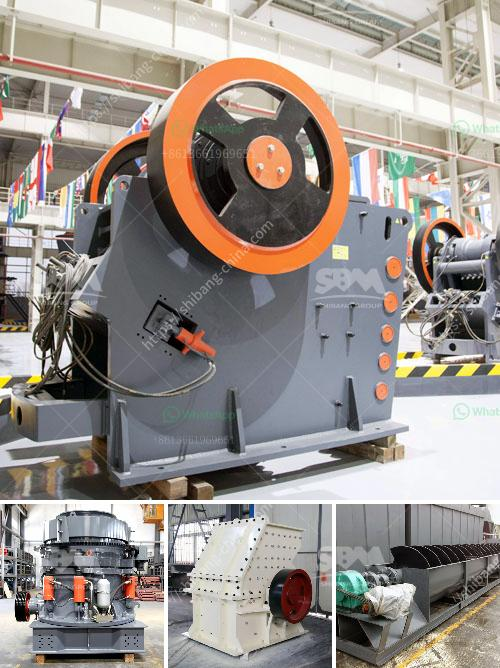

<h3>What equipment and machinery are needed to mine marble?</h3>
Marble is a stunning natural stone that has been utilized for centuries in construction and design. From ancient statues and palaces to modern luxury homes, marble adds a touch of elegance and sophistication. Mining marble requires a systematic process that involves heavy machinery, sophisticated equipment, and skillful operators. Let's delve into the equipment and machinery needed to mine marble.

First and foremost, a marble mining site needs to be identified. This involves prospecting, studying geological reports, and analyzing satellite images. Once a suitable deposit is found, the next step is to acquire the necessary permits and licenses from the local authorities. Compliance with environmental regulations is essential to ensure sustainable mining practices.

Marble mining generally involves two main methods – the underground method and the open-pit method. Each method requires different equipment and machinery to extract and transport the marble.

In the underground method, tunnels are excavated in the earth's crust to reach the marble deposit. Tunnel boring machines (TBMs), also known as moles, are used to create the tunnels. These machines have rotating cutting wheels equipped with carbide or diamond-tipped teeth that tear through the rock. As the moles advance, the excavated material is transported via conveyor belts or other haulage systems to the surface.

In the open-pit method, huge slabs of marble are extracted by cutting vertical and horizontal slices from the quarry wall. Excavators, loaders, and bulldozers are employed to remove the overburden and expose the marble deposit. Large diamond wire saws are then used to cut through the marble blocks. These wire saws consist of a series of diamond-coated cables that are threaded through the marble. As the wire saw moves back and forth, it slices through the marble with precision. Cranes or heavy machinery with lifting capabilities are needed to remove the marble blocks from the quarry floor.

Another vital equipment for marble mining is the diamond chainsaw. As the name suggests, a diamond chainsaw consists of a rotating chain with diamond-embedded saw blades. This machine allows for more precise cutting, especially in intricate patterns or designs. The diamond chainsaw is commonly used in shaping and carving marble into various forms, such as columns, sculptures, and countertops.

To process the extracted marble, additional machinery is required, such as bridge saws, polishing machines, and grinding tools. Bridge saws are automated machines that use diamond blades to cut slabs of marble into precise dimensions. Polishing machines utilize rotating pads and abrasive compounds to give the marble a glossy finish. Lastly, various grinding tools are used to smooth and shape the marble into its final form.

Mining marble is undoubtedly a complex and technically demanding task that requires specialized machinery and equipment. From tunnel boring machines and wire saws to diamond chainsaws and bridge saws, each piece of machinery plays a crucial role in the extraction and processing of marble. However, it is essential to ensure that mining operations are conducted sustainably to minimize environmental impacts and preserve the beauty of this magnificent natural stone for future generations.
<h3>Contact us</h3><ul><li><strong>Whatsapp:&nbsp;<a href="https://wa.me/8613661969651">+8613661969651</a></strong></li><li><a href="https://swt.shibang-china.com/?git&amp;zhl&amp;What equipment and machinery are needed to mine marble"><strong>Online Service(chat now)</strong></a></li></ul><h3>Related</h3><ul><li><a href='What equipment is used in the bauxite mining process in Jamaica.md'>What equipment is used in the bauxite mining process in Jamaica?</a></li><li><a href='What are the parts of ball mill internal structure.md'>What are the parts of ball mill internal structure?</a></li><li><a href='What are machines used for mining iron ore.md'>What are machines used for mining iron ore?</a></li><li><a href='What is an ore vibrating screen What is it for.md'>What is an ore vibrating screen? What is it for?</a></li><li><a href='What is the difference between stationary and mobile crushers.md'>What is the difference between stationary and mobile crushers?</a></li></ul>