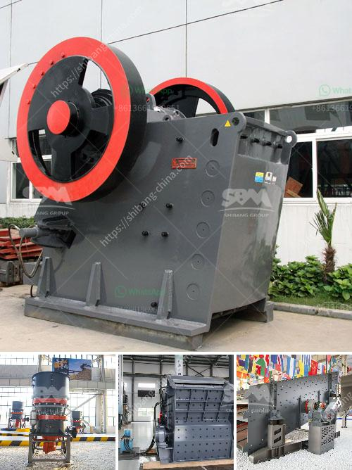

<h3>What equipment is needed for alumstone mines?</h3>
Alumstone, also known as alum rock, is a mineral primarily composed of alumina, sulfur, and potassium. It has been widely used for various industrial applications, including as a source of alum, which is used in various industries such as water treatment, paper manufacturing, and cosmetics. To extract alumstone from mines, certain equipment is required to ensure efficient and safe mining operations.

1. Excavators: Excavators are heavy construction equipment used for digging and removing overburden or earth in the mining process. These machines are equipped with a bucket attached to a hydraulic arm, allowing them to efficiently scoop up and transport large amounts of soil and rocks. Excavators come in different sizes, from compact machines suitable for small-scale mining operations to large machines used in large-scale mining projects.

2. Haul Trucks: Haul trucks are essential for transporting the extracted alumstone from the mine to the processing or storage area. These trucks come in different sizes, ranging from small dump trucks to large off-road vehicles capable of carrying hundreds of tons of material. Haul trucks are designed to operate in rough terrains commonly found in mining sites, making them ideal for transporting the heavy loads associated with alumstone extraction.

3. Drilling Rigs: Drilling rigs play a crucial role in the mining process by creating holes to access the alumstone deposits. These rigs are equipped with drill bits specifically designed to penetrate through the surface and reach the ore body. Some of the commonly used drilling techniques in alumstone mining include rotary drilling and core drilling, depending on the geological characteristics of the deposit.

4. Blasting Equipment: Blasting is an important step in alumstone mining, as it helps to break apart large rock formations and extract the mineral. Blasting equipment includes explosives, detonators, and safety components. It is important to follow strict safety protocols and regulations when using blasting equipment to ensure the safety of workers and minimize environmental impacts.

5. Crushing and Grinding Machinery: Once the alumstone has been extracted from the mine, it needs to be crushed and ground into smaller particles for further processing. Crushing equipment, such as jaw crushers or impact crushers, is used to reduce the size of the large rock pieces. Grinding machinery, such as ball mills or grinding mills, is then employed to further grind the crushed alumstone into a fine powder.

6. Material Handling Equipment: Material handling equipment, such as conveyors or bucket elevators, is used to move the alumstone within the mining site and transport it to different stages of processing. These machines are designed to handle bulk materials and ensure a smooth flow of the mined material throughout the operation.

In conclusion, alumstone mining requires a range of equipment to extract the mineral efficiently and safely. Excavators, haul trucks, drilling rigs, blasting equipment, crushing and grinding machinery, and material handling equipment are all crucial components of the mining process. By utilizing the appropriate equipment, mining companies can ensure the extraction of alumstone is carried out effectively while adhering to safety protocols and minimizing the impact on the environment.
<h3>Contact us</h3><ul><li><strong>Whatsapp:&nbsp;<a href="https://wa.me/8613661969651">+8613661969651</a></strong></li><li><a href="https://swt.shibang-china.com/?git&amp;zhl&amp;What equipment is needed for alumstone mines"><strong>Online Service(chat now)</strong></a></li></ul><h3>Related</h3><ul><li><a href='What can be used for basalt.md'>What can be used for basalt?</a></li><li><a href='What are the machines and equipment in mining.md'>What are the machines and equipment in mining?</a></li><li><a href='What is the best concrete crusher to make gravel.md'>What is the best concrete crusher to make gravel?</a></li><li><a href='what type of pumps uesd in stone crusher？.md'>what type of pumps uesd in stone crusher？</a></li><li><a href='Whats better for a granite mobile crusher or fixed crusher.md'>Whats better for a granite mobile crusher or fixed crusher?</a></li></ul>