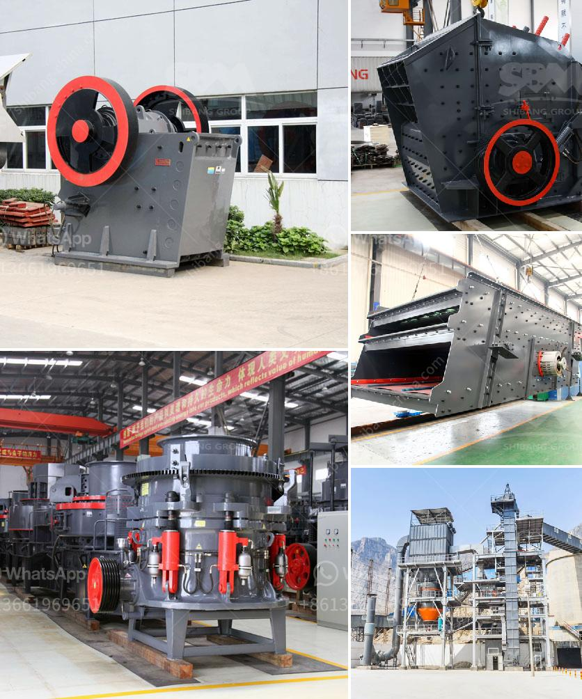

<h3>What equipment is needed for boron ore mines?</h3>
Boron is an important element that finds its applications in various industries, from agriculture to manufacturing. Boron ore mines play a vital role in the extraction of this valuable element. Mining boron ore involves the utilization of specific equipment to extract, refine, and process the raw ore into usable products.

Firstly, let's understand what boron ore is. Boron ore, also known as borax, is a naturally occurring compound made up of boron, oxygen, hydrogen, and sodium. It is primarily found in evaporite deposits, which are formed by the evaporation of ancient seabeds. These deposits are typically found in arid regions such as California, Turkey, and Chile.

To extract boron ore from these deposits, several key pieces of equipment are needed. One essential piece of machinery is the crawler drill, which is used to create access holes in the ground for blasting. Crawler drills are equipped with hydraulics, ensuring they can easily traverse the uneven terrain found in mining operations. These drills typically employ rotary or percussive methods to bore into the ground, depending on the geology of the deposit.

After the access holes are created, explosives are used to break up the boron ore. Explosives are meticulously placed and timed to ensure safe and efficient extraction. Once the ore is fragmented, it is loaded and transported using large haul trucks. These trucks, often referred to as mine trucks or dump trucks, can carry a substantial amount of ore from the mine face to the processing plant.

Upon arrival at the processing plant, the boron ore undergoes several stages of refinement. Crushers and grinding mills reduce the size of the ore particles to facilitate further processing. These equipment are powered by electric motors or diesel engines, depending on the availability of power at the mine site.

Next, the ore is subjected to flotation. Flotation equipment, such as flotation cells and mixers, are used to separate the valuable boron minerals from other impurities. The process involves adding specialized chemicals to create differences in surface tensions, which enable the selective attachment of boron minerals to air bubbles. This allows for their subsequent recovery as a concentrate.

Finally, the concentrate is further processed to obtain refined boron products. Filtration equipment, such as vacuum or pressure filters, is used to separate water from the boron concentrate. Through a series of chemical reactions and extractive processes, refined boron products are obtained, including boric acid, borax, and boron minerals used in various industries.

In conclusion, the equipment needed for boron ore mines encompasses a range of machinery to extract, refine, and process the raw ore into valuable products. From crawler drills and haul trucks for extraction to crushers, grinding mills, and flotation cells for refinement, each piece of equipment plays a crucial role in the mining process. These mining operations ultimately contribute to the supply of essential boron products, which find applications in agriculture, glass manufacturing, ceramics, and numerous other industries worldwide.
<h3>Contact us</h3><ul><li><strong>Whatsapp:&nbsp;<a href="https://wa.me/8613661969651">+8613661969651</a></strong></li><li><a href="https://swt.shibang-china.com/?git&amp;zhl&amp;What equipment is needed for boron ore mines"><strong>Online Service(chat now)</strong></a></li></ul><h3>Related</h3><ul><li><a href='what is the difference between river sand and crusher sand.md'>what is the difference between river sand and crusher sand</a></li><li><a href='What is the difference between an open circuit and a closed circuit ball mill.md'>What is the difference between an open circuit and a closed circuit ball mill?</a></li><li><a href='Whats better for a granite mobile crusher or fixed crusher.md'>Whats better for a granite mobile crusher or fixed crusher?</a></li><li><a href='What type of mining is used for magnetite.md'>What type of mining is used for magnetite?</a></li><li><a href='What good pebble crushing equipment .md'>What good pebble crushing equipment ?</a></li></ul>