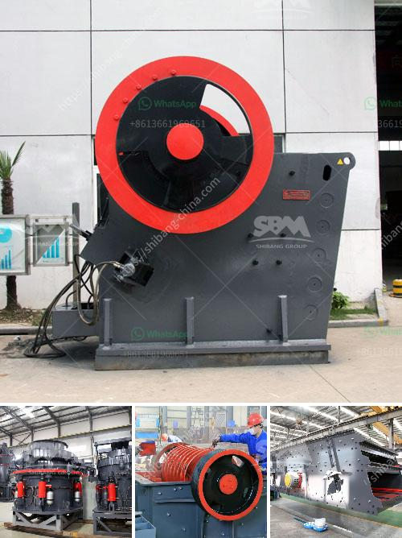

<h3>What equipment is needed for coal ore mines?</h3>
Coal ore mining is a crucial and intricate operation that requires a variety of specialized machinery and equipment. It plays a vital role in the energy sector, contributing to the production of electricity and fuel used in various industries. To ensure efficient and safe extraction of coal ore, miners rely on a range of equipment designed to handle the unique challenges of this mining process.

One of the primary pieces of equipment used in coal mining is the coal shearer. This large machine is used to cut and remove the coal from the seam. It utilizes rotating drums equipped with cutting bits to penetrate the coal and extract it from the face of the mine. Coal shearers are typically operated by remote control and are capable of cutting tons of coal per minute, significantly boosting productivity.

Another crucial machine found in coal ore mines is the continuous miner. It is responsible for cutting coal while simultaneously loading it onto a conveyor system. Continuous miners are equipped with rotating drums fitted with cutting teeth or bits that scrape or gouge the coal from the seam. These machines are designed to operate in tight spaces and handle various geological conditions often encountered in underground coal mining.

Conveyors are an essential component of a coal mine's infrastructure, facilitating the efficient transport of coal to the surface. They are responsible for moving large quantities of material, such as coal and overburden, from one area of the mine to another. Belt conveyors are commonly used in coal mines due to their flexibility and ability to handle both horizontal and inclined transport. These conveyors can be powered through electric motors or diesel engines, depending on the mine's specific needs.

To provide proper ventilation in underground coal mines, it is necessary to use high-capacity ventilation fans. These fans ensure the circulation of fresh air, preventing the accumulation of harmful gases and controlling the temperature and humidity levels within the mine. Ventilation systems are critical for the safety and well-being of miners, helping to mitigate the risk of accidents and maintain a comfortable working environment.

In addition to the primary equipment mentioned above, several auxiliary machines and equipment are needed to support coal mining operations. Roof bolters are used to secure roof and wall supports, ensuring the stability of underground mine tunnels. Shuttle cars and scoops are employed to transport coal from the continuous miner to the conveyor system or storage areas. Dust control systems, such as sprayers and water cannons, are utilized to minimize the amount of airborne dust particles, protecting miners' respiratory health.

Moreover, coal ore mines require specialized lighting equipment, communication systems, and safety devices ranging from gas detectors to self-rescue equipment. The use of advanced technology and monitoring systems further enhances safety and operational efficiency in coal mines.

To conclude, coal ore mining necessitates the use of various equipment to ensure the successful extraction, transportation, and safety of miners. The machinery utilized ranges from large cutting machines like coal shearers and continuous miners to conveyors, ventilation fans, and auxiliary equipment. With the right equipment and advanced technologies, coal mining operations can be conducted efficiently, helping to meet the increasing demands for energy while prioritizing the safety of workers in these challenging environments.
<h3>Contact us</h3><ul><li><strong>Whatsapp:&nbsp;<a href="https://wa.me/8613661969651">+8613661969651</a></strong></li><li><a href="https://swt.shibang-china.com/?git&amp;zhl&amp;What equipment is needed for coal ore mines"><strong>Online Service(chat now)</strong></a></li></ul><h3>Related</h3><ul><li><a href='What is an ore vibrating screen What is it for.md'>What is an ore vibrating screen? What is it for?</a></li><li><a href='What kind of crusher crushes basalt best.md'>What kind of crusher crushes basalt best?</a></li><li><a href='What could be the problems with your crusher plant.md'>What could be the problems with your crusher plant?</a></li><li><a href='what is the feed size for ball mill？.md'>what is the feed size for ball mill？</a></li><li><a href='what are rock crusher cone liners made out of.md'>what are rock crusher cone liners made out of</a></li></ul>