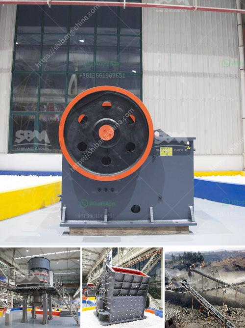

<h3>What equipment is needed for iron ore mines ?</h3>
Iron ore mining is a multi-billion-dollar industry globally and one of the main sources of revenue for numerous countries around the world. However, mining iron ore comes with its own set of challenges and requirements. To extract the valuable mineral from the vast quantities of ore, certain equipment is required.

One of the primary equipment for mining iron ore is a mining drill. This powerful machine is used to bore holes into the ground to excavate the ore. Some drills are large enough to create shafts that extend deep into the ground, allowing miners to access the lowest levels of the mine. These drilling machines come in various sizes and configurations depending on the scale of the operation and the geological conditions.

Once the ore has been extracted, it needs to be transported to the surface for further processing. Conveyors are commonly used in iron ore mines to move the mined material from the bottom of the mine to the surface. These robust systems are often built over long distances and can be tailored to accommodate varying inclines and angles. Conveyors are efficient and reliable, ensuring a continuous flow of ore for processing.

To crush the large pieces of ore into smaller fragments, crushing equipment is utilized. Crushers are commonly employed in iron ore mines to reduce the size of the ore particles before further processing. Primary crushers break down large chunks of ore into more manageable sizes, making it easier to transport and process them. Secondary crushers further reduce the ore to the desired size for subsequent stages of processing.

After the ore has been crushed, it undergoes various stages of beneficiation. Beneficiation equipment is used to extract and concentrate the iron content found within the ore. The most common equipment for this purpose is magnetic separators. These devices use magnets to separate iron particles from surrounding materials, enabling the valuable ore to be further processed.

In addition to the above equipment, iron ore mines require various support machinery and vehicles to ensure smooth operations. This includes heavy-duty trucks for ore transportation, loaders for loading the ore onto trucks, and excavators for removing overburden or waste material. Additionally, specialized equipment may be needed for tasks such as water management, dust suppression, and maintaining safety on site.

Safety is of utmost importance in the mining industry, and thus, protective gear is essential for workers in iron ore mines. This includes hard hats, safety goggles, gloves, steel-toed boots, and high-visibility clothing. Respirators or dust masks are necessary when working in environments with high concentrations of dust particles.

Overall, mining iron ore requires a range of sophisticated equipment to extract, transport, crush, beneficiate, and process the raw material. This involves mining drills, conveyors, crushing equipment, magnetic separators, trucks, loaders, and various support machinery and vehicles. Safety gear is also crucial to protect workers in these hazardous environments. By investing in the right equipment, iron ore mining operations can run smoothly, efficiently, and safely.
<h3>Contact us</h3><ul><li><strong>Whatsapp:&nbsp;<a href="https://wa.me/8613661969651">+8613661969651</a></strong></li><li><a href="https://swt.shibang-china.com/?git&amp;zhl&amp;What equipment is needed for iron ore mines "><strong>Online Service(chat now)</strong></a></li></ul><h3>Related</h3><ul><li><a href='What is iron ore screening process.md'>What is iron ore screening process?</a></li><li><a href='What is a magnetic iron separator.md'>What is a magnetic iron separator</a></li><li><a href='What is the difference between stationary and mobile crushers.md'>What is the difference between stationary and mobile crushers?</a></li><li><a href='What are the parts of ball mill internal structure.md'>What are the parts of ball mill internal structure?</a></li><li><a href='What is grindind machine.md'>What is grindind machine?</a></li></ul>