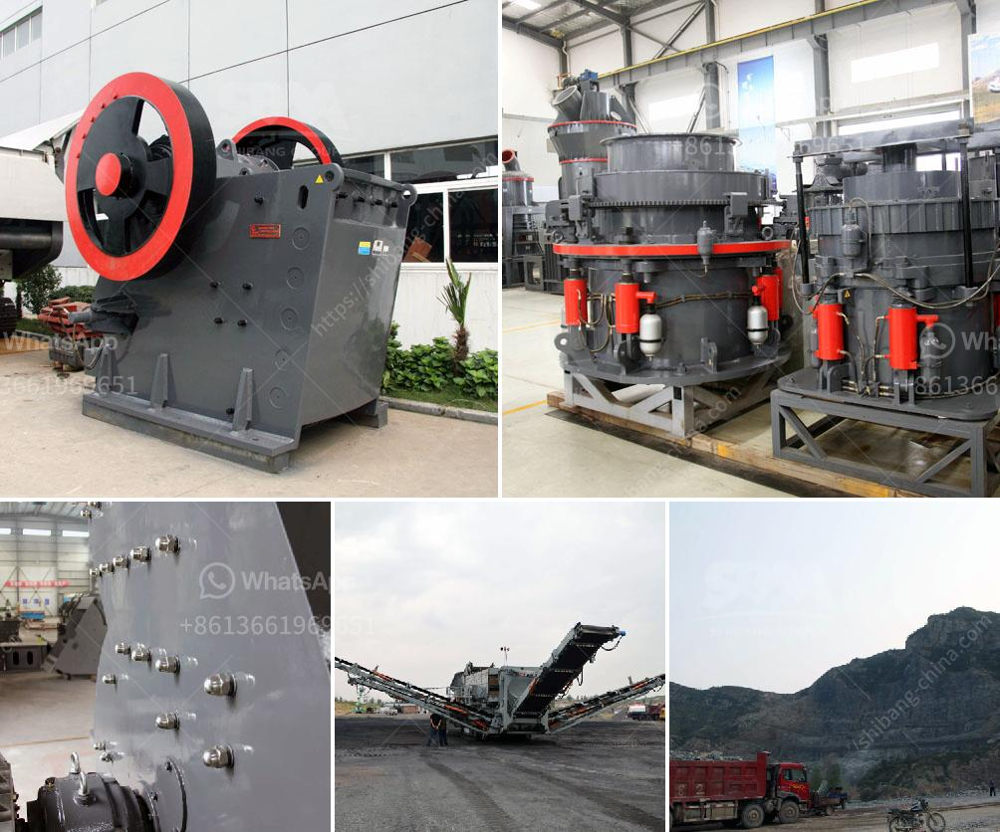

<h3>What equipment is needed for kaolin ore mines?</h3>
Kaolin, also known as china clay, is a versatile and essential industrial mineral used in various applications, including paper, ceramics, rubber, and paints. The mining and processing of kaolin ore require several equipment and technologies to be efficiently carried out. In this article, we will discuss the equipment needed for kaolin ore mines and its significance in the extraction process.

Excavators and bulldozers are heavy machinery used for the initial excavation of the kaolin ore. These machines are crucial in breaking down the overlying materials and exposing the ore deposits. Excavators are typically used to remove large amounts of clayey soil, while bulldozers are used to push and level the ground, creating a proper working area for further operations.

After the kaolin ore has been excavated, it needs to be crushed into smaller pieces for further processing. Jaw crushers and cone crushers are used to break down the ore into manageable sizes. These crushers exert a compressive force on the material, reducing it to a size suitable for efficient processing. Cone crushers are particularly useful for the final crushing stage before the ore is sent for grinding and beneficiation.

In many kaolin ore mines, iron and titanium-bearing impurities are present, which need to be removed during the processing. Magnetic separators are used to separate magnetic materials, such as iron oxides, from the non-magnetic kaolin ore. By using magnetic forces, these separators attract and separate the impurities, resulting in a purer and more valuable kaolin product.

Once the kaolin ore is crushed, it needs to be further processed to obtain the desired particle size and purity. Grinding mills are extensively used in this stage to grind the crushed ore into fine particles. Ball mills and vertical mills are commonly used for kaolin grinding. These mills rotate at certain speeds, causing the grinding media inside them to cascade and grind the ore particles into smaller sizes.

To separate the fine particles from the coarse ones, hydrocyclones and centrifuges are employed in the kaolin ore processing. Hydrocyclones use centrifugal force to separate the fine particles from the slurry, based on their density. Centrifuges, on the other hand, employ centrifugal force to separate the solid and liquid components based on their different densities. These separation methods are crucial in obtaining high-quality kaolin ore concentrates.

After the kaolin ore has been processed, dewatering equipment is used to remove excess water and moisture from the final product. Filter presses and vacuum filters are commonly employed for this purpose. These devices help reduce the moisture content of the kaolin ore, making it suitable for various applications without compromising its quality.

In conclusion, the extraction and processing of kaolin ore require a range of specialized equipment. Excavators, crushers, magnetic separators, grinding mills, hydrocyclones, and dewatering equipment are all essential to efficiently mine and process kaolin ore. Each piece of equipment serves a specific purpose in the overall extraction and refinement process, ensuring the production of high-quality kaolin products that meet the demands of various industries.
<h3>Contact us</h3><ul><li><strong>Whatsapp:&nbsp;<a href="https://wa.me/8613661969651">+8613661969651</a></strong></li><li><a href="https://swt.shibang-china.com/?git&amp;zhl&amp;What equipment is needed for kaolin ore mines"><strong>Online Service(chat now)</strong></a></li></ul><h3>Related</h3><ul><li><a href='what equipment is used when mining zinc ore.md'>what equipment is used when mining zinc ore?</a></li><li><a href='What is a belt conveyor control system.md'>What is a belt conveyor control system?</a></li><li><a href='What is hematite magnetic limonite and rhodochrosite.md'>What is hematite, magnetic limonite and rhodochrosite?</a></li><li><a href='What is primary crushing equipment .md'>What is primary crushing equipment ?</a></li><li><a href='What is the mining process for fluorite.md'>What is the mining process for fluorite?</a></li></ul>