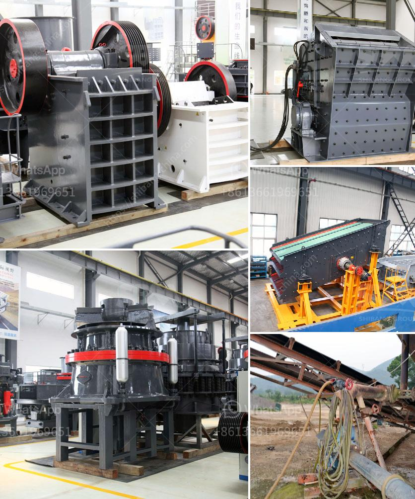

<h3>What equipment is needed for magnesite ore mines?</h3>
Magnesite ore, also known as magnesium carbonate, is a naturally occurring mineral that is used extensively in various industries. It is primarily extracted through open-pit mining, a method that requires robust equipment to effectively and efficiently mine this valuable resource. In this article, we will explore the equipment needed for magnesite ore mining.

First and foremost, any successful mining operation requires a reliable fleet of mining trucks. These trucks are used to transport the extracted magnesite from the open-pit mine to the processing plant. Given the large quantities of ore that need to be moved, these trucks must be capable of carrying heavy loads over long distances without compromising performance. Typically, off-highway trucks with strong hauling capacities are preferred for magnesite ore mining.

Apart from mining trucks, loaders play a vital role in the mining process by loading the ore onto the trucks. Loaders come in various sizes and designs, but in the case of magnesite ore mining, wheel loaders are commonly used due to their versatility and maneuverability. These loaders are equipped with a bucket attachment, which allows them to scoop up the ore and load it onto the trucks efficiently.

To access the magnesite ore deposits, an open-pit mine requires a robust drilling and blasting system. Drilling rigs are essential in creating blast holes to facilitate the extraction process. These rigs are equipped with powerful drills that can bore deep into the ground to reach the magnesite deposits. Once the holes are drilled, explosives are carefully placed to break up the rock formations, allowing easier access to the ore.

Once the magnesite ore is extracted, it needs to be processed to remove impurities and obtain the desired purity levels. For this purpose, crushing and screening equipment are crucial. Crushers are used to break down the large chunks of ore into smaller, more manageable sizes. These can be either jaw crushers or cone crushers, depending on the specific requirements of the mine. Following the crushing process, screens are then used to separate the different sizes of ore and ensure uniformity.

To achieve optimal efficiency and safety in mining operations, various auxiliary equipment is required. This may include conveyor belts to transport the ore from one process to another, as well as mills and mixers for further processing or chemical extraction. Dust control systems are also essential to prevent harmful particulate matter from being released into the atmosphere during the mining and refining process.

In conclusion, magnesite ore mining requires a range of specialized equipment to ensure efficient and effective extraction. From mining trucks to loaders, drilling rigs to crushers and screens, various equipment plays a vital role in every step of the process. Additionally, auxiliary equipment such as conveyor belts, mills, mixers, and dust control systems contribute to maintaining optimal operations and promoting worker safety. Investing in the right equipment is crucial for any magnesite ore mine to ensure a successful and productive operation.
<h3>Contact us</h3><ul><li><strong>Whatsapp:&nbsp;<a href="https://wa.me/8613661969651">+8613661969651</a></strong></li><li><a href="https://swt.shibang-china.com/?git&amp;zhl&amp;What equipment is needed for magnesite ore mines"><strong>Online Service(chat now)</strong></a></li></ul><h3>Related</h3><ul><li><a href='What about the crusher made in Ethiopia.md'>What about the crusher made in Ethiopia?</a></li><li><a href='What is aluminium ore benefication process.md'>What is aluminium ore benefication process?</a></li><li><a href='What  is vertical shaft impact crusher.md'>What  is vertical shaft impact crusher?</a></li><li><a href='What is concrete crushing.md'>What is concrete crushing?</a></li><li><a href='What are the processes of iron ore beneficiation.md'>What are the processes of iron ore beneficiation?</a></li></ul>