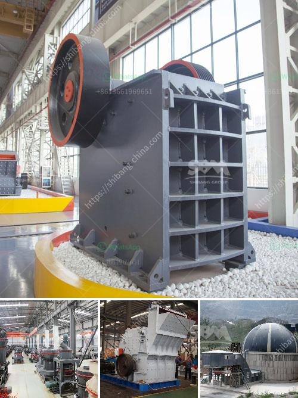

<h3>What equipment is needed for perlite ore mines?</h3>
Perlite ore mining involves extracting perlite, a naturally occurring volcanic glass, from deposits found in various regions around the world. Perlite is a versatile material with numerous applications, including horticulture, construction, and industrial processes. To efficiently extract perlite ore from mines, specific equipment is required to ensure productivity and safety. In this article, we will explore the main equipment needed for perlite ore mines.

1. Excavators and bulldozers: The initial step in perlite ore mining involves removing the overlying soil and debris to access the perlite deposit. Excavators and bulldozers are essential for this task, as they have the power and versatility to clear the area and create access roads.

2. Drilling rigs: Once the perlite deposit is exposed, drilling rigs are utilized to create blast holes. These holes are necessary for the controlled blasting of the perlite ore, allowing for easier extraction. Drilling rigs come in various sizes and types, depending on the depth and width of the blast holes required.

3. Explosives: Controlled blasting is performed to break the perlite ore into manageable pieces. Explosives are used to ensure a controlled and efficient extraction process. Trained professionals handle the handling and detonation of explosives to ensure safety during blasting operations.

4. Haul trucks: After the perlite ore has been blasted, haul trucks are used to transport the broken material to the processing plant or stockpiling site. Haul trucks vary in size, with larger trucks capable of carrying more substantial loads of perlite ore. These trucks are essential for efficient material handling and ensuring a continuous mining process.

5. Crushers and screens: Once the perlite ore reaches the processing plant or stockpile, crushers and screens come into play. Crushers are used to break down the larger perlite pieces into smaller, more manageable sizes. Screens are employed to separate the different-sized perlite particles, ensuring the ore is properly graded for further processing.

6. Conveyors: Conveying systems, including belts and bucket elevators, are utilized to transport the processed perlite ore to different stages of the production process. Conveyors are essential for maintaining the flow of material between various processing equipment and ensuring a smooth operation.

7. Furnaces: Perlite ore undergoes a thermal expansion process to create expanded perlite, which is the end product used in various applications. Furnaces are used to heat the raw perlite ore at high temperatures, causing it to expand and transform into the lightweight and porous perlite.

8. Bagging equipment: Finally, bagging equipment is used to package and transport the processed perlite for distribution and sale. This equipment ensures that the perlite is properly sealed and packaged, ready for delivery to customers.

In conclusion, perlite ore mining requires various specialized equipment to ensure the efficient and safe extraction and processing of the perlite. Excavators, drilling rigs, explosives, haul trucks, crushers, screens, conveyors, furnaces, and bagging equipment are all crucial components of a perlite ore mining operation. By utilizing the correct equipment, perlite mining companies can optimize productivity, maintain safety standards, and meet the growing demand for this versatile volcanic glass.
<h3>Contact us</h3><ul><li><strong>Whatsapp:&nbsp;<a href="https://wa.me/8613661969651">+8613661969651</a></strong></li><li><a href="https://swt.shibang-china.com/?git&amp;zhl&amp;What equipment is needed for perlite ore mines"><strong>Online Service(chat now)</strong></a></li></ul><h3>Related</h3><ul><li><a href='What are the machines and equipment in mining.md'>What are the machines and equipment in mining?</a></li><li><a href='What good pebble crushing equipment .md'>What good pebble crushing equipment ?</a></li><li><a href='What type of mining is used for magnetite.md'>What type of mining is used for magnetite?</a></li><li><a href='What is the process for mining line.md'>What is the process for mining line?</a></li><li><a href='What kind of crusher crushes basalt best.md'>What kind of crusher crushes basalt best?</a></li></ul>