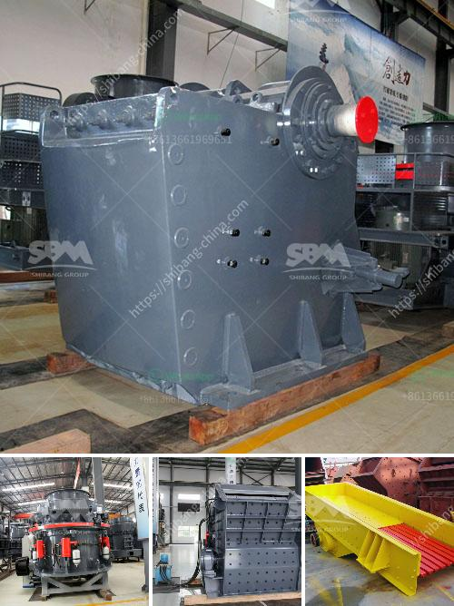

<h3>What equipment is needed for phosphorite ore mines?</h3>
Phosphorite ore mines play a crucial role in the production of phosphorous-based fertilizers, as phosphorous is an essential nutrient for plant growth and agricultural productivity. To extract phosphorite ore efficiently, several pieces of specialized equipment are required.

One of the primary pieces of equipment needed for phosphorite ore mines is the drill rig. Drill rigs are used to create holes in the ground, allowing geologists and mining engineers to determine the quantity and quality of the phosphorite ore reserves. These holes also serve as access points for further mining activities. Drill rigs come in various sizes and configurations, including handheld drills for smaller-scale operations and large-scale rigs capable of drilling deep into the earth.

Once the phosphorite ore reserves are identified, blasting equipment is necessary to break up the rock and extract the ore. Explosives are carefully placed in pre-drilled holes and detonated, fracturing the rock and making it easier to separate the ore from the waste material. Blasting equipment typically includes blasting machines, detonators, explosives, and safety gear such as helmets, goggles, and ear protection.

After the ore is blasted, it needs to be loaded and transported to the processing plant. Front-end loaders and excavators are commonly used for this purpose. These heavy-duty machines are capable of scooping up large quantities of ore and loading it into trucks or conveyors for transportation. Front-end loaders can be equipped with special attachments, such as buckets specifically designed for handling phosphorite ore, to optimize efficiency and productivity.

Once at the processing plant, the phosphorite ore requires further treatment to separate the valuable phosphate minerals from the unwanted materials. Crushers and mills are utilized in this stage to reduce the size of the ore particles and free the phosphate minerals. Crushers use mechanical force to break down the rock, while mills utilize grinding media to further crush the ore. These machines come in various sizes and configurations depending on the desired final product.

To ensure the efficient operation of the processing plant, various ancillary equipment is needed. This includes screens, which separate the crushed ore into different sizes, and separators, which remove any remaining impurities or unwanted materials from the phosphate minerals. Additionally, machines such as pumps, pipes, and conveyors are required for the transportation, handling, and processing of the ore.

In conclusion, the equipment needed for phosphorite ore mines comprises a range of specialized machines designed to effectively extract, process, and transport the valuable phosphate minerals. From drill rigs and blasting equipment to front-end loaders and crushers, every piece of equipment plays a critical role in ensuring the efficient and sustainable operation of phosphorite ore mines. By employing the appropriate equipment, miners can maximize productivity and meet the ever-increasing global demand for phosphorous-based fertilizers, contributing to global food security and agricultural prosperity.
<h3>Contact us</h3><ul><li><strong>Whatsapp:&nbsp;<a href="https://wa.me/8613661969651">+8613661969651</a></strong></li><li><a href="https://swt.shibang-china.com/?git&amp;zhl&amp;What equipment is needed for phosphorite ore mines"><strong>Online Service(chat now)</strong></a></li></ul><h3>Related</h3><ul><li><a href='What is the best concrete crusher to make gravel.md'>What is the best concrete crusher to make gravel?</a></li><li><a href='What is the difference between an open circuit and a closed circuit ball mill.md'>What is the difference between an open circuit and a closed circuit ball mill?</a></li><li><a href='What are the characteristics of bauxite ore and how to crush it.md'>What are the characteristics of bauxite ore and how to crush it?</a></li><li><a href='What is a rare earth beneficiation plant.md'>What is a rare earth beneficiation plant?</a></li><li><a href='What type of crushing equipment should copper mine choose.md'>What type of crushing equipment should copper mine choose?</a></li></ul>