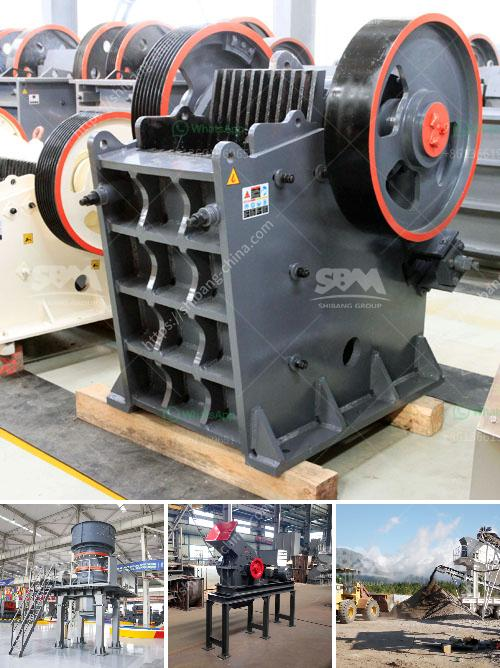

<h3>What equipment is needed for silicon ore mines?</h3>
Silicon ore mining is a highly specialized industry, requiring specific equipment to extract and process this valuable mineral. Silicon, primarily used in the manufacturing of computer chips and solar panels, is in high demand due to the rapid advancement of technology and the shift towards renewable energy sources. To meet this demand, silicon ore mines must have the necessary equipment to extract, refine, and transport the ore efficiently. Let's explore the critical equipment needed for silicon ore mining.

1. Excavators and Bulldozers: These heavy-duty machines are used for large-scale digging and earthmoving operations. Excavators are vital for removing overburden, the topsoil and minerals above the silicon ore, while bulldozers are used for leveling and clearing the mining area.

2. Drills and Blasting Equipment: Drilling rigs equipped with diamond-tipped drill bits penetrate the soil to create blast holes for explosive charges. Blasting is crucial to break up the silicon ore into manageable pieces for further processing. Proper drilling and blasting techniques ensure maximum ore recovery while minimizing environmental impact.

3. Haul Trucks: Once the silicon ore is loosened, large haul trucks are employed to transport the material to the processing facility. These trucks have a high payload capacity and are designed to handle rough terrain, ensuring a smooth and efficient transportation process.

4. Crushers and Screeners: After transportation, the silicon ore undergoes primary crushing to reduce its size for further processing. Crushers break the ore into smaller, more manageable pieces, while screeners separate the crushed ore into different particle sizes, removing any unwanted impurities.

5. Conveyors and Feeders: To move the silicon ore from one processing stage to another, conveyors and feeders are used. Conveyors transport the ore between crushers, screens, and other processing equipment, while feeders control the flow of ore into the different stages of the extraction process.

6. Magnetic Separators: Silicon ore often contains impurities such as iron, titanium, and aluminum. Magnetic separators are employed to remove these impurities, ensuring the final product is of high purity and suitable for use in various industries.

7. Furnaces: Refining the silicon ore into high-purity silicon requires the use of electric arc furnaces. Due to its high melting point, the ore is heated to extreme temperatures to extract the pure silicon, which is then cooled and cast into ingots or shaped into silicon wafers.

8. Environmental Control Systems: Silicon ore mining operations must prioritize environmental protection. Equipment such as dust collectors, water treatment plants, and noise control devices are essential to minimize the impact of mining activities on ecosystems and nearby communities.

It is worth noting that the specific equipment and machinery required for silicon ore mining may vary depending on factors such as the size of the mine, the depth of the deposits, and the mining methods employed. However, these are the fundamental equipment needed to extract and process the silicon ore efficiently.

In conclusion, silicon ore mining requires specialized equipment to successfully extract, refine, and transport this valuable mineral. From excavators and bulldozers to crushers and magnetic separators, each piece of equipment plays a vital role in the entire mining process. Investing in state-of-the-art machinery ensures higher productivity, reduced environmental impact, and competitive advantage in the ever-growing silicon market.
<h3>Contact us</h3><ul><li><strong>Whatsapp:&nbsp;<a href="https://wa.me/8613661969651">+8613661969651</a></strong></li><li><a href="https://swt.shibang-china.com/?git&amp;zhl&amp;What equipment is needed for silicon ore mines"><strong>Online Service(chat now)</strong></a></li></ul><h3>Related</h3><ul><li><a href='What is chrome ore grades.md'>What is chrome ore grades?</a></li><li><a href='What is primary crushing equipment .md'>What is primary crushing equipment ?</a></li><li><a href='What is the process of sandstone mining？.md'>What is the process of sandstone mining？</a></li><li><a href='What is the difference between an open circuit and a closed circuit ball mill.md'>What is the difference between an open circuit and a closed circuit ball mill?</a></li><li><a href='What is concrete crushing.md'>What is concrete crushing?</a></li></ul>