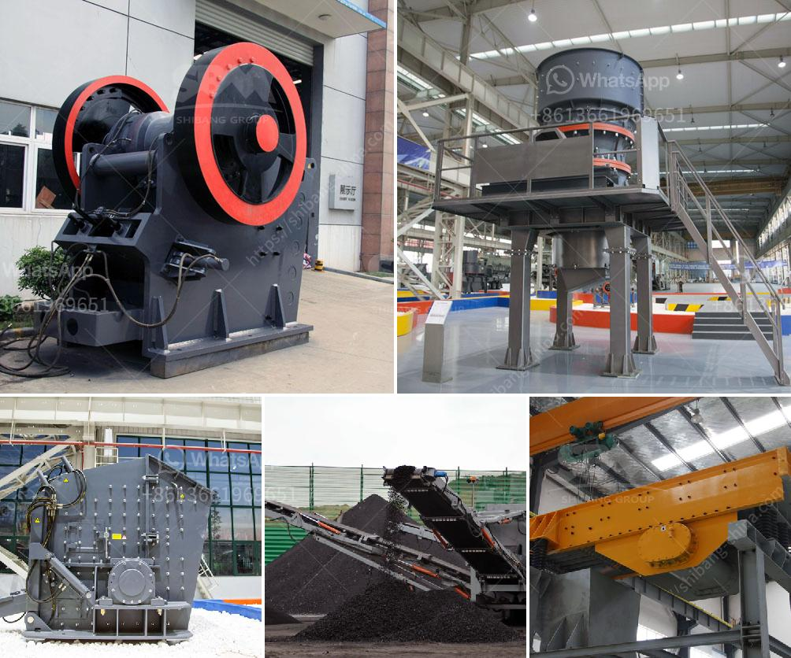

<h3>What equipment is used in antimony mining ?</h3>
Antimony, a silvery-white brittle metal, is a chemical element that is commonly found in minerals such as stibnite and is primarily used for the production of flame retardants. It is also used in a variety of other industries, including cosmetics, electronics, and semiconductors. Antimony mining is the process of extracting the valuable antimony metal from its ores, and as such, it is an essential component of the world's modern economic infrastructure.

Mining antimony involves several steps, including the extraction, crushing, and grinding of mineral ores, and the subsequent processing through various chemical and metallurgical techniques. The equipment used for mining antimony includes smelting furnaces, rotary drills, draglines, and scoops. Let's delve deeper into the equipment involved in this process.

One of the primary pieces of equipment used in antimony mining is the rotary drill. It is responsible for drilling holes into the mine's walls to access the stibnite ore. Rotary drills are efficient and powerful tools that can bore large-diameter holes deep into the ground, allowing miners to extract the maximum amount of antimony ore.

Once the ore is extracted from the mine, it is crushed into smaller pieces to facilitate further processing. Crushing equipment, such as jaw crushers and cone crushers, are commonly used to accomplish this task. These machines utilize a rotating cone or jaws to apply pressure, breaking down the ore into smaller pieces. The crushed ore is then ground into a fine powder through the use of mills, such as ball mills and rod mills. These grinding machines further reduce the size of the ore, making it easier to extract the antimony metal.

After the crushing and grinding processes, the antimony ore is ready for further processing. Smelting furnaces are essential equipment in this stage of the mining process. These furnaces heat the crushed and ground ore to high temperatures, resulting in the separation of antimony metal from other impurities. The molten antimony is then cast into desired shapes to be used in various industries.

Draglines and scoops are other important pieces of equipment used in antimony mining. These large machines are used to remove the overburden – the waste material that covers the valuable antimony ore. Draglines use a bucket attached to a boom and cable system to remove the overburden, while scoops are similar to large shovels and are used to load the ore onto trucks for transport.

In conclusion, antimony mining requires a range of equipment to extract and process the metal from its ores. Rotary drills, crushers, grinding mills, smelting furnaces, and excavation machinery are just a few examples of the types of specialized equipment used throughout the mining process. Understanding the intricacies of this equipment is vital for efficient and safe mining operations. As the demand for antimony and its derivatives continues to grow, advancements in mining equipment technology will undoubtedly play a crucial role in ensuring the sustainable extraction of this valuable metal for years to come.
<h3>Contact us</h3><ul><li><strong>Whatsapp:&nbsp;<a href="https://wa.me/8613661969651">+8613661969651</a></strong></li><li><a href="https://swt.shibang-china.com/?git&amp;zhl&amp;What equipment is used in antimony mining "><strong>Online Service(chat now)</strong></a></li></ul><h3>Related</h3><ul><li><a href='What is chrome ore grades.md'>What is chrome ore grades?</a></li><li><a href='when pulverizing coal what is a crusher use for？.md'>when pulverizing coal what is a crusher use for？</a></li><li><a href='What is quarrying in relation to cement production.md'>What is quarrying in relation to cement production?</a></li><li><a href='What is the optimum frequency for a vibrating screen.md'>What is the optimum frequency for a vibrating screen?</a></li><li><a href='What are machines used for mining iron ore.md'>What are machines used for mining iron ore?</a></li></ul>