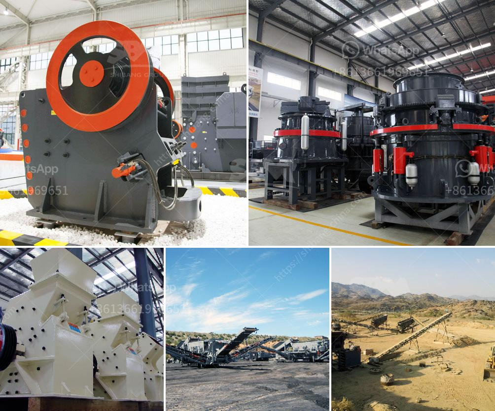

<h3>What equipment is used in iron ore crusher?</h3>
Iron ore is one of the main raw materials in the production of iron and steel, and its processing and utilization play a decisive role in the development of steel production. The iron ore crusher is a device that crushes large pieces of raw iron ore into granules convenient for transportation, so that it can be directly blended with various industrial raw materials for smelting and is an essential equipment in the steel production line.

Jaw crusher is a kind of iron ore crushing equipment commonly used in jaw crusher spare parts. Its main purpose is to crush ore raw materials with a maximum size of 1000mm into smaller sizes, and then, the crushed materials can be used for processing in the next procedure.

Cone crusher is widely used in iron ore crushing production line. Its production efficiency is higher than that of other types of crushers. It realizes laminated crushing, which can crush the iron ore and rock materials into fine, cubic particles.

The crusher equipment mainly includes impact crusher and hammer crusher. Both crushing principles and granularity are suitable for crushing iron ore materials. The cone crusher has the characteristics of high crushing efficiency, low energy consumption, and uniform product size. It is widely used in the iron ore crushing production line to improve the production efficiency.

Iron ore crusher equipment is mainly divided into two categories, namely coarse crushing and fine crushing. Jaw crusher and cone crusher are the coarse crushing equipment commonly used in iron ore crushing operations. Impact crusher and hammer crusher are the fine crushing equipment commonly used in iron ore crushing production line.

The selection of the crusher equipment should comprehensively consider the characteristics of the ore, such as hard, thick, fragile, and fine. In addition, it should consider the requirements of the final product size and shape. Only by selecting the appropriate crusher equipment can the crushing efficiency be improved, and the crushing cost can be reduced, so as to achieve the purpose of economic and rational allocation of resources.

With the progress of the times, the development of science and technology continues to advance. The application of new technologies and new materials to the crusher equipment has greatly improved its performance and expanded its application range. For example, the iron ore crusher equipped with hydraulic clearing chamber technology is more intelligent, and can automatically adjust the discharge port to ensure the unobstructed feed and discharge of iron ore, and greatly improve the production efficiency and equipment stability.

In summary, the iron ore crusher is a device used in the production line of iron ore crushing and processing. The crushing equipment is mainly divided into coarse crushing, medium crushing, and fine crushing. It can be said that the iron ore crusher equipment has made great contributions to the development of steel production.
<h3>Contact us</h3><ul><li><strong>Whatsapp:&nbsp;<a href="https://wa.me/8613661969651">+8613661969651</a></strong></li><li><a href="https://swt.shibang-china.com/?git&amp;zhl&amp;What equipment is used in iron ore crusher"><strong>Online Service(chat now)</strong></a></li></ul><h3>Related</h3><ul><li><a href='What is iron ore screening process.md'>What is iron ore screening process?</a></li><li><a href='What type of Raymond Mill exhaust fan is used at gypsum plant.md'>What type of Raymond Mill exhaust fan is used at gypsum plant?</a></li><li><a href='what are the applications of small portable crusher.md'>what are the applications of small portable crusher?</a></li><li><a href='What are the production and uses of crushed rock aggregates.md'>What are the production and uses of crushed rock aggregates?</a></li><li><a href='What are the machines used to mine bauxite.md'>What are the machines used to mine bauxite?</a></li></ul>