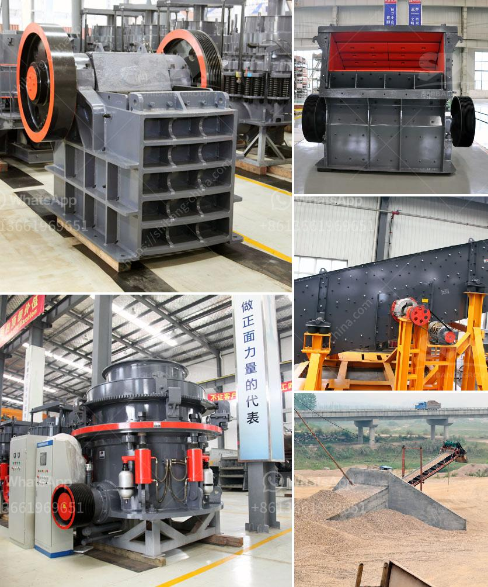

<h3>What equipment is used in the bauxite mining process in Jamaica?</h3>
Bauxite is a mineral rich in alumina, which is utilized in various industries such as aluminum smelting, refractory material production, and cement manufacturing. To extract bauxite from the Earth, the mining process usually entails the following steps:

1. Pre-mining: Pre-mining refers to the activities carried out before the actual mining process begins. This typically includes the clearing of vegetation and the removal of topsoil and overburden material to expose the bauxite ore beneath the surface. Bulldozers and excavators are commonly used during this preliminary stage of the process.

2. Drilling and blasting: Once the overburden layer is removed, drilling and blasting techniques are employed to access the bauxite ore deposits. Drilling machines equipped with large drill bits are utilized to create holes for placing explosives. These explosives are then detonated to break apart the bauxite into smaller fragments, which can be easily removed and loaded onto trucks for transportation.

3. Crushing and grinding: After the bauxite ore is extracted from the ground, it is crushed and ground into particles of smaller sizes through crushing and grinding machines. These particles can range from large lumps to fine powders, depending on the specific requirements of downstream processing.

4. Washing and beneficiation: The crushed and ground bauxite particles are then washed to remove impurities and further processed to increase their alumina content. This process is called beneficiation and aims to separate the valuable aluminum-bearing minerals from the gangue material. Various equipment, such as gravity separators, magnetic separators, and flotation cells, are employed in this stage to achieve effective separation.

5. Drying: Once the bauxite particles are washed and separated, they are dried to reduce moisture content. Specialized drying equipment, such as rotary kilns or fluidized bed dryers, are often used for this purpose. Drying the bauxite is crucial to ensure proper handling and storage before further processing.

6. Calcination: After drying, the bauxite particles are subjected to a high-temperature calcination process to convert them into alumina or aluminum oxide. This process involves heating the bauxite at temperatures above 1000 degrees Celsius, which results in the removal of the combined water and the transformation of the mineral structure.

7. Transport: Throughout the entire mining process, transportation plays a vital role in moving the extracted bauxite from the mine site to processing plants or port facilities for export. Dump trucks, conveyor belts, or rail systems are commonly used for this purpose, depending on the distance and terrain involved.

In conclusion, the bauxite mining process in Jamaica involves the use of various equipment such as excavators, drilling machines, crushing and grinding machines, washing and beneficiation equipment, drying equipment, calcination, and transportation. Each of these steps contributes to the overall extraction and processing of this valuable mineral, which is vital to the global aluminum industry.
<h3>Contact us</h3><ul><li><strong>Whatsapp:&nbsp;<a href="https://wa.me/8613661969651">+8613661969651</a></strong></li><li><a href="https://swt.shibang-china.com/?git&amp;zhl&amp;What equipment is used in the bauxite mining process in Jamaica"><strong>Online Service(chat now)</strong></a></li></ul><h3>Related</h3><ul><li><a href='What are the methods of mining mica.md'>What are the methods of mining mica?</a></li><li><a href='What is cost of bauxite processing per ton.md'>What is cost of bauxite processing per ton?</a></li><li><a href='What mechanical equipment is used in limestone mining.md'>What mechanical equipment is used in limestone mining</a></li><li><a href='what are the equipment for gypsum mining.md'>what are the equipment for gypsum mining?</a></li><li><a href='What is the fault and how do I repair a cone crusher.md'>What is the fault and how do I repair a cone crusher?</a></li></ul>