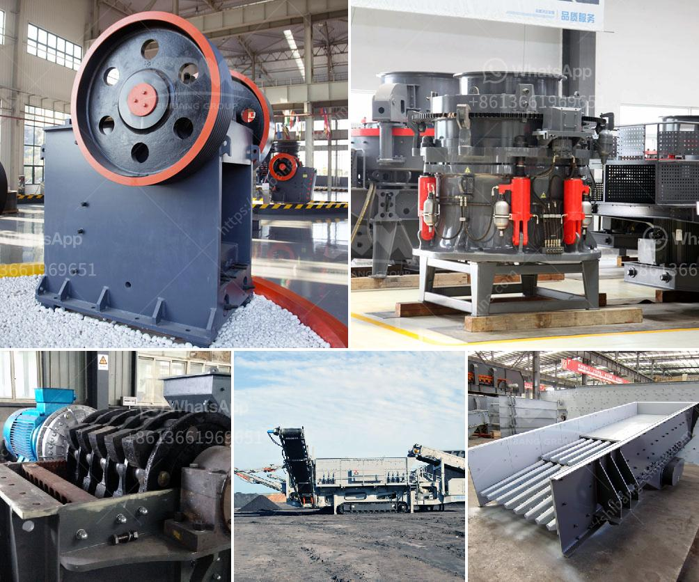

<h3>What equipment is used in the cement process?</h3>
The cement manufacturing process is a highly energy-intensive and complex process, involving the extraction and grinding of raw materials, blending of materials, clinker formation, and cement grinding. To carry out these processes efficiently, various cement equipment is used. Let's take a closer look at some of the essential equipment used in the cement process.

Crushers are used to reduce the size of the raw materials by compression, impact, and shear forces. The primary crushers, such as jaw crushers and gyratory crushers, are usually used for the initial reduction of the raw materials. Cone crushers and impact crushers are commonly used as secondary crushers to further reduce the size of the materials.

Raw material mill is an essential grinding equipment in the cement manufacturing process. It grinds the raw mix consisting of limestone, clay, and iron ore particles into a fine powder called raw meal. The raw meal is then blended and homogenized to achieve a consistent chemical composition, which is vital for the production of high-quality cement.

The kiln is the heart of the cement manufacturing process. It is a large, cylindrical, rotating furnace, where the raw meal is heated at high temperatures (up to 1450°C) to produce clinker. The most commonly used types of kilns are the rotary kiln and the vertical shaft kiln. In the kiln, the raw materials undergo a series of chemical reactions, such as calcination and sintering, resulting in the formation of clinker.

After leaving the kiln, the clinker is hot and needs to be cooled down rapidly to avoid undesirable reactions. The cooler is used to achieve this by blowing cool air through the clinker. There are different types of coolers, such as the grate cooler and the air quenching cooler, which use different cooling techniques. The cooled clinker is then stored in clinker silos before being further processed into cement.

The cement mill is the final processing equipment in the cement manufacturing process. It is responsible for grinding the clinker to a specific size, usually 3-4% of the micron order. The cement mill consists of two compartments, separated by a partition. The coarser particles are fed back into the first compartment, while the finer particles pass through to the second compartment. Various grinding media, such as steel balls, are used to aid in the grinding process.

After grinding, the cement is transported to the packing and bagging machine. This equipment fills the cement into bags or containers, typically ranging from 50 to 100 kilograms per bag. The bags are then sealed and palletized for storage or transportation.

In addition to the equipment mentioned above, there are numerous auxiliary equipment used in the cement manufacturing process, such as conveyors, dust collectors, electrical motors, and fans, to name a few. These equipment work together to ensure a smooth and efficient cement manufacturing process.

In conclusion, the cement process relies heavily on various equipment to transform raw materials into high-quality cement. Crushers, raw material mills, kilns, coolers, cement mills, and packing machines are just a few examples of the essential equipment used in this process. The use of advanced equipment and technologies not only improves efficiency but also reduces energy consumption and environmental impact in the cement industry.
<h3>Contact us</h3><ul><li><strong>Whatsapp:&nbsp;<a href="https://wa.me/8613661969651">+8613661969651</a></strong></li><li><a href="https://swt.shibang-china.com/?git&amp;zhl&amp;What equipment is used in the cement process"><strong>Online Service(chat now)</strong></a></li></ul><h3>Related</h3><ul><li><a href='What is needed to open an aggregate mine.md'>What is needed to open an aggregate mine?</a></li><li><a href='What kind of crusher crushes basalt best.md'>What kind of crusher crushes basalt best?</a></li><li><a href='What type of bearings must be used for the taper of a jaw crusher.md'>What type of bearings must be used for the taper of a jaw crusher?</a></li><li><a href='What equipment is needed for silicon ore mines.md'>What equipment is needed for silicon ore mines?</a></li><li><a href='What machinery and equipment is needed for a sand and gravel processing plant.md'>What machinery and equipment is needed for a sand and gravel processing plant</a></li></ul>