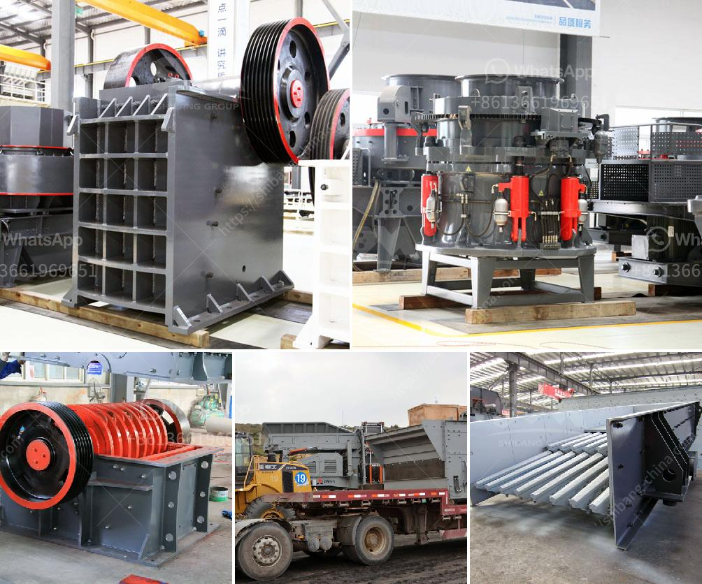

<h3>What equipment is used in the mining industry ?</h3>
The mining industry is known for its high demands and extensive operations. From extracting valuable minerals to processing and manufacturing them into various products, the mining industry plays a crucial role in the global economy. To successfully carry out these complex mining operations, various types of equipment are required. These equipment play a vital role in enhancing productivity, efficiency, and safety in mines. Let's explore some of the commonly used equipment in the mining industry.

1. Excavators: Excavators are enormous machines used in mining to ensure efficient digging and removal of ore or waste material. These machines are ideal for excavation, loading, hauling, and dumping tasks in mines. Excavators use buckets attached to a boom arm to excavate the material and transfer it to trucks or other processing equipment.

2. Bulldozers: Bulldozers are heavy-duty machines equipped with a robust metal plate at the front, called a blade. These machines are mainly used for clearing land, removing debris, and grading or leveling in the mining industry. Bulldozers can handle tough terrains and harsh conditions, making them indispensable in mining operations.

3. Haul Trucks: Haul trucks, also known as dump trucks, are specifically designed to transport bulk materials, such as rocks, ore, and minerals, from the mining site to the processing plant or dump area. These trucks are loaded with the material using excavators or wheel loaders. Haul trucks are available in various sizes, with the capacity to carry up to hundreds of tons of material.

4. Crushing Equipment: Ore processing is a crucial process that involves breaking down the mined ore into smaller pieces for further processing. Crushing equipment is used to reduce the size of the mined material by applying mechanical force. Jaw crushers, gyratory crushers, and cone crushers are commonly used crushing equipment in the mining industry.

5. Grinding Equipment: Grinding equipment is used to grind the mined ore or minerals into fine particles. It involves breaking down the material using crushing equipment and then further grinding it using ball mills or rod mills. This process helps to release valuable minerals from the ore and improve their concentration for further processing.

6. Drilling Equipment: Drilling is an essential process in mining operations. It is used to create holes in the earth's surface to extract minerals or other valuable resources. Drill rigs are used for this purpose, which can be either surface drills or underground drills, depending on the type and location of the mining operation.

7. Safety Equipment: Safety is of utmost importance in the mining industry, considering the challenging and hazardous nature of mining activities. Various safety equipment, including respiratory protection, helmets, gloves, safety glasses, and high-visibility clothing, are used to ensure the well-being and protection of mining personnel.

These are just a few examples of the equipment extensively used in the mining industry. From excavation to ore processing and materials handling, each piece of equipment has a specific role to play in achieving efficient and productive mining operations. With advancements in technology, mining equipment is continuously evolving, becoming more efficient, automated, and safer, striving to improve productivity and reduce mining-related hazards.
<h3>Contact us</h3><ul><li><strong>Whatsapp:&nbsp;<a href="https://wa.me/8613661969651">+8613661969651</a></strong></li><li><a href="https://swt.shibang-china.com/?git&amp;zhl&amp;What equipment is used in the mining industry "><strong>Online Service(chat now)</strong></a></li></ul><h3>Related</h3><ul><li><a href='What is an ore vibrating screen What is it for.md'>What is an ore vibrating screen? What is it for?</a></li><li><a href='what type of crusher is best for concrete crushing.md'>what type of crusher is best for concrete crushing?</a></li><li><a href='What is the separation process in a vertical raw mill.md'>What is the separation process in a vertical raw mill?</a></li><li><a href='What equipment is needed for boron ore mines.md'>What equipment is needed for boron ore mines?</a></li><li><a href='what is throughput for a cement grinding ball mill？.md'>what is throughput for a cement grinding ball mill？</a></li></ul>