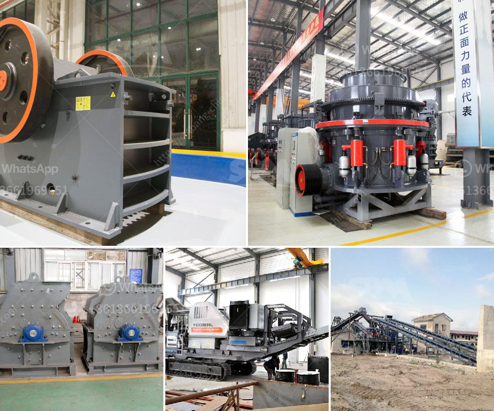

<h3>What equipment is used to mine gold in Australia？</h3>
Australia is one of the largest gold producers in the world, with an estimated 10% of global gold reserves. To extract gold from the ground, mining companies utilize various equipment, including excavators, bulldozers, dump trucks, and loaders. These machines work together to extract gold-bearing ore from underground or open-pit mines, where it is then processed and refined. This article will explore the equipment used in gold mining operations in Australia.

Excavators are versatile machines commonly used in mining operations. In gold mining, they are primarily used to remove overburden (the soil and rocks covering the gold deposits) by digging large quantities of earth. Excavators vary in size and capacity, with larger machines capable of handling more substantial loads.

Bulldozers, with their powerful blades and tracks, play a vital role in the extraction process. They are responsible for pushing earth and rocks from the gold-rich areas and creating paths for the mining equipment to move around the site. Bulldozers are also used to establish the necessary infrastructure, such as roads and access ramps, ensuring smooth operations.

Dump trucks are heavy-duty vehicles equipped with large beds for transporting minerals or waste material. These trucks are often used in open-pit mining, where gold deposits are easily accessible near the surface. Dump trucks carry the extracted ore from the mining site to a designated processing facility or waste dump.

Loaders are commonly seen in gold mining operations due to their versatility in handling materials. They are used to load both ore and waste rock into trucks for transportation. Loaders come in different sizes and capacities, allowing for efficient and quick loading of materials.

Apart from the machines mentioned above, gold mining operations in Australia also make use of drills, crushers, and specialized drying and smelting equipment. Drilling machines are used to create boreholes to access gold deposits. Crushers break down larger rocks into smaller pieces for easier processing and extraction. Drying equipment is crucial in removing moisture from the ore before further processing, while smelting equipment is used to melt the gold concentrate, resulting in a pure gold product.

In addition to these essential machines, mining companies often use advanced technology and equipment to optimize efficiency and safety. For example, modern mining operations employ remote-controlled vehicles to access hard-to-reach areas or operate in hazardous environments.

Mining gold in Australia is a complex and extensive process that requires advanced machinery. The equipment used varies depending on the size of the mine, the nature of the gold deposit, and the mode of extraction. From excavators and bulldozers to dump trucks and loaders, these various machines work hand-in-hand to uncover and refine Australia's abundant gold reserves.
<h3>Contact us</h3><ul><li><strong>Whatsapp:&nbsp;<a href="https://wa.me/8613661969651">+8613661969651</a></strong></li><li><a href="https://swt.shibang-china.com/?git&amp;zhl&amp;What equipment is used to mine gold in Australia？"><strong>Online Service(chat now)</strong></a></li></ul><h3>Related</h3><ul><li><a href='What is the raw ore crushing process.md'>What is the raw ore crushing process?</a></li><li><a href='What is the cost of the equipment used in mining lead ore.md'>What is the cost of the equipment used in mining lead ore?</a></li><li><a href='what is the primary use for dolomite rock.md'>what is the primary use for dolomite rock</a></li><li><a href='What is the process for mining line.md'>What is the process for mining line?</a></li><li><a href='What is belt conveyor in gold mining.md'>What is belt conveyor in gold mining?</a></li></ul>