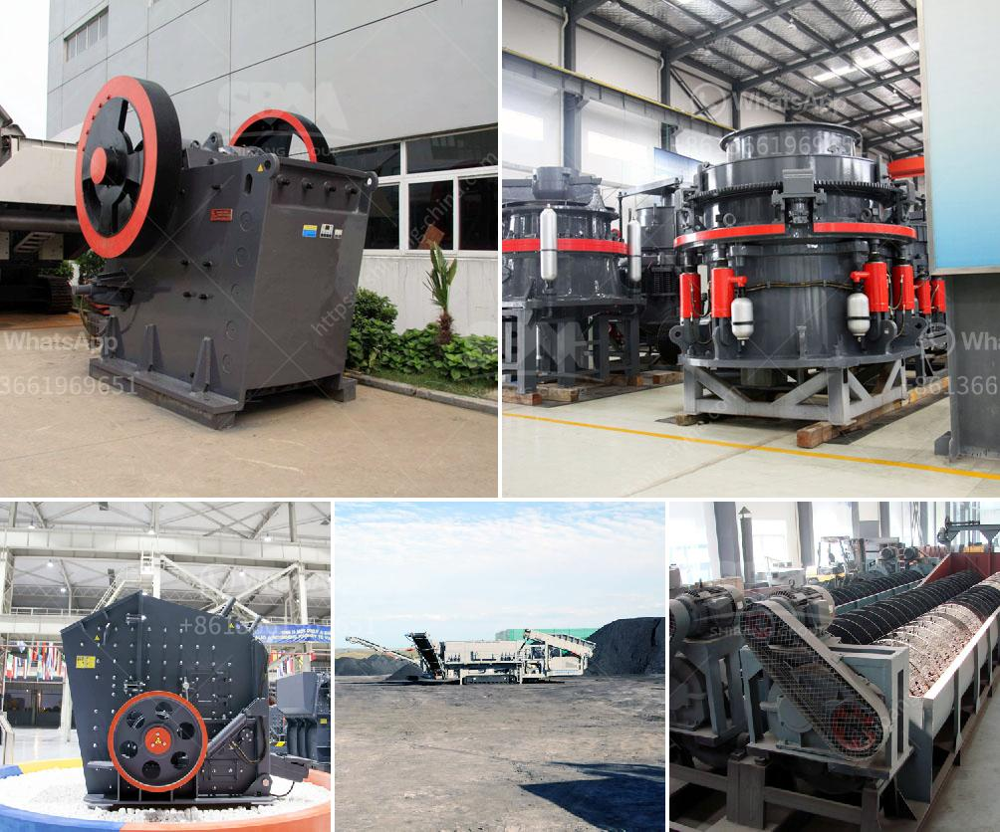

<h3>What equipment is used when sand mining?</h3>
Sand mining has become a crucial industry in many parts of the world. With demand for sand reaching an all-time high, particularly in developing countries, mining operations are on the rise. However, extracting sand from natural sources comes with its own set of challenges. Understanding the equipment needed when sand mining is vital to ensuring successful operations.

1. Excavators: Excavators are commonly used in sand mining operations to dig below the surface and reach the sand deposits. These powerful machines are typically equipped with a bucket on the front end, allowing them to remove large quantities of sand and other materials quickly and efficiently. Excavators come in various sizes, but those used for sand mining are generally large and capable of handling heavy loads.

2. Bulldozers: Bulldozers, with their immense strength and durability, are frequently employed in sand mining to move large quantities of sand and debris. These robust machines feature a wide, flat blade at the front for pushing and clearing sand, while maintaining stability and traction on uneven terrain. Bulldozers are essential in preparing the area for mining and creating access roads for other equipment.

3. Dredgers: Dredgers are specialized machines used in sand mining operations where the sand is extracted from below the water's surface. They come in different variations, including cutter suction dredgers, trailing suction hopper dredgers, and bucket wheel dredgers. These machines remove sand from riverbeds, lakes, and oceans, and can operate in both shallow and deep waters.

4. Conveyor Systems: Once the sand is excavated or dredged, it needs to be transported for processing or storage. Conveyor systems are commonly used to handle this task efficiently. These systems consist of belts or chains that move continuously, transporting sand from one location to another. They are crucial in reducing manual labor and increasing productivity in sand mining operations.

5. Sieving Equipment: Sieving or screening equipment is used to separate sand particles of different sizes. Vibrating screens, rotary screens, or trommel screens are commonly used in sand mining to efficiently separate the sand from other materials. Depending on the desired end use of the sand, further processing may be required to create consistent and uniform particle sizes.

6. Crushers and Grinders: In some sand mining operations, crushers and grinders are used to break down large rocks or gravel into smaller, more manageable sizes. These machines can reduce the size of the sand particles and ensure they meet specific quality requirements for various applications, such as construction or industrial use.

7. Trucks and Barges: Transportation of mined sand is a critical aspect of sand mining operations. Trucks and barges are commonly used to move sand from the mining site to processing plants or storage facilities. These large vehicles are designed to carry heavy loads over long distances, providing a cost-effective solution for the transport of sand.

In conclusion, sand mining requires a range of equipment to extract, transport, and process sand efficiently. Excavators, bulldozers, dredgers, conveyor systems, sieving equipment, crushers, grinders, trucks, and barges are all commonly utilized in sand mining operations. Each piece of equipment plays a vital role in ensuring a smooth and productive sand mining process, meeting the ever-increasing global demand for sand resources. However, it is important to conduct sand mining operations responsibly and sustainably, considering the environmental impact and mitigating potential harm to ecosystems.
<h3>Contact us</h3><ul><li><strong>Whatsapp:&nbsp;<a href="https://wa.me/8613661969651">+8613661969651</a></strong></li><li><a href="https://swt.shibang-china.com/?git&amp;zhl&amp;What equipment is used when sand mining"><strong>Online Service(chat now)</strong></a></li></ul><h3>Related</h3><ul><li><a href='What is aluminium ore benefication process.md'>What is aluminium ore benefication process?</a></li><li><a href='What is mechanism sand.md'>What is mechanism sand?</a></li><li><a href='What is critical speed in rpm of ball mill 1290 mm id charged with 64mm balls.md'>What is critical speed in rpm of ball mill 1290 mm id charged with 64mm balls</a></li><li><a href='What does 20 mm all in aggregate mean.md'>What does "20 mm all in aggregate" mean?</a></li><li><a href='What equipment is used in iron ore crusher.md'>What equipment is used in iron ore crusher?</a></li></ul>