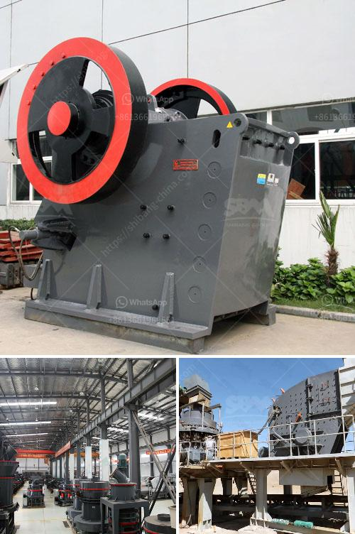

<h3>What equipment to extract iron ore?</h3>
Iron ore is one of the most crucial elements used in various industrial sectors, especially in the production of steel. It is extracted from the earth's crust in a process that involves a combination of machinery and human labor. Understanding the equipment needed to extract iron ore is essential for anyone involved in this industry, as it helps in increasing productivity and efficiency.

The first and most crucial step in extracting iron ore is its mining. This process is carried out using heavy machinery including bulldozers, excavators, and dump trucks. These powerful machines are operated by skilled workers who work together to extract ore from the ground.

Bulldozers are large, robust machines that are equipped with a blade in the front. They are mainly used for clearing the surface and leveling the ground before mining can commence. This is essential because it helps in creating a suitable working area for other mining equipment.

Excavators are another essential piece of equipment used in iron ore extraction. They are equipped with a bucket at the end of a long arm that is used to dig into the earth and extract the ore. Excavators are versatile machines that come in different sizes to cater to various mining operations. They help in removing large amounts of soil and rock, making it easier to access the iron ore deposits.

Once the iron ore has been extracted, it needs to be transported to the processing plant. This is usually done using large dump trucks. These heavy-duty vehicles are designed to carry a considerable amount of ore over long distances. They are equipped with hydraulic systems that allow them to tip their load and unload it at the processing plant.

At the processing plant, the extracted iron ore undergoes several stages of refinement to remove impurities and increase its purity. One of the primary machines used in this process is the crusher. Crushing the iron ore into smaller-sized rocks helps in increasing its surface area, making it easier to extract the desired iron content.

After crushing, the iron ore is then passed through magnetic separators. These machines use magnets to attract and separate any remaining impurities from the iron ore. This process helps in reducing impurities such as sulfur and phosphorus, which can affect the quality of the final product.

Once the iron ore has been purified, it is then subjected to further processes such as grinding and drying before being transported to steel mills for further processing. Grinding machines, such as ball mills and rod mills, help in reducing the ore to a fine powder, while dryers remove any remaining moisture.

In conclusion, extracting iron ore is a complex process that requires heavy machinery and skilled workers. Bulldozers, excavators, and dump trucks are used to remove and transport the ore from the ground, while crushers and magnetic separators help in extracting the desired iron content. Understanding the equipment needed for iron ore extraction is vital for ensuring smooth and efficient operations in the mining industry.
<h3>Contact us</h3><ul><li><strong>Whatsapp:&nbsp;<a href="https://wa.me/8613661969651">+8613661969651</a></strong></li><li><a href="https://swt.shibang-china.com/?git&amp;zhl&amp;What equipment to extract iron ore"><strong>Online Service(chat now)</strong></a></li></ul><h3>Related</h3><ul><li><a href='What type of Raymond Mill exhaust fan is used at gypsum plant.md'>What type of Raymond Mill exhaust fan is used at gypsum plant?</a></li><li><a href='What is the cost of limestone crushing process .md'>What is the cost of limestone crushing process ?</a></li><li><a href='what crusher types are used in copper processing in zambia.md'>what crusher types are used in copper processing in zambia?</a></li><li><a href='What machinery is used in copper mining .md'>What machinery is used in copper mining ?</a></li><li><a href='What does the concrete batching plant contain.md'>What does the concrete batching plant contain?</a></li></ul>