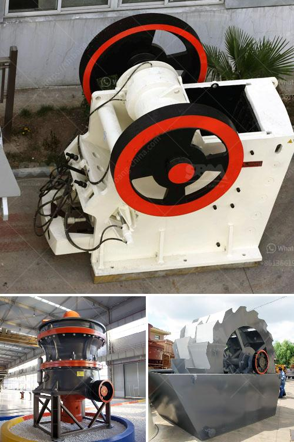

<h3>What good pebble crushing equipment ?</h3>
Crushing pebbles is an important process that helps to transform raw materials into construction aggregates. Pebbles are smooth, rounded stones that are often used in landscaping and as a decorative element in gardens. As the demand for high-quality pebble aggregates continues to grow, the need for efficient and reliable pebble crushing equipment becomes paramount. In this article, we will explore the various types of equipment available and highlight some of the best options for crushing pebbles.

A jaw crusher is a primary crusher that is well-suited for crushing different types of materials, including pebbles. It consists of a fixed jaw plate and a movable jaw plate that work together to crush the pebbles between them. Jaw crushers are known for their high production rates, large feed openings, and easy maintenance. With advancements in technology, modern jaw crushers offer improved performance and reduced operating costs.

Cone crushers are another popular choice for pebble crushing. They operate by crushing the pebbles between a mantle and a concave. Cone crushers are known for their ability to produce well-shaped and consistent particle sizes. They are versatile machines that can be used for both secondary and tertiary crushing applications.

An impact crusher uses impact force to crush pebbles against a stationary plate. This type of crusher is suitable for crushing hard and abrasive materials, such as pebbles with high silica content. Impact crushers are efficient machines that produce high-quality aggregates and are often used in the mining and construction industries.

A VSI crusher utilizes a high-speed rotor with wear-resistant tips to crush pebbles by throwing them against a stationary anvil. VSI crushers are known for their ability to produce cubical-shaped aggregates, making them an excellent choice for producing high-quality pebble aggregates. They are commonly used in the production of concrete and asphalt.

HPGR is a relatively new technology that has gained popularity in recent years. This equipment consists of two counter-rotating rolls that apply high pressure to the pebbles, causing them to break and generate a significant amount of fines. HPGR has proven to be an effective solution for crushing hard and abrasive materials, such as pebbles, while also reducing energy consumption and operating costs.

In conclusion, crushing pebbles requires equipment that can efficiently process the raw materials into aggregates of the desired size and shape. Jaw crushers, cone crushers, impact crushers, VSI crushers, and HPGR are some of the best options available for pebble crushing. Each type of equipment offers distinct advantages and is suitable for different applications. When selecting the right equipment, factors such as the feed size, desired product size, and production capacity should be considered. Ultimately, choosing the best pebble crushing equipment will depend on specific requirements and project constraints.
<h3>Contact us</h3><ul><li><strong>Whatsapp:&nbsp;<a href="https://wa.me/8613661969651">+8613661969651</a></strong></li><li><a href="https://swt.shibang-china.com/?git&amp;zhl&amp;What good pebble crushing equipment "><strong>Online Service(chat now)</strong></a></li></ul><h3>Related</h3><ul><li><a href='What are the most common expenses in crushing plant project.md'>What are the most common expenses in crushing plant project?</a></li><li><a href='What equipment is used in the mining industry .md'>What equipment is used in the mining industry ?</a></li><li><a href='What does the concrete batching plant contain.md'>What does the concrete batching plant contain?</a></li><li><a href='What is a recycle feed hopper sand mine.md'>What is a recycle feed hopper sand mine?</a></li><li><a href='What kind of crushing machinery is needed for gypsum mine mining.md'>What kind of crushing machinery is needed for gypsum mine mining?</a></li></ul>