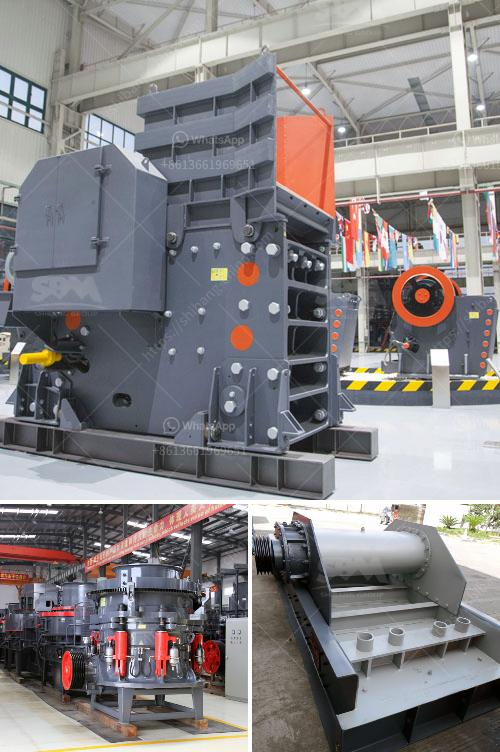

<h3>What guidelines are needed to set up a mobile stone crusher in Orissa?</h3>
Mobile stone crusher is a very useful equipment in these industries. Its application range is very wide, including mining, building materials, chemical, metallurgy, and many other fields. In this article, we will analyze the guidelines for setting up a mobile stone crusher in Orissa.

As a major tourist place, Orissa attracts many tourists from different parts of the country. This has led to an increase in the demand for construction materials, including stone chips and sand. To meet this demand, many entrepreneurs have set up their own stone crusher plants.

Setting up a stone crushing plant requires careful planning so that the plant can be easily maintained over the long term. Initial planning may involve selecting land for the plant, obtaining necessary environmental clearances, securing funding, and hiring skilled workers.

The first step in setting up a stone crusher plant is identifying the site, which is ideally located near a stone quarry, so that the stone can be easily obtained. Once the site is selected, clearances from the concerned authorities and permits for land use need to be obtained. This is followed by applying for a mining lease, which requires the submission of essential documents such as identity proof, land ownership proof, and environmental impact assessment report.

Securing funding for the project is the next critical step. Entrepreneurs can approach banks and financial institutions for loans. They may also explore partnerships or joint ventures with other investors.

The machinery and equipment required for the stone crushing plant include conveyors, crushers, vibrating screens, feeders, and more. The most important equipment is the crusher. As we all know, the process of crushing stones requires multiple crushing stages. For this purpose, a suitable mobile crusher is used. The main advantage of a mobile crusher is the flexibility to move from one site to another at any time. It can be easily transported to the crushing site using a truck or trailer.

Once the site is prepared, the mobile crusher is set up on the site. This process involves placing the crusher on a suitable leveling ground, organizing the feed hopper, and connecting the power source. The crusher is then powered on and the stone is fed into the crusher for crushing. Different sizes of stones are obtained by crushing them into smaller pieces. The stones are then screened to separate the required sizes.

To ensure the smooth operation of the stone crusher plant, regular maintenance is required. This includes regular cleaning of the crusher, checking the oil levels, and replacing worn-out parts. Regular maintenance ensures that the crusher operates efficiently and reduces the chances of unexpected breakdowns.

In conclusion, setting up a mobile stone crusher in Orissa requires a series of steps such as obtaining clearances, securing funding, selecting the site, and purchasing the necessary equipment. The main advantage of a mobile crusher is its flexibility in terms of moving from one site to another, which makes it an ideal choice for stone crushing operations in Orissa.
<h3>Contact us</h3><ul><li><strong>Whatsapp:&nbsp;<a href="https://wa.me/8613661969651">+8613661969651</a></strong></li><li><a href="https://swt.shibang-china.com/?git&amp;zhl&amp;What guidelines are needed to set up a mobile stone crusher in Orissa"><strong>Online Service(chat now)</strong></a></li></ul><h3>Related</h3><ul><li><a href='what jaw crushers speed rpm should do.md'>what jaw crushers speed rpm should do</a></li><li><a href='what equipment is used when mining zinc ore.md'>what equipment is used when mining zinc ore?</a></li><li><a href='what equipment needed for mining iron ore.md'>what equipment needed for mining iron ore</a></li><li><a href='What is cost of bauxite processing per ton.md'>What is cost of bauxite processing per ton?</a></li><li><a href='what is alluvial gold mining.md'>what is alluvial gold mining?</a></li></ul>