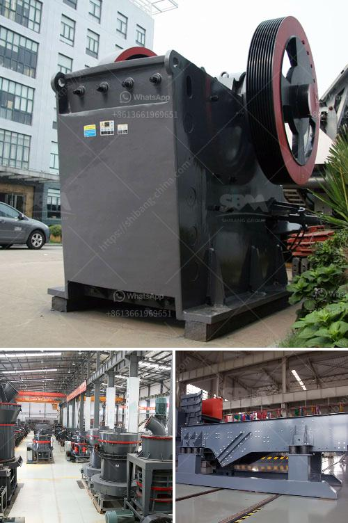

<h3>What is a belt conveyor control system?</h3>
Belt conveyor systems are widely used in industries across the world for the efficient transportation of goods, materials, and products. These systems consist of a series of interconnected belts that move in a continuous loop to transport items from one location to another. To ensure the smooth operation of a belt conveyor system, a control system is essential.

A belt conveyor control system is a software-based solution that automates the movement of materials on the conveyor belt. It enables operators to program the conveyor system to start, stop, and change the speed of the belts as needed. This control system not only enhances productivity but also ensures the safety and efficiency of the entire conveyor system.

The control system consists of various components that work together seamlessly. The heart of the system is the programmable logic controller (PLC). The PLC is a specialized computer that receives input signals from various sensors located along the conveyor system. These sensors can detect the presence, speed, and position of objects on the conveyor belt, providing real-time data to the PLC.

Using the data from the sensors, the PLC executes a pre-programmed sequence of commands to control the movements of the conveyor system. For example, if a sensor detects an object on the belt, the PLC can be programmed to stop the conveyor to avoid collisions or jamming. Once the object is cleared, the PLC can resume the operation of the conveyor system.

In addition to the PLC, other components of a belt conveyor control system include the human-machine interface (HMI), motor drives, and communication devices. The HMI is the interface between the operator and the control system, allowing them to monitor and control the conveyor system. It provides real-time information on the status of the conveyor, such as speed, temperature, and alarms.

Motor drives are responsible for controlling the speed and direction of the belts. They receive signals from the PLC and adjust the frequency and voltage supplied to the motors accordingly. Communication devices enable the control system to interface with other systems in the facility, such as inventory management or barcode scanning systems.

A belt conveyor control system offers numerous benefits to organizations. Firstly, it improves productivity by automating the movement of materials, reducing the need for manual labor. Secondly, it enhances safety by continuously monitoring the conveyor system and preventing potential accidents due to collisions or blockages. Thirdly, it allows for flexibility and adaptability as the control system can be easily reprogrammed to accommodate changes in production requirements.

In conclusion, a belt conveyor control system is a critical component of a conveyor system. It uses advanced technologies to automate the movement of materials on the conveyor belts, enhancing productivity, safety, and efficiency. With the ability to monitor and control the conveyor system in real-time, organizations can optimize their operations and streamline their material handling processes.
<h3>Contact us</h3><ul><li><strong>Whatsapp:&nbsp;<a href="https://wa.me/8613661969651">+8613661969651</a></strong></li><li><a href="https://swt.shibang-china.com/?git&amp;zhl&amp;What is a belt conveyor control system"><strong>Online Service(chat now)</strong></a></li></ul><h3>Related</h3><ul><li><a href='What is barite and how is it mined.md'>What is barite and how is it mined?</a></li><li><a href='How to choose a cone crusher for rock crushing？.md'>How to choose a cone crusher for rock crushing？</a></li><li><a href='What is critical speed in rpm of ball mill 1290 mm id charged with 64mm balls.md'>What is critical speed in rpm of ball mill 1290 mm id charged with 64mm balls</a></li><li><a href='What is the best concrete crusher to make gravel.md'>What is the best concrete crusher to make gravel?</a></li><li><a href='What equipment is needed for alumstone mines.md'>What equipment is needed for alumstone mines?</a></li></ul>