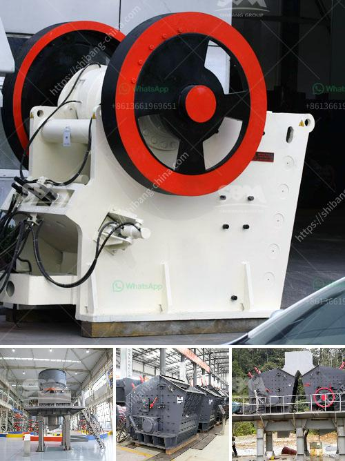

<h3>What is a bentonite grinding unit?</h3>
Bentonite is a geological clay material that is mainly composed of the mineral montmorillonite. It is a highly porous material with a wide variety of applications. Bentonite grinding unit is a grinding unit consisting of two or more millstones connected by a conveyor belt. It is essentially a laboratory grinder used for reducing dry laboratory samples to small particles.

The bentonite grinding unit consists of a grinding machine, roller mill, and classifier. The roller mill is a precision grinding machine that is built on a strong and solid foundation and that uses a patented grinding system for achieving high energy efficiency. It is also equipped with a patented intermediate separator and a classifier to ensure the production of high quality powder in the desired fineness range.

The grinding machine can be used for processing bentonite into powder for other applications such as in the production of particle boards, insulating materials, coatings, and even in food production. It grinds the bentonite material by forcing it between two grinding media, a rotating drum and a stationary one, causing the material to be crushed and ground into smaller particles.

In addition to grinding, the unit can also be used for de-agglomerating, granulating, and drying of various materials. The grinding unit is a versatile piece of equipment that can be easily integrated into existing systems or used as a stand-alone unit. It can be used in various industries including mining, construction, agriculture, and food processing.

Bentonite grinding unit is also known as bentonite pulverizer, pulverizing mill, and pulverizing machine. Bentonite grinding unit is widely used in mining, metallurgy, chemical engineering, building materials, water conservancy, and other industries. It is used in industrial applications such as calcite, barite, dolomite, feldspar, limestone, gypsum, bauxite, magnesite, and various minerals.

Moreover, bentonite grinding unit can also be used to grind talc, graphite, calcium carbonate, kaolin, diatomite, and other materials. It is widely used in the fields of paint, ink, plastics, masterbatch, and pigment production. It is also used in the production of paper, rubber, ceramics, cement, glass, and other industries for grinding non-flammable and explosive materials with a Mohs hardness of not more than 9.3 and a humidity below 6%.

In conclusion, a bentonite grinding unit is a valuable piece of equipment in the mining industry. It is used to grind bulk materials into powder for further processing. The unit can be used as a stand-alone machine or integrated into existing systems for increased efficiency and productivity. With its versatile capabilities, it is widely used in various industries for grinding and processing a wide range of materials.
<h3>Contact us</h3><ul><li><strong>Whatsapp:&nbsp;<a href="https://wa.me/8613661969651">+8613661969651</a></strong></li><li><a href="https://swt.shibang-china.com/?git&amp;zhl&amp;What is a bentonite grinding unit"><strong>Online Service(chat now)</strong></a></li></ul><h3>Related</h3><ul><li><a href='What does 20 mm all in aggregate mean.md'>What does "20 mm all in aggregate" mean?</a></li><li><a href='What is barite and how is it mined.md'>What is barite and how is it mined?</a></li><li><a href='What machinery is used in copper mining .md'>What machinery is used in copper mining ?</a></li><li><a href='what is alluvial gold mining.md'>what is alluvial gold mining?</a></li><li><a href='What are the parts of ball mill internal structure.md'>What are the parts of ball mill internal structure?</a></li></ul>